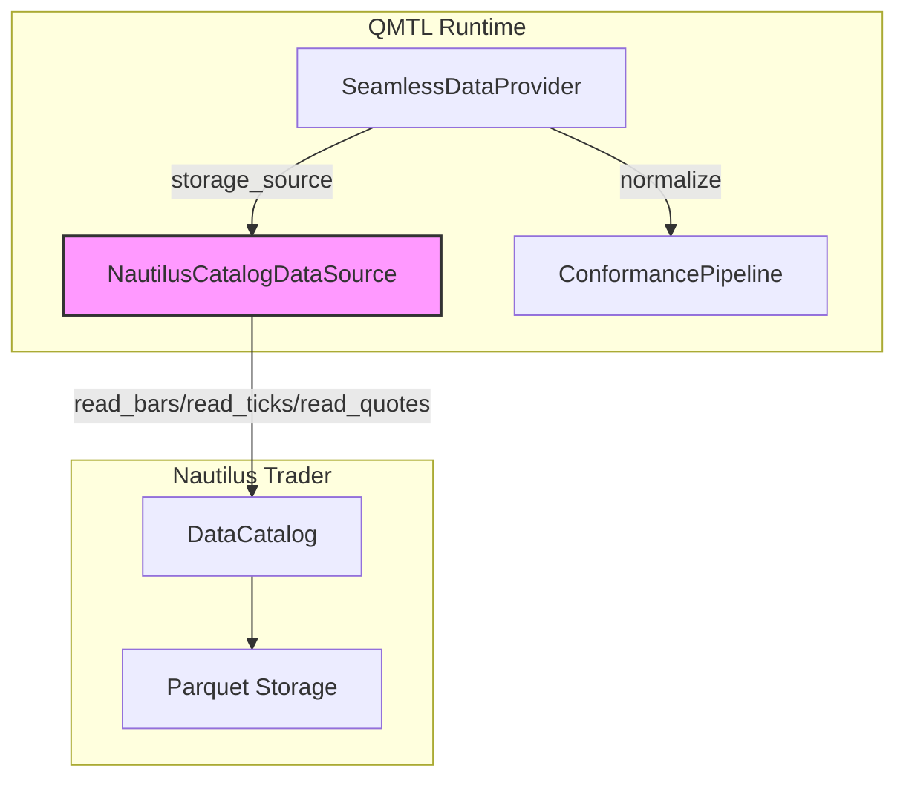
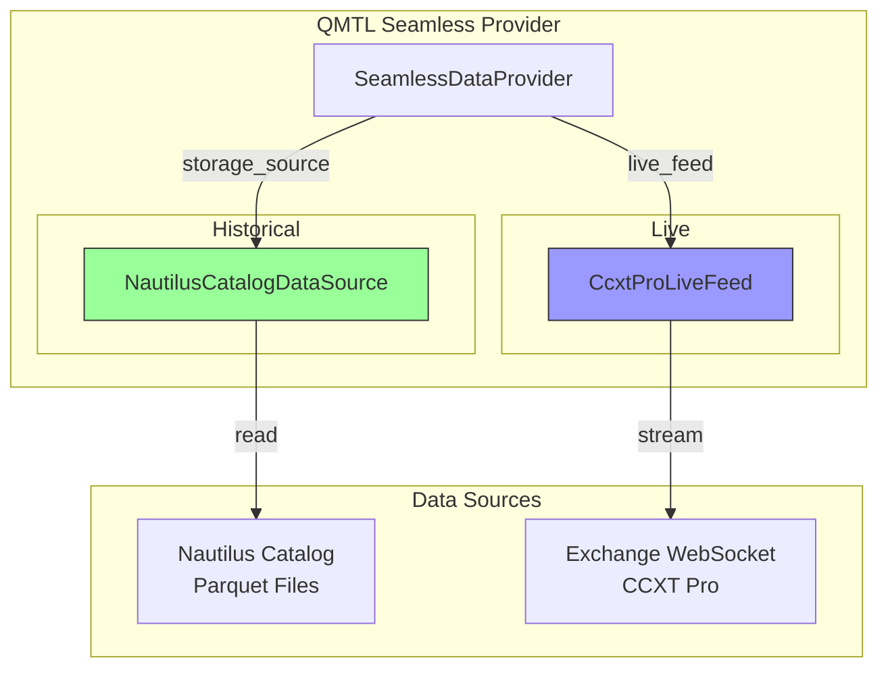

# Nautilus Trader Data Catalog 통합 설계

## 개요

**목표**: QMTL의 Seamless Data Provider에서 Nautilus Trader의 Data Catalog를 투명하게 읽을 수 있도록 `DataSource` 어댑터를 구현한다.

**스코프**: OHLCV bars, ticks, quotes를 모두 지원한다.

**방향**: (A) QMTL이 Nautilus Catalog를 읽는다. Nautilus → QMTL 방향 통합.

## 아키텍처 개요



## Nautilus Catalog API 분석

### 데이터 타입별 읽기 메서드

Nautilus DataCatalog는 다음 주요 메서드를 제공한다:

| 메서드 | 용도 | 반환 타입 |
|--------|------|-----------|
| `read_bars(instrument, bar_type, start, end)` | OHLCV 바 데이터 | `list[Bar]` or DataFrame |
| `read_ticks(instrument, start, end)` | Trade tick 데이터 | `list[TradeTick]` or DataFrame |
| `read_quotes(instrument, start, end)` | Quote tick 데이터 (bid/ask) | `list[QuoteTick]` or DataFrame |
| `instruments(venue)` | 거래소별 종목 리스트 | `list[Instrument]` |

### 타임스탬프 처리

- **Nautilus**: 나노초 단위 (Unix epoch in nanoseconds)
- **QMTL**: 초 단위 (Unix epoch in seconds)
- **변환 필요**: `nautilus_ts_ns / 1_000_000_000 → qmtl_ts_sec`

### 스키마 차이

#### OHLCV Bars

**Nautilus**:
```python
{
    'ts_event': int64,  # nanoseconds
    'ts_init': int64,   # nanoseconds
    'open': Decimal,
    'high': Decimal,
    'low': Decimal,
    'close': Decimal,
    'volume': Decimal
}
```

**QMTL 기대 스키마**:
```python
{
    'ts': int64,      # seconds
    'open': float64,
    'high': float64,
    'low': float64,
    'close': float64,
    'volume': float64
}
```

#### Ticks

**Nautilus TradeTick**:
```python
{
    'ts_event': int64,  # nanoseconds
    'ts_init': int64,
    'price': Decimal,
    'size': Decimal,
    'aggressor_side': str  # 'BUY' or 'SELL'
}
```

**QMTL 제안 스키마**:
```python
{
    'ts': int64,        # seconds
    'price': float64,
    'size': float64,
    'side': str         # 'buy' or 'sell'
}
```

#### Quotes

**Nautilus QuoteTick**:
```python
{
    'ts_event': int64,
    'ts_init': int64,
    'bid_price': Decimal,
    'ask_price': Decimal,
    'bid_size': Decimal,
    'ask_size': Decimal
}
```

**QMTL 제안 스키마**:
```python
{
    'ts': int64,
    'bid': float64,
    'ask': float64,
    'bid_size': float64,
    'ask_size': float64
}
```

## node_id 매핑 규칙

### 기존 QMTL 컨벤션

OHLCV는 이미 `qmtl.runtime.sdk.ohlcv_nodeid` 모듈에 정의되어 있음:
```
ohlcv:{exchange}:{symbol}:{timeframe}
예: ohlcv:binance:BTC/USDT:1m
```

### 제안: Ticks/Quotes 컨벤션

```
tick:{venue}:{instrument}
quote:{venue}:{instrument}

예:
tick:binance:BTC/USDT
quote:binance:BTC/USDT
```

### 매핑 로직

```python
# QMTL node_id → Nautilus (venue, instrument, bar_type)
def parse_qmtl_node_id(node_id: str) -> NautilusIdentifier:
    parts = node_id.split(':')
    prefix = parts[0]
    
    if prefix == 'ohlcv':
        # ohlcv:binance:BTC/USDT:1m → (binance, BTC/USDT, 1m)
        venue = parts[1]
        instrument = parts[2]
        timeframe = parts[3]
        bar_type = f"{instrument}-{timeframe}-LAST"  # Nautilus bar_type format
        return NautilusIdentifier('bar', venue, instrument, bar_type)
    
    elif prefix == 'tick':
        # tick:binance:BTC/USDT → (binance, BTC/USDT)
        venue = parts[1]
        instrument = parts[2]
        return NautilusIdentifier('tick', venue, instrument, None)
    
    elif prefix == 'quote':
        # quote:binance:BTC/USDT → (binance, BTC/USDT)
        venue = parts[1]
        instrument = parts[2]
        return NautilusIdentifier('quote', venue, instrument, None)
    
    else:
        raise ValueError(f"Unsupported node_id prefix: {prefix}")
```

## DataSource 구현 설계

### 클래스 구조

```python
# qmtl/runtime/io/nautilus_catalog_source.py

from typing import Optional
import pandas as pd
from qmtl.runtime.sdk.seamless_data_provider import (
    DataSource,
    DataSourcePriority,
)

class NautilusCatalogDataSource:
    """Nautilus Trader DataCatalog를 QMTL DataSource로 감싸는 어댑터."""
    
    def __init__(
        self,
        catalog: "DataCatalog",  # nautilus_trader.persistence.catalog.DataCatalog
        *,
        priority: DataSourcePriority = DataSourcePriority.STORAGE,
        coverage_cache_ttl: int = 3600,  # 1 hour
    ):
        self.catalog = catalog
        self.priority = priority
        self._coverage_cache: dict[str, tuple[float, list[tuple[int, int]]]] = {}
        self._coverage_cache_ttl = coverage_cache_ttl
    
    async def is_available(
        self, start: int, end: int, *, node_id: str, interval: int
    ) -> bool:
        """Check if data is available for the given range."""
        coverage = await self.coverage(node_id=node_id, interval=interval)
        for range_start, range_end in coverage:
            if range_start <= start and end <= range_end:
                return True
        return False
    
    async def fetch(
        self, start: int, end: int, *, node_id: str, interval: int
    ) -> pd.DataFrame:
        """Fetch data from Nautilus Catalog."""
        identifier = parse_qmtl_node_id(node_id)
        
        # Convert QMTL timestamps (seconds) to Nautilus (nanoseconds)
        start_ns = start * 1_000_000_000
        end_ns = end * 1_000_000_000
        
        if identifier.data_type == 'bar':
            df = self._fetch_bars(identifier, start_ns, end_ns)
        elif identifier.data_type == 'tick':
            df = self._fetch_ticks(identifier, start_ns, end_ns)
        elif identifier.data_type == 'quote':
            df = self._fetch_quotes(identifier, start_ns, end_ns)
        else:
            raise ValueError(f"Unsupported data type: {identifier.data_type}")
        
        # Convert to QMTL schema
        return self._normalize_to_qmtl(df, identifier.data_type)
    
    async def coverage(
        self, *, node_id: str, interval: int
    ) -> list[tuple[int, int]]:
        """Return timestamp ranges available."""
        # Check cache first
        cache_key = f"{node_id}:{interval}"
        if cache_key in self._coverage_cache:
            cached_at, ranges = self._coverage_cache[cache_key]
            if time.time() - cached_at < self._coverage_cache_ttl:
                return ranges
        
        # Query Nautilus catalog for available data ranges
        identifier = parse_qmtl_node_id(node_id)
        ranges = self._query_coverage(identifier)
        
        # Cache the result
        self._coverage_cache[cache_key] = (time.time(), ranges)
        return ranges
    
    def _fetch_bars(self, identifier, start_ns, end_ns) -> pd.DataFrame:
        """Fetch OHLCV bars from Nautilus catalog."""
        bars = self.catalog.read_bars(
            instrument=identifier.instrument,
            bar_type=identifier.bar_type,
            start=start_ns,
            end=end_ns,
        )
        # Convert to DataFrame if needed
        if not isinstance(bars, pd.DataFrame):
            bars = pd.DataFrame([bar.to_dict() for bar in bars])
        return bars
    
    def _fetch_ticks(self, identifier, start_ns, end_ns) -> pd.DataFrame:
        """Fetch trade ticks from Nautilus catalog."""
        ticks = self.catalog.read_ticks(
            instrument=identifier.instrument,
            start=start_ns,
            end=end_ns,
        )
        if not isinstance(ticks, pd.DataFrame):
            ticks = pd.DataFrame([tick.to_dict() for tick in ticks])
        return ticks
    
    def _fetch_quotes(self, identifier, start_ns, end_ns) -> pd.DataFrame:
        """Fetch quote ticks from Nautilus catalog."""
        quotes = self.catalog.read_quotes(
            instrument=identifier.instrument,
            start=start_ns,
            end=end_ns,
        )
        if not isinstance(quotes, pd.DataFrame):
            quotes = pd.DataFrame([quote.to_dict() for quote in quotes])
        return quotes
    
    def _normalize_to_qmtl(
        self, df: pd.DataFrame, data_type: str
    ) -> pd.DataFrame:
        """Convert Nautilus schema to QMTL schema."""
        if df.empty:
            return df
        
        result = pd.DataFrame()
        
        # Convert timestamp from nanoseconds to seconds
        if 'ts_event' in df.columns:
            result['ts'] = (df['ts_event'] / 1_000_000_000).astype('int64')
        elif 'ts_init' in df.columns:
            result['ts'] = (df['ts_init'] / 1_000_000_000).astype('int64')
        
        # Convert Decimal to float
        if data_type == 'bar':
            for col in ['open', 'high', 'low', 'close', 'volume']:
                if col in df.columns:
                    result[col] = df[col].astype('float64')
        
        elif data_type == 'tick':
            result['price'] = df['price'].astype('float64')
            result['size'] = df['size'].astype('float64')
            if 'aggressor_side' in df.columns:
                result['side'] = df['aggressor_side'].str.lower()
        
        elif data_type == 'quote':
            result['bid'] = df['bid_price'].astype('float64')
            result['ask'] = df['ask_price'].astype('float64')
            result['bid_size'] = df['bid_size'].astype('float64')
            result['ask_size'] = df['ask_size'].astype('float64')
        
        return result
    
    def _query_coverage(self, identifier) -> list[tuple[int, int]]:
        """Query coverage from Nautilus catalog metadata.
        
        Nautilus stores Parquet files with partitioning by date.
        We need to scan available partitions or use metadata index.
        """
        # Strategy 1: Use Nautilus catalog's instruments() to check existence
        # Strategy 2: Scan Parquet files in catalog directory
        # Strategy 3: Maintain separate coverage index
        
        # For now, return full range if instrument exists
        # TODO: Implement proper coverage scanning
        instruments = self.catalog.instruments(venue=identifier.venue)
        if identifier.instrument in [inst.id for inst in instruments]:
            # Return a very wide range - will be refined by actual fetch
            return [(0, 2**31 - 1)]  # Max int32 range
        return []
```

## coverage() 최적화 전략

### 문제

Nautilus Catalog는 명시적인 "coverage" API를 제공하지 않는다. Parquet 파일 스캔이 필요할 수 있다.

### 구현된 방법: 메타데이터 매니페스트 (NautilusCoverageIndex)

**상태**: ✅ 구현 완료 (`qmtl/runtime/io/nautilus_coverage_index.py`)

`NautilusCoverageIndex`는 Nautilus catalog의 Parquet 파일을 스캔해 coverage 인덱스를 사전 생성/캐싱합니다:

```python
# qmtl/runtime/io/nautilus_coverage_index.py

class NautilusCoverageIndex:
    """Nautilus catalog의 coverage를 사전 생성/캐시하는 인덱스."""
    
    def __init__(self, catalog_path: Path, index_path: Path):
        self.catalog_path = catalog_path
        self.index_path = index_path
        self._index: dict[str, list[tuple[int, int]]] = {}
    
    async def build_index(self) -> None:
        """Scan Nautilus Parquet files and build coverage index."""
        # Scan {catalog_path}/{venue}/{instrument}/{data_type}/*.parquet
        for parquet_file in self.catalog_path.rglob("*.parquet"):
            metadata = self._read_parquet_metadata(parquet_file)
            key = self._build_key(metadata)
            ranges = self._extract_time_ranges(metadata)
            self._merge_ranges(key, ranges)
        
        # Save to disk
        self._save_index()
    
    def get_coverage(self, node_id: str, interval: int) -> list[tuple[int, int]]:
        """Get coverage for a node_id from the index."""
        key = f"{node_id}:{interval}"
        return self._index.get(key, [])
    
    def _read_parquet_metadata(self, path: Path) -> dict:
        """Read Parquet metadata without loading full data."""
        import pyarrow.parquet as pq
        table = pq.read_table(path, columns=['ts_event'])
        # Get min/max timestamp from metadata
        return {
            'min_ts': table['ts_event'].min().as_py(),
            'max_ts': table['ts_event'].max().as_py(),
        }
```

### 전략 2: 레이지 스캔 + 캐싱

첫 `coverage()` 호출 시 스캔하고, 결과를 Redis/로컬 파일에 캐시.

### 전략 3: 보수적 범위 반환

`is_available()`을 무조건 `True` 반환하고, `fetch()`에서 실제 데이터 체크. 성능은 떨어지지만 구현은 단순.

## Conformance Pipeline 확장

**상태**: ✅ 구현 완료 (`qmtl/runtime/sdk/conformance.py`)

### 기존 Conformance

QMTL의 `ConformancePipeline`은 OHLCV 바 데이터를 검증/정규화한다:
- 타임스탬프 정렬
- 중복 제거
- 간격 검증
- NaN/Inf 처리

### Ticks/Quotes 지원 추가

```python
# qmtl/runtime/sdk/conformance.py에 추가

class TickConformanceRule:
    """Trade tick 데이터 검증 규칙."""
    
    def validate(self, df: pd.DataFrame) -> ConformanceReport:
        warnings = []
        
        # Required columns
        required = ['ts', 'price', 'size']
        missing = [col for col in required if col not in df.columns]
        if missing:
            warnings.append(f"Missing columns: {missing}")
        
        # Price/size must be positive
        if (df['price'] <= 0).any():
            warnings.append("Non-positive prices detected")
        if (df['size'] <= 0).any():
            warnings.append("Non-positive sizes detected")
        
        # Timestamp must be sorted
        if not df['ts'].is_monotonic_increasing:
            warnings.append("Timestamps not sorted")
        
        return ConformanceReport(warnings=warnings)

class QuoteConformanceRule:
    """Quote tick 데이터 검증 규칙."""
    
    def validate(self, df: pd.DataFrame) -> ConformanceReport:
        warnings = []
        
        required = ['ts', 'bid', 'ask', 'bid_size', 'ask_size']
        missing = [col for col in required if col not in df.columns]
        if missing:
            warnings.append(f"Missing columns: {missing}")
        
        # Bid must be less than ask
        if (df['bid'] >= df['ask']).any():
            warnings.append("Crossed quotes detected (bid >= ask)")
        
        # Sizes must be positive
        if (df['bid_size'] <= 0).any() or (df['ask_size'] <= 0).any():
            warnings.append("Non-positive quote sizes detected")
        
        return ConformanceReport(warnings=warnings)
```

## 통합 예제

### 설정

```python
# examples/nautilus_catalog_example.py

from pathlib import Path
from nautilus_trader.persistence.catalog import DataCatalog
from qmtl.runtime.io.nautilus_catalog_source import (
    NautilusCatalogDataSource,
    NautilusCoverageIndex,
)
from qmtl.runtime.io.seamless_provider import EnhancedQuestDBProvider
from qmtl.runtime.sdk.seamless_data_provider import (
    SeamlessDataProvider,
    DataAvailabilityStrategy,
)

# 1. Nautilus catalog 로드
catalog_path = Path("~/.nautilus/catalog").expanduser()
catalog = DataCatalog(str(catalog_path))

# 2. Coverage 인덱스 생성 (선택)
coverage_index = NautilusCoverageIndex(
    catalog_path=catalog_path,
    index_path=Path("~/.qmtl/nautilus_coverage.json").expanduser()
)
await coverage_index.build_index()

# 3. DataSource 어댑터 생성
nautilus_source = NautilusCatalogDataSource(
    catalog=catalog,
    coverage_cache_ttl=3600,
)

# 4. Seamless provider에 주입
provider = SeamlessDataProvider(
    strategy=DataAvailabilityStrategy.SEAMLESS,
    storage_source=nautilus_source,
    # cache_source, backfiller, live_feed는 기존대로
)

# 5. 사용
# OHLCV 바
bars = await provider.fetch(
    start=1700000000,
    end=1700003600,
    node_id="ohlcv:binance:BTC/USDT:1m",
    interval=60,
)

# Trade ticks
ticks = await provider.fetch(
    start=1700000000,
    end=1700001000,
    node_id="tick:binance:BTC/USDT",
    interval=1,  # tick data는 interval이 의미 없지만 API 일관성을 위해 전달
)

# Quotes
quotes = await provider.fetch(
    start=1700000000,
    end=1700001000,
    node_id="quote:binance:BTC/USDT",
    interval=1,
)
```

### 전략 통합

```python
# 기존 QMTL 전략에서 사용
from qmtl.runtime.sdk import Strategy, StreamInput

class MyStrategy(Strategy):
    def setup(self):
        # OHLCV bars from Nautilus
        self.price = StreamInput(
            tags=["btc", "spot"],
            interval="60s",
            period=100,
            history_provider=provider,  # Nautilus-backed provider
            node_id_override="ohlcv:binance:BTC/USDT:1m",
        )
        
        # Trade ticks from Nautilus
        self.ticks = StreamInput(
            tags=["btc", "ticks"],
            interval="1s",
            period=1000,
            history_provider=provider,
            node_id_override="tick:binance:BTC/USDT",
        )
        
        # Quotes from Nautilus
        self.quotes = StreamInput(
            tags=["btc", "quotes"],
            interval="1s",
            period=1000,
            history_provider=provider,
            node_id_override="quote:binance:BTC/USDT",
        )
```

## 구현 계획

### ✅ Phase 1: OHLCV Bars 지원 (완료)

1. ✅ `NautilusCatalogDataSource` 기본 구현
2. ✅ `ohlcv:*` node_id 매핑
3. ✅ 타임스탬프 변환 (ns → s)
4. ✅ 스키마 정규화 (Decimal → float64)
5. ✅ 단위 테스트

### ✅ Phase 2: Coverage 최적화 (완료)

1. ✅ `NautilusCoverageIndex` 구현
2. ✅ Parquet 메타데이터 스캔
3. ✅ 캐싱 로직
4. ✅ 갱신 전략

### ✅ Phase 3: Ticks/Quotes 지원 (완료)

1. ✅ `tick:*`, `quote:*` node_id 매핑
2. ✅ 스키마 정규화
3. ✅ Conformance 규칙 추가 (`TickConformanceRule`, `QuoteConformanceRule`)
4. ✅ 통합 테스트

### ✅ Phase 4: 문서화 및 예제 (완료)

1. ✅ 사용 가이드 작성 ([docs/ko/guides/nautilus_catalog_integration.md](../guides/nautilus_catalog_integration.md))
2. ✅ 예제 전략 ({{ code_link('examples/nautilus_catalog_example.py') }})
3. ✅ 설정 템플릿
4. ✅ 성능 벤치마크 ({{ code_link('scripts/benchmark_nautilus_integration.py') }})

## 의존성 관리

### Optional Dependency

Nautilus Trader를 선택적 의존성으로 관리:

```toml
# pyproject.toml
[project.optional-dependencies]
nautilus = [
    "nautilus_trader>=1.200.0",
]
```

### 런타임 체크

```python
# qmtl/runtime/io/nautilus_catalog_source.py
try:
    from nautilus_trader.persistence.catalog import DataCatalog
    NAUTILUS_AVAILABLE = True
except ImportError:
    NAUTILUS_AVAILABLE = False
    DataCatalog = None

def check_nautilus_available():
    if not NAUTILUS_AVAILABLE:
        raise ImportError(
            "nautilus_trader is required for NautilusCatalogDataSource. "
            "Install with: uv pip install qmtl[nautilus]"
        )
```

## 테스트 전략

### 단위 테스트

```python
# tests/qmtl/runtime/io/test_nautilus_catalog_source.py

import pytest
from qmtl.runtime.io.nautilus_catalog_source import (
    NautilusCatalogDataSource,
    parse_qmtl_node_id,
)

def test_parse_ohlcv_node_id():
    identifier = parse_qmtl_node_id("ohlcv:binance:BTC/USDT:1m")
    assert identifier.data_type == 'bar'
    assert identifier.venue == 'binance'
    assert identifier.instrument == 'BTC/USDT'
    assert identifier.bar_type == 'BTC/USDT-1m-LAST'

def test_parse_tick_node_id():
    identifier = parse_qmtl_node_id("tick:binance:BTC/USDT")
    assert identifier.data_type == 'tick'
    assert identifier.venue == 'binance'
    assert identifier.instrument == 'BTC/USDT'

@pytest.mark.asyncio
async def test_fetch_bars(mock_nautilus_catalog):
    source = NautilusCatalogDataSource(catalog=mock_nautilus_catalog)
    
    df = await source.fetch(
        start=1700000000,
        end=1700003600,
        node_id="ohlcv:binance:BTC/USDT:1m",
        interval=60,
    )
    
    assert not df.empty
    assert 'ts' in df.columns
    assert df['ts'].dtype == 'int64'
    assert all(col in df.columns for col in ['open', 'high', 'low', 'close', 'volume'])
```

### 통합 테스트

```python
# tests/e2e/test_nautilus_integration.py

@pytest.mark.skipif(not NAUTILUS_AVAILABLE, reason="nautilus_trader not installed")
@pytest.mark.asyncio
async def test_end_to_end_nautilus_seamless(tmp_path):
    # Setup Nautilus catalog with sample data
    catalog = setup_test_catalog(tmp_path)
    
    # Create QMTL provider
    source = NautilusCatalogDataSource(catalog=catalog)
    provider = SeamlessDataProvider(storage_source=source)
    
    # Fetch data
    df = await provider.fetch(
        start=1700000000,
        end=1700003600,
        node_id="ohlcv:binance:BTC/USDT:1m",
        interval=60,
    )
    
    # Verify conformance
    assert df.metadata.conformance_flags == {}
    assert len(df.metadata.conformance_warnings) == 0
```

## 성능 고려사항

### 병목 지점

1. **Coverage 스캔**: Parquet 메타데이터 읽기가 느릴 수 있음
   - 해결: 인덱스 사전 생성 + 캐싱
2. **타임스탬프 변환**: 나노초 → 초 변환이 대량 데이터에서 부담
   - 해결: Numpy vectorized 연산 사용
3. **Decimal → float 변환**: Nautilus의 Decimal이 느림
   - 해결: Pandas bulk 변환

### 최적화

```python
# 타임스탬프 변환 최적화
import numpy as np

def convert_timestamps(df: pd.DataFrame) -> pd.DataFrame:
    """Vectorized timestamp conversion."""
    # Instead of: df['ts'] = df['ts_event'].apply(lambda x: x // 1_000_000_000)
    df['ts'] = (df['ts_event'].values // 1_000_000_000).astype('int64')
    return df
```

## 대안 검토

### 대안 1: Parquet 직접 읽기

Nautilus Catalog를 거치지 않고 Parquet 파일을 직접 읽는다.

**장점**:
- Nautilus 의존성 제거
- 더 빠를 수 있음

**단점**:
- Nautilus 내부 구조 변경에 취약
- 메타데이터 처리 직접 구현 필요

### 대안 2: 중간 변환 레이어

Nautilus Catalog → 중간 포맷(Parquet/Arrow) → QMTL

**장점**:
- 런타임 결합도 낮음
- 배치 처리 가능

**단점**:
- 스토리지 중복
- 동기화 지연

## 라이브 데이터 통합

### 아키텍처 분석

Nautilus Trader의 라이브 데이터 시스템은 `TradingNode` 런타임 내에서 동작하도록 설계되어 있어, QMTL의 독립적인 `LiveDataFeed` 프로토콜과 직접 연결하기 어렵습니다.

**Nautilus 라이브 데이터 구조:**
- `LiveMarketDataClient` 클래스 상속
- WebSocket 기반 스트리밍 (`subscribe_bars`, `subscribe_trade_ticks`, `subscribe_quote_ticks`)
- 거래소별 어댑터 (Binance, OKX, Bybit 등)
- MessageBus를 통한 데이터 배포

**QMTL LiveDataFeed 프로토콜:**
```python
class LiveDataFeed(Protocol):
    async def is_live_available(self, *, node_id: str, interval: int) -> bool: ...
    async def subscribe(self, *, node_id: str, interval: int) -> AsyncIterator[tuple[int, pd.DataFrame]]: ...
```

### 통합 전략: 권장 접근법

| 데이터 유형 | 소스 | 구현 |
|------------|------|------|
| 히스토리컬 | Nautilus DataCatalog | `NautilusCatalogDataSource` ✅ 완료 |
| 라이브 | CCXT Pro WebSocket | `CcxtProLiveFeed` (재사용) |

**이유:**
1. Nautilus 런타임 의존성 회피 - QMTL은 독립 실행 가능해야 함
2. CCXT Pro는 이미 구현되어 있고 안정적
3. 같은 거래소 데이터를 두 가지 경로로 접근 (히스토리컬: Nautilus, 라이브: CCXT)

### Seamless 통합 구성



### 구성 예시

```python
from nautilus_trader.persistence.catalog import DataCatalog
from qmtl.runtime.io import (
    NautilusCatalogDataSource,
    CcxtProLiveFeed,
    CcxtProConfig,
)
from qmtl.runtime.sdk.seamless_data_provider import SeamlessDataProvider

# Historical: Nautilus DataCatalog
catalog = DataCatalog("~/.nautilus/catalog")
storage = NautilusCatalogDataSource(catalog=catalog)

# Live: CCXT Pro WebSocket
live_config = CcxtProConfig(
    exchange_id="binance",
    symbols=["BTC/USDT"],
    timeframe="1m",
    mode="ohlcv",
)
live_feed = CcxtProLiveFeed(live_config)

# Seamless Provider: 통합
provider = SeamlessDataProvider(
    storage_source=storage,
    live_feed=live_feed,
)

# 사용: 히스토리컬 + 라이브 자동 전환
async for ts, df in provider.stream("ohlcv:binance:BTC/USDT:1m", interval=60):
    # 히스토리컬 데이터가 있으면 그것 사용, 없으면 라이브 스트림
    process_data(df)
```

### 대안: Nautilus 브릿지 (고급)

Nautilus TradingNode 내에서 QMTL로 데이터를 전달하는 브릿지 패턴:

```python
# nautilus_strategy.py (Nautilus 런타임 내에서 실행)
from nautilus_trader.trading.strategy import Strategy

class QMTLBridge(Strategy):
    """Nautilus → QMTL 데이터 브릿지."""
    
    def __init__(self, qmtl_queue: asyncio.Queue):
        self._queue = qmtl_queue
    
    def on_bar(self, bar: Bar) -> None:
        # Nautilus 데이터를 QMTL 포맷으로 변환
        record = {
            'ts': bar.ts_event // 1_000_000_000,
            'open': float(bar.open),
            'high': float(bar.high),
            'low': float(bar.low),
            'close': float(bar.close),
            'volume': float(bar.volume),
        }
        asyncio.create_task(self._queue.put(record))
```

**이 접근법의 단점:**
- Nautilus TradingNode가 실행 중이어야 함
- 별도 프로세스/스레드 관리 필요
- 복잡한 라이프사이클 관리

### 권장 구성: nautilus.full 프리셋

향후 `seamless_presets.py`에 추가할 프리셋:

```python
# nautilus.full 프리셋: 히스토리컬(Nautilus) + 라이브(CCXT Pro)
SeamlessPresetRegistry.register("nautilus.full", _apply_nautilus_full)

def _apply_nautilus_full(builder: SeamlessBuilder, config: dict) -> SeamlessBuilder:
    catalog_path = config.get("catalog_path", "~/.nautilus/catalog")
    exchange_id = config.get("exchange_id", "binance")
    symbols = config.get("symbols", [])
    timeframe = config.get("timeframe", "1m")
    
    # Historical source
    catalog = DataCatalog(catalog_path)
    storage = NautilusCatalogDataSource(catalog=catalog)
    
    # Live feed
    live_config = CcxtProConfig(
        exchange_id=exchange_id,
        symbols=symbols,
        timeframe=timeframe,
        mode="ohlcv",
    )
    live_feed = CcxtProLiveFeed(live_config)
    
    return builder.with_storage(storage).with_live(live_feed)
```

## 다음 단계

1. **히스토리컬 구현 완료** ✅: NautilusCatalogDataSource 구현 완료
2. **Coverage Index 구현 완료** ✅: NautilusCoverageIndex 구현 완료
3. **라이브 통합 완료** ✅: nautilus.full 프리셋 추가
4. **Core Loop 통합 완료** ✅: world preset → Seamless 매핑 추가
5. **E2E 테스트**: 히스토리컬 + 라이브 전환 시나리오 테스트
6. **문서화**: 사용 가이드 업데이트

## Core Loop 통합

Nautilus 통합은 QMTL의 Core Loop 원칙을 준수한다:

### Core Loop 원칙 준수 사항

| 원칙 | 구현 내용 |
|------|-----------|
| **Single Entry Point** | `Runner.submit(..., world=..., data_preset=...)` 단일 진입점 유지 |
| **WS SSOT** | World 설정이 데이터 프리셋 선택의 권위자 |
| **Default-safe** | nautilus_trader 미설치 시 명확한 에러 메시지와 대안 제시 |
| **World preset auto-wiring** | `world.data.presets[]` → `presets.yaml` → `SeamlessPresetRegistry` 체인 완성 |

### Preset 매핑 테이블

`presets.yaml`의 `data_presets` 맵에 등록된 Nautilus 프리셋:

| preset ID | provider.preset | 용도 | SLA/Conformance |
|-----------|-----------------|------|-----------------|
| `ohlcv.nautilus.crypto.1m` | `nautilus.catalog` | 1분봉 히스토리컬 (카탈로그 전용) | baseline/strict-blocking |
| `ohlcv.nautilus.crypto.1h` | `nautilus.catalog` | 1시간봉 히스토리컬 (카탈로그 전용) | baseline/strict-blocking |
| `ohlcv.nautilus.binance.1m` | `nautilus.full` | 1분봉 히스토리컬 + 라이브 | baseline/strict-blocking |
| `ohlcv.nautilus.binance.1h` | `nautilus.full` | 1시간봉 히스토리컬 + 라이브 | baseline/strict-blocking |

### World 설정 예시

```yaml
world:
  id: "nautilus-backtest"
  data:
    presets:
      - id: "ohlcv-1m"
        preset: "ohlcv.nautilus.binance.1m"  # Nautilus catalog + CCXT Pro live
        universe:
          symbols: ["BTC/USDT", "ETH/USDT"]
          venue: "binance"
        window:
          warmup_bars: 1440
```

### 사용 예시

```bash
# World preset을 통한 자동 연결
uv run qmtl submit strategies.my:MyStrategy \
  --world nautilus-backtest \
  --data-preset ohlcv-1m
```

### Default-safe 동작

Nautilus가 설치되지 않은 경우:

```python
from qmtl.runtime.io import NautilusPresetUnavailableError

# 에러 메시지:
# "Nautilus preset 'nautilus.catalog' requires nautilus_trader which is not installed.
#  Install with: uv pip install qmtl[nautilus]
#  Alternative presets: 'ccxt.questdb.ohlcv', 'ccxt.bundle.ohlcv_live', 'demo.inmemory.ohlcv'"
```

## 참고 문서

- [QMTL Seamless Data Provider](../guides/ccxt_seamless_usage.md)
- [QMTL OHLCV Node ID]({{ code_url('qmtl/runtime/sdk/ohlcv_nodeid.py') }})
- [Nautilus Trader Documentation](https://nautilustrader.io/)
- [Nautilus DataCatalog API](https://docs.nautilustrader.io/api_reference/persistence.html)
- [QMTL Core Loop Architecture](../architecture/architecture.md)
- [World Data Preset 규약](../world/world.md#62-데이터-preset-onramp)
