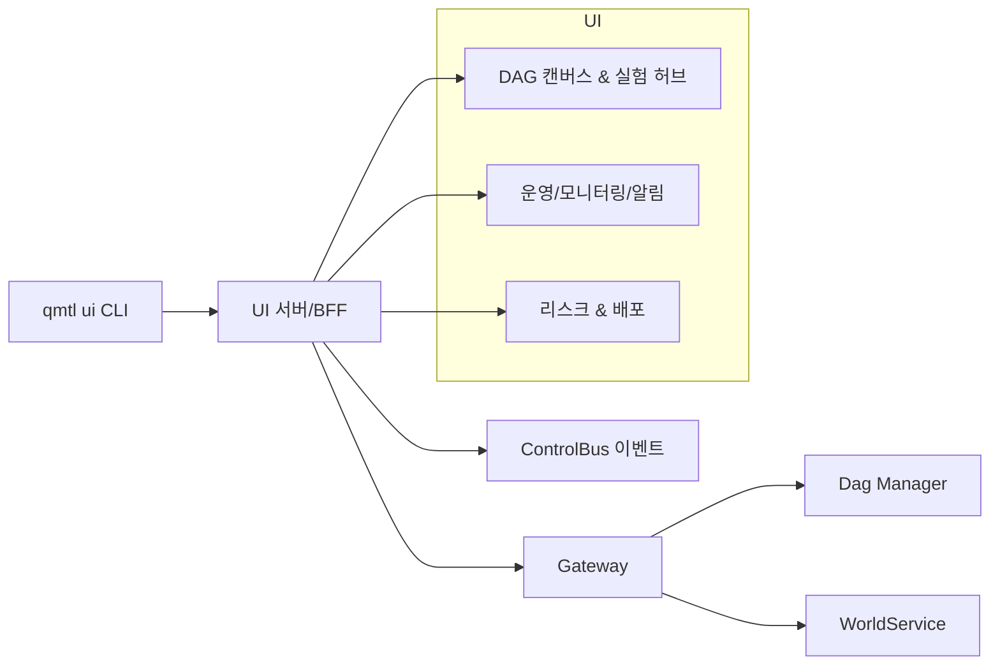

# QMTL UI 설계

## 0. 목적과 범위

- QMTL의 Gateway·DAG Manager·WorldService 경로를 시각화하고 운영할 UI를 정의한다. 새 백엔드를 추가하지 않고 기존 컴포넌트에 얇은 UI/CLI 층을 덧씌운다.
- `qmtl ui` CLI로 로컬/스테이징 UI 서버를 띄우고, 동일한 설정/시크릿(예: `config-cli`, 환경 변수)을 재사용한다.
- 대상 사용자는 전략 작성자, 런너/배포 담당자, SRE/리스크 팀이며, 핵심 흐름은 [`architecture/architecture.md`](../architecture/architecture.md), [`architecture/gateway.md`](../architecture/gateway.md), [`architecture/dag-manager.md`](../architecture/dag-manager.md)와 일관되게 설계한다.

## 1. 사용자 여정과 기능 축

- 전략 캔버스 & DAG 빌더: 노드 기반으로 데이터 소스 → 피처 추출(qmtl utils) → 시뮬레이션/실행 파이프라인을 구성·버전 관리.
- 프로젝트/포트폴리오 뷰: 전략별 상태, 최근 실행, 성능 지표(수익률·MDD·샤프·슬리피지 등), 자산군/거래소별 분포.
- 실험/백테스트 허브: 파라미터 스윕, A/B 비교, 실험 기록·메모·아티팩트(로그, 결과 파일) 보관, 재현 실행.
- 런북 & 스케줄러: 정기/이벤트 기반 실행 예약, 재시도·타임아웃 정책, DAG 상태(대기/진행/성공/실패) 실시간 스트림.
- 데이터 소스 & 커넥션: 거래소/API 키 상태, 레이트리밋/쿼터 대시보드, 헬스 체크 및 키 만료 알림.
- 모니터링/알림: 지표·오더 이벤트·지연 시간·에러율 알림(이메일/웹훅/슬랙), 규칙 기반 리스크 가드(포지션/노출/슬리피지 한도).
- 리스크 & 자본 관리: 실시간 포지션/주문/PnL, VaR/워스트케이스 시나리오, 드로다운 알림, 손절/트레일링 스톱 정책 UI.
- 배포 파이프라인: 스테이징→프로덕션 승격, 변경 요약(diff), 롤백/롤포워드, 환경 변수·시크릿 스코프 관리.
- 감사/추적성 & 협업: 실행 로그, 입력 파라미터, 코드/노드 버전, 사용자 액션 이력; 역할·권한(RBAC), 공유 링크, 코멘트/승인 워크플로.
- 템플릿 & 예제: 자주 쓰는 전략/노드 템플릿 갤러리, 빠른 시작 마법사, 문서/아키텍처 다이어그램 인라인 노출.
- 성능/비용 가시성: 실행별 리소스 사용량, 추정 비용, 캐시/재사용 히트율, 비정상적 자원 급증 감지.

## 2. UI/CLI 아키텍처 개요

- UI 서버는 Gateway HTTP/gRPC 엔드포인트와 ControlBus 이벤트를 읽는 얇은 BFF(Backend for Frontend)로 두고, 데이터 정규화/권한 매핑만 담당한다.
- 실행/배포/스케줄 요청은 DAG Manager·WorldService·Runner 경로로 위임하며, UI는 오케스트레이션 상태와 로그 스트림을 집계해 표시만 한다.
- `qmtl ui` CLI는 동일한 설정 파일을 사용하며, dev/hot-reload와 배포 모드를 구분한다.

## 3. CLI 진입점 (`qmtl ui`)

- `qmtl ui init`: UI 프로필 생성, Gateway/ControlBus 주소·토큰 연동, 로컬 `.env.ui` 스텁 생성.
- `qmtl ui up`: 프로덕션 모드로 UI 서버 실행(정적 자산 빌드 후 서빙), 기본 포트/호스트 출력.
- `qmtl ui dev`: 개발 모드 실행(핫 리로드, 프록시로 Gateway·ControlBus 연결).
- `qmtl ui status`: 실행 중인 UI 프로세스/포트/타깃 환경 확인, 헬스 체크 결과 요약.
- `qmtl ui open`: 현재 프로필의 UI URL을 브라우저로 연다(비헤드리스 환경 가정).
- `qmtl ui stop`: 로컬 UI 프로세스 종료.
- `qmtl ui export --project <id>`: 특정 전략/실험을 정적 리포트로 내보내기(옵션: 메트릭만/로그 포함).
- 모든 명령은 `--profile`, `--config`, `--env-file` 공통 플래그를 지원해 Runner/Backend 구성과 정렬한다.

## 4. 화면 모듈 및 연결 규칙

- Canvas & DAG 빌더: 노드 템플릿, 입력/출력 스키마, DAG Manager의 상태/실행 ID를 그대로 사용해 재현성을 확보한다.
- 실험/백테스트 허브: 실행 파라미터, TagQuery, 메트릭 아티팩트를 캐시하고 재실행 시 동일 파라미터/노드 버전을 고정한다.
- 런북/스케줄러: DAG Manager 스케줄 API와 동일한 정책(재시도, SLA, 타임아웃)을 UI에서 템플릿으로 제공한다.
- 모니터링/알림: ControlBus 이벤트와 Gateway 진단 엔드포인트를 구독하여 상태 변화를 스트리밍으로 노출한다.
- 배포/롤백: 환경별 시크릿/설정 차이를 diff로 노출하고, 승인 워크플로 이후에만 실행 경로를 열도록 가드한다.

## 5. 데이터·메타데이터 수집

- 전략/실험 메타: 실행 ID, NodeSet/Template 버전, 입력 파라미터, 사용 preset/world, 로그 핑거프린트.
- 리스크/포지션: WorldService/Execution Nodes의 포지션, 주문 내역, 슬리피지/레이트리밋 이벤트를 주기적으로 스냅샷.
- 관측성: 지연 시간, 에러율, 캐시 히트율, 비용 추정치를 UI 서버에서 집계 후 캐시(역시 ControlBus 이벤트 기반).

## 6. 운영·보안

- 인증/인가: Gateway 인증 계층을 그대로 사용하고, UI 세션은 단기 토큰 + 역할 기반 뷰 필터(RBAC)로 제한한다.
- 감사 로그: UI에서 발생한 액션(실행/중단/승격/롤백/설정 변경)을 별도 스트림으로 기록해 ControlBus 또는 전용 감사 채널로 전송한다.
- 실패 전략: Gateway·Dag Manager·WorldService 장애 시 UI는 읽기 전용 모드로 자동 전환하고, 재시도/대체 엔드포인트를 안내한다.

## 7. 범위 외 및 후속 과제

- 모바일 UX, 멀티 테넌시, 외부 아이덴티티 연동은 후속 범위로 둔다.
- UI 빌드/배포 파이프라인, 퍼포먼스 예산, 접근성 체크리스트는 별도 문서로 확장한다.
