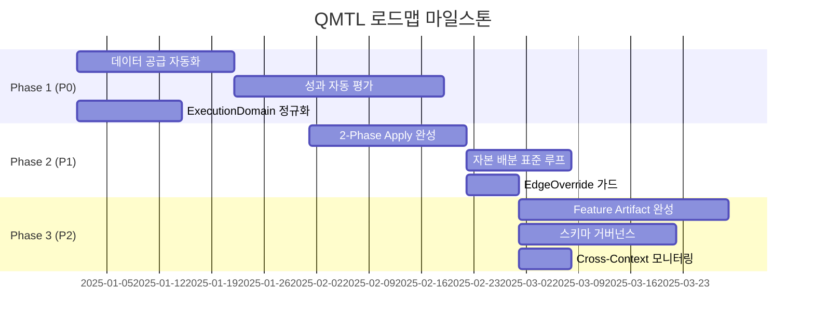

# QMTL 개발 로드맵

## 개요

이 문서는 QMTL 아키텍처 문서들(architecture.md, gateway.md, dag-manager.md, worldservice.md, seamless_data_provider_v2.md 등)에서 정의한 **Core Loop**와 **As-Is / To-Be** 분석을 바탕으로, 시스템이 발전해 나가야 할 방향과 구체적인 개선 계획을 제시합니다.

!!! abstract "Core Loop 목표"
    **"전략 작성 → 제출 → (시스템이 월드 안에서 백테스트/평가/배포) → 월드 성과 확인 → 전략 개선"**
    
    사용자는 **전략 로직에만 집중**하면 시스템이 알아서 최적화하고 수익을 낸다.

---

## 1. 핵심 격차 요약 (As-Is → To-Be)

아래 표는 각 아키텍처 영역에서 식별된 주요 격차를 정리한 것입니다.

| 영역 | As-Is 현황 | To-Be 목표 | 우선순위 |
|------|-----------|-----------|---------|
| **데이터 공급 자동화** | `history_provider`를 전략에서 직접 구성해야 함 | world + preset만으로 Seamless 자동 연결 | P0 |
| **성과 자동 평가** | `auto_returns` 미구현, ValidationPipeline과 WorldService 이원화 | 제출 시 자동 백테스트 → 평가 → 활성화 일원화 | P0 |
| **자본 자동 배분** | Runner.submit과 allocation 경로가 분리됨 | "제출 → 평가 → 배분" 표준 루프 문서화 및 CLI 통합 | P1 |
| **ExecutionDomain 정규화** | 제출 메타 힌트와 WS 결정 간 우선순위 혼란 | WS `effective_mode`만 권위 있는 소스로 통일 | P0 |
| **2-Phase Apply** | 설계 존재, ACK 수렴 부분 구현 중 | Freeze → Switch → Unfreeze 완전 자동화 | P1 |
| **Feature Artifact Plane** | 설계와 기본 어댑터 존재 | 도메인 간 안전한 읽기 전용 공유 완전 보장 | P2 |
| **스키마 거버넌스** | 최선의 노력 수준 검증 | Schema Registry + Canary/Strict 모드 도입 | P2 |

---

## 2. 로드맵 단계별 계획

### Phase 0: 기반 정비 (완료)

!!! success "완료된 항목"
    - Runner API 통합: `Runner.submit(..., world=..., mode=...)`
    - SeamlessDataProvider v2 런타임 적용
    - ValidationPipeline 기본 구현
    - WorldService 핵심 API (`/evaluate`, `/apply`, `/activation`, `/allocations`)
    - ControlBus 이벤트 발행/구독 구조
    - ComputeContext/ComputeKey 공유 모듈

---

### Phase 1: Core Loop 완성 (P0 우선순위)

**목표:** "전략 제출 → 평가 → 활성화"가 한 번의 호출로 자동으로 이어지는 경험 완성

#### 1.1 데이터 공급 자동화 (On-Ramp)

**현황:**
```python
# As-Is: 사용자가 직접 provider 구성
from qmtl.runtime.sdk import SeamlessDataProvider
provider = SeamlessDataProvider(config=...)
strategy = MyStrategy(history_provider=provider)
```

**목표:**
```python
# To-Be: world만 지정하면 preset 기반 자동 구성
Runner.submit(MyStrategy, world="crypto_mom_1h")
# → Runner가 world 설정에서 data_preset을 읽어 Seamless 자동 주입
```

**작업 항목:**

| 작업 | 설명 | 예상 공수 |
|-----|------|----------|
| `WorldDataPreset` 스키마 정의 | world 설정에 `data_preset` 섹션 추가 | 2일 |
| `Runner._resolve_data_provider()` | world preset → SeamlessDataProvider 자동 생성 | 3일 |
| CLI `--data-preset` 옵션 | 수동 오버라이드 지원 | 1일 |
| 통합 테스트 | world 기반 데이터 자동 연결 검증 | 2일 |

#### 1.2 성과 자동 평가 (`auto_returns`)

**현황:**
- `ValidationPipeline`이 Sharpe/MDD 등 지표 계산
- WorldService `/evaluate`가 활성 집합 결정
- 하지만 `backtest_returns`를 사용자가 직접 전달해야 함

**목표:**
- `auto_returns` 구현으로 "returns를 명시하지 않은 전략"도 기본 백테스트 평가 가능
- WorldService 평가 결과가 Runner/CLI에 일관되게 노출

**작업 항목:**

| 작업 | 설명 | 예상 공수 |
|-----|------|----------|
| `auto_returns` 전처리 구현 | Runner.submit 전 단계에서 히스토리 기반 returns 계산 | 5일 |
| `SubmitResult` 스키마 확장 | WS 평가 결과(active/weight/contribution/violations) 포함 | 2일 |
| ValidationPipeline ↔ WS 통합 | 로컬 평가는 힌트, WS가 최종 결정 | 3일 |
| CLI `world status` 명령 | 월드 평가/활성 상태 조회 | 2일 |

#### 1.3 ExecutionDomain 정규화

**현황:**
- 제출 메타의 `execution_domain` 힌트와 WS 결정이 혼재
- 일부 경로에서 우선순위가 불명확

**목표:**
- **WS `effective_mode`만 권위 있는 소스**로 명확히 문서화
- 제출 메타 힌트는 참조용으로만 사용

**작업 항목:**

| 작업 | 설명 | 예상 공수 |
|-----|------|----------|
| Gateway 정규화 로직 통합 | 모든 경로에서 WS 결정 우선 적용 | 2일 |
| 문서 정렬 | architecture/gateway/worldservice에 동일 규범 기술 | 1일 |
| 매핑 테이블 코드화 | `validate→backtest`, `paper→dryrun`, `live→live` 단일 함수화 | 1일 |
| 강등 메트릭 추가 | `strategy_compute_context_downgrade_total{reason=...}` | 1일 |

---

### Phase 2: 운영 자동화 (P1 우선순위)

**목표:** 2-Phase Apply 완전 자동화, 자본 배분 표준 루프 정립

#### 2.1 2-Phase Apply 완성

**현황:**
- Freeze/Drain → Switch → Unfreeze 설계 존재
- ACK 수렴 로직 부분 구현 (`requires_ack`, `sequence`)

**작업 항목:**

| 작업 | 설명 | 예상 공수 |
|-----|------|----------|
| Gateway ACK 수렴 완성 | Freeze ACK 전 Unfreeze 전파 차단 | 3일 |
| SDK ACK 응답 구현 | `sequence` 기반 선형 재생 보장 | 2일 |
| 롤백 자동화 | Switch 실패 시 이전 Activation 스냅샷 복원 | 3일 |
| Apply 상태 모니터링 | `apply_phase_duration_ms{phase=...}` 메트릭 | 1일 |
| 타임아웃 정책 | `freeze_timeout_ms` 초과 시 자동 롤백 | 2일 |

#### 2.2 자본 배분 표준 루프

**현황:**
- `/allocations`와 `/rebalancing/*` API 존재
- Runner.submit과 분리된 운영자 주도 루프

**목표:**
- "전략 평가 루프"와 "자본 배분 루프"를 **표준 두 단계 루프**로 문서화
- Runner/CLI에서 world allocations 조회/표시 가능

**작업 항목:**

| 작업 | 설명 | 예상 공수 |
|-----|------|----------|
| 표준 루프 문서화 | "평가 → 활성화 → 배분" 연결 가이드 | 2일 |
| CLI `world allocations` | 월드/전략 배분 현황 조회 | 2일 |
| `SubmitResult.allocations` | 평가 결과와 배분 정보 연결 | 1일 |
| Rebalancing v2 스키마 협상 | `alpha_metrics` 봉투 표준화 | 2일 |

#### 2.3 EdgeOverride 프로모션 가드

**현황:**
- `EdgeOverride` 레코드로 도메인 간 엣지 비활성화 가능
- 프로모션 후 수동 활성화 필요

**작업 항목:**

| 작업 | 설명 | 예상 공수 |
|-----|------|----------|
| 기본 비활성화 적용 | `backtest→live` 엣지 기본 OFF | 1일 |
| Apply 후 자동 활성화 | 2-Phase 완료 시 정책 기반 엣지 ON | 2일 |
| CLI `edges override` | 수동 오버라이드 관리 | 1일 |

---

### Phase 3: 안정성 및 확장성 (P2 우선순위)

**목표:** Feature Artifact Plane 완성, 스키마 거버넌스, 관측 가능성 강화

#### 3.1 Feature Artifact Plane 완성

**현황:**
- 설계와 FileSystem 기본 어댑터 존재
- 도메인 간 공유 정책 `share_policy` 정의됨

**작업 항목:**

| 작업 | 설명 | 예상 공수 |
|-----|------|----------|
| S3/GCS 어댑터 | 분산 환경용 객체 스토리지 지원 | 5일 |
| `dataset_fingerprint` 강제 | 아티팩트 하이드레이션 시 지문 검증 | 2일 |
| 버전 관리 및 GC | 아티팩트 보존 정책, 만료 아티팩트 정리 | 3일 |
| 읽기 전용 마운트 검증 | live 도메인에서 쓰기 시도 시 예외 발생 | 1일 |

#### 3.2 스키마 레지스트리 거버넌스

**현황:**
- 스키마 검증은 최선의 노력 수준
- 중앙 레지스트리 조회 미구현

**작업 항목:**

| 작업 | 설명 | 예상 공수 |
|-----|------|----------|
| Canary 모드 | 스키마 불일치 시 로깅만 (차단 안 함) | 3일 |
| Strict 모드 | 승인된 스키마와 다르면 응답 차단 | 2일 |
| 감사 로그 | 스키마 위반 이력 기록 | 2일 |
| 스키마 번들 핑거프린팅 | 버전 추적 자동화 | 3일 |

#### 3.3 Cross-Context 캐시 히트 모니터링

**현황:**
- `cross_context_cache_hit_total` 메트릭 설계됨
- SLO: 0 (위반 시 치명)

**작업 항목:**

| 작업 | 설명 | 예상 공수 |
|-----|------|----------|
| 메트릭 구현 | DAG Manager/SDK에서 메트릭 방출 | 2일 |
| Alert 규칙 | `> 0` 시 치명 알림 | 1일 |
| 프로모션 차단 | 위반 상태에서 Apply 거부 | 1일 |

---

## 3. 마일스톤 요약



---

## 4. 검증 기준

각 Phase 완료 시 다음 검증을 수행합니다:

### Phase 1 완료 조건
- [ ] `Runner.submit(Strategy, world="...")` 한 번으로 데이터 연결부터 평가까지 완료
- [ ] `auto_returns` 활성화 시 returns 미지정 전략도 백테스트 평가 통과
- [ ] ExecutionDomain 매핑이 모든 문서에서 일관되게 기술됨
- [ ] CLI `world status` 명령으로 평가/활성 상태 조회 가능

### Phase 2 완료 조건
- [ ] 2-Phase Apply가 ACK 수렴 포함해 완전 자동화
- [ ] Switch 실패 시 자동 롤백 동작 확인
- [ ] CLI `world allocations` 명령 동작
- [ ] EdgeOverride가 프로모션 전/후 자동 전환

### Phase 3 완료 조건
- [ ] Feature Artifact S3 어댑터 동작
- [ ] `dataset_fingerprint` 불일치 시 하이드레이션 차단
- [ ] 스키마 Canary/Strict 모드 전환 가능
- [ ] `cross_context_cache_hit_total` 메트릭 방출 및 알림 동작

---

## 5. 원칙 재확인

이 로드맵을 실행하면서 다음 원칙을 항상 준수합니다:

!!! danger "Breaking Change 원칙"
    **하위 호환성을 유지하기 위해 레거시를 장기 보관하지 않는다.**
    
    단순성을 잃는 것이 하위 호환성을 깨는 것보다 치명적이다.

!!! warning "Default-Safe 원칙"
    설정이 부족하거나 모호할수록 **compute-only(backtest) 안전 모드**로 강등한다.
    
    live로 기본 설정하지 않는다.

!!! note "Core Loop 중심 설계"
    새로운 기능을 추가할 때도 "사용자가 더 많은 옵션을 알게 만드는 대신, 
    시스템이 자동 결정하고 필요 시에만 override 하게 한다"는 방향을 기본으로 삼는다.

---

## 관련 문서

- [아키텍처 개요](../architecture/architecture.md)
- [Gateway 명세](../architecture/gateway.md)
- [DAG Manager 명세](../architecture/dag-manager.md)
- [WorldService 명세](../architecture/worldservice.md)
- [Seamless Data Provider v2](../architecture/seamless_data_provider_v2.md)
- [World 사양](../world/world.md)
