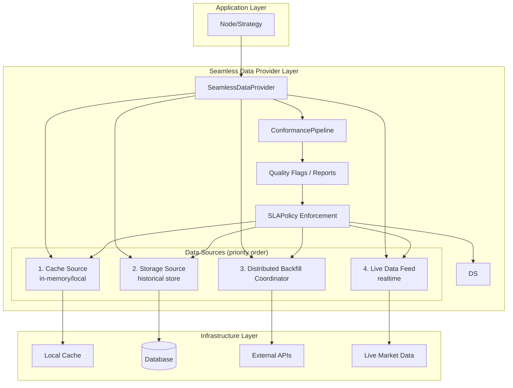

# QMTL Seamless Data Provider - 설계 문서

## 개요

**Seamless Data Provider v2** 아키텍처는 자동 백필, 컨포먼스 파이프라인, 분산 백필 코디네이터, SLA 집행, 스키마 레지스트리 거버넌스를 결합합니다. `HistoryProvider`, `EventRecorder`, `DataFetcher` 를 확장해 전략이 데이터를 항상 이용 가능한 것처럼 경험하도록 만들면서, 제공되는 데이터가 최신 스키마와 서비스 목표를 충족하도록 보장합니다.

## 설계 목표

1. **투명성**: 호출자는 데이터 출처나 가용성을 걱정하지 않고 요청합니다.
2. **자동 백필**: 누락 구간을 자동으로 가져오고 물질화합니다.
3. **부드러운 전환**: 과거 데이터와 라이브 데이터 사이의 매끄러운 핸드오프.
4. **컨포먼스 보장**: 스키마/시간 롤업 및 리포트를 시각화하고 필요 시 차단.
5. **전략 유연성**: 다양한 데이터 가용성 전략 지원.
6. **하위 호환성**: 기존 코드를 변경 없이 유지.

## 아키텍처 개요



## 핵심 구성 요소

### 1. ConformancePipeline (컴포넌트)
`SchemaRollupStage`, `TemporalRollupStage`, `RegressionReportStage` 로 구성됩니다. 각 스테이지는 기본적으로 위반 시 차단하며 `partial_ok=True` 로 완화할 수 있습니다. 2025.09 릴리스부터 `EnhancedQuestDBProvider` 는 기본적으로 `ConformancePipeline` 을 삽입하고 경고/플래그 발생 시 `ConformancePipelineError` 를 발생시킵니다. `partial_ok=True` 를 사용하면 응답은 통과하지만 동일한 리포트를 `SeamlessDataProvider.last_conformance_report` 에서 확인할 수 있습니다. 리포트는 대시보드와 감사를 위해 `qmtl://observability/seamless/<node>` 경로에 업로드됩니다.

### 2. SLAPolicy (구성)
지연/신선도 한도를 정의합니다. 프로바이더는 각 요청의 단계별 시간과 커버리지를 추적하고 `seamless_sla_deadline_seconds` 히스토그램과 트레이스를 게시합니다. 위반 시 `SeamlessSLAExceeded` 를 발생시키고 `alert_rules.yml` 의 `seamless-*` 규칙으로 경보합니다.

### 3. DistributedBackfillCoordinator (서비스)
이전 인메모리 스텁을 Raft 기반 코디네이터로 대체해 정렬된 리스를 관리하고, 스테일 클레임을 감지하며, 부분 완료를 추적하고 `backfill_completion_ratio` 를 내보냅니다. `scripts/lease_recover.py` 로 수동 개입을 지원합니다.

### 4. DataAvailabilityStrategy (enum)
누락 데이터를 처리하는 방식을 제어합니다.

- **FAIL_FAST**: 데이터가 없으면 즉시 예외
- **AUTO_BACKFILL**: 반환 전 누락 구간을 가져와 물질화
- **PARTIAL_FILL**: 사용 가능한 데이터만 즉시 반환하고 백그라운드 백필
- **SEAMLESS**: 모든 소스를 결합해 투명 접근 제공

### 5. DataSource (프로토콜)
모든 소스가 구현하는 공통 인터페이스:

```python
class DataSource(Protocol):
    priority: DataSourcePriority
    
    async def is_available(...) -> bool
    async def fetch(...) -> pd.DataFrame
    async def coverage(...) -> list[tuple[int, int]]
```

### 6. AutoBackfiller (프로토콜)
자동 백필 인터페이스:

```python
class AutoBackfiller(Protocol):
    async def can_backfill(...) -> bool
    async def backfill(...) -> pd.DataFrame
    async def backfill_async(...) -> AsyncIterator[pd.DataFrame]
```

### 7. SeamlessDataProvider (추상 기반)
핵심 로직을 구현합니다.

- 컨포먼스 스테이지 실행 및 실패 시 차단
- 다중 데이터 소스 오케스트레이션
- 우선순위 기반 데이터 조회
- SLA 예산 회계 및 메트릭
- 자동 백필 트리거
- 범위 병합 및 갭 감지

## 구현 세부 사항

### 조회 알고리즘

1. **우선순위 순으로 소스 프로브**
   - 캐시(가장 빠름)
   - 스토리지(빠름)
   - 백필(느림)
   - 라이브(변동 지연)

2. **범위 분할 및 병합**
   - 각 소스가 제공할 수 있는 윈도우로 요청 범위를 분할
   - 결과를 시간 순으로 병합
   - 중복 제거 및 일관성 유지

3. **자동 백필 트리거**
   - 누락 구간 감지
   - 백필 가능 여부 확인
   - 동기/비동기 백필 실행
  - 결과를 대상 스토어에 물질화

### 범위 관리 알고리즘

```python
def _merge_ranges(ranges: list[tuple[int, int]]) -> list[tuple[int, int]]:
    """겹치는 범위를 병합"""
    
def _find_missing_ranges(start, end, available_ranges) -> list[tuple[int, int]]:
    """누락 범위를 찾아 반환"""
    
def _intersect_ranges(ranges1, ranges2) -> list[tuple[int, int]]:
    """두 범위 목록의 교집합"""
    
def _subtract_ranges(from_ranges, subtract_ranges) -> list[tuple[int, int]]:
    """범위 목록에서 다른 범위 목록을 뺍니다"""
```

실제 구현에서는 인터벌 인지 병합과 갭 감지를 위해 SDK 유틸리티를 사용하세요.

- `qmtl.runtime.sdk.history_coverage.merge_coverage()`
- `qmtl.runtime.sdk.history_coverage.compute_missing_ranges()`

이 함수들은 바 정렬과 인접 인터벌 병합을 일관되게 처리합니다.

## 기존 시스템과의 통합

### 1. HistoryProvider 확장
`QuestDBLoader` 를 `EnhancedQuestDBProvider` 로 업그레이드합니다.

```python
class EnhancedQuestDBProvider(SeamlessDataProvider):
    def __init__(self, dsn, *, fetcher=None, live_fetcher=None, **kwargs):
        # 기존 QuestDBLoader를 storage_source로 사용
        # DataFetcher를 AutoBackfiller로 감쌈
        # 필요 시 live_fetcher 지원
```

### 2. StreamInput 통합
`StreamInput` 노드와 완전히 호환됩니다.

```python
stream_input = StreamInput(
    history_provider=EnhancedQuestDBProvider(...)  # 기존 노드 코드 변경 없음
)
```

### 3. 점진적 마이그레이션

```python
# 기존 코드
provider = QuestDBLoader(dsn, fetcher=my_fetcher)
await provider.fill_missing(...)  # 수동 백필
data = await provider.fetch(...)

# 새로운 코드
provider = EnhancedQuestDBProvider(dsn, fetcher=my_fetcher)
data = await provider.fetch(...)  # 자동 백필
```
