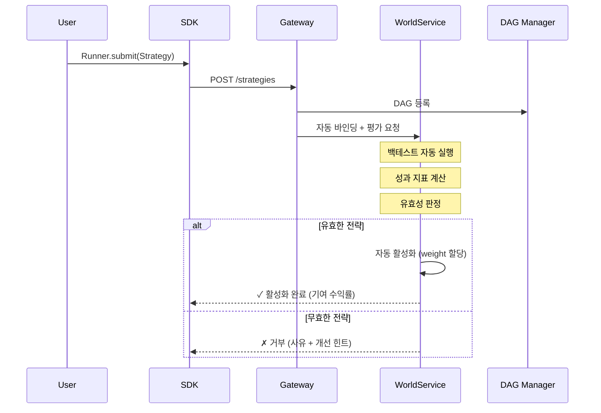

# QMTL 단순화 제안서

!!! success "구현 완료"
    이 제안서의 핵심 내용은 **QMTL v2.0**으로 구현되었습니다.
    
    - ✅ Phase 1: `Runner.submit()` API 통합 완료
    - ✅ Phase 2: `Mode` enum 통합 (`backtest | paper | live`)
- ✅ Phase 3: CLI 플랫화 및 레거시 숨김
- ✅ 모든 예제 및 문서 v2 API로 업데이트

## 2025-Q4 업데이트

- `Runner.submit`/`ValidationPipeline`이 WS 정책/프리셋을 조회해 검증하며, 단조성(모노토닉) 수익률 보호 가드를 추가했습니다.
- CLI v2 `status`/`world`가 Gateway와 연동되어 월드 생성 시 프리셋 정책을 저장하고 조회합니다.

### 0. As‑Is / To‑Be (단순화 관점 요약)

- As‑Is
  - 이 문서는 v2.0 단순화(Runner.submit 단일 진입점, Mode 통합, CLI v2)를 중심으로 구현 완료 상태를 설명하지만, auto_returns, WorldService 평가/활성/배분 일원화, world/preset 기반 데이터 on‑ramp 같은 후속 단순화는 Core Loop 관점에서 여전히 과제로 남아 있습니다.
- To‑Be
- 본 문서의 “단순화 목표” 절은 [rewrite_architecture_docs.md](../../../docs_archive/rewrite_architecture_docs.md)에 정리된 네 축(Core Loop)을 기준으로 갱신되어, 앞으로의 단순화(P1/P2: auto_returns+SR 통합, WS 평가/할당 일원화)를 명시적으로 추적합니다.
  - v2.0 이후 단순화 작업은 Maintenance/Radon 문서와 함께 이곳에서 요약·링크되어, 독자가 “현재 세대의 canonical path”를 항상 한 문서에서 찾을 수 있게 합니다.

## 1. 초기 설계 목적 재확인

QMTL의 핵심 목적:
1. **DAG 기반 전략 구성 단순화** - 사용자는 전략 로직만 작성
2. **시스템이 최적화/관리 전담** - 연산 재사용, 스케줄링, 리소스 관리
3. **자동 유효성 평가 및 배포** - 전략 제출 → WorldService가 평가 → 유효하면 자동 배포
4. **수익률 자동 증가** - 유효한 전략이 제출될 때마다 월드의 수익률이 늘어나는 구조

**이상적인 사용자 경험:**
```
전략 작성 → 제출 → (시스템이 알아서 평가/배포) → 수익률 증가 확인
```

**사용자가 반드시 이해해야 할 최소 개념(3개 이내):**
- **전략(Strategy)**: DAG 노드 집합으로 구현된 수익 창출 로직
- **월드(World)**: 전략들이 함께 운용되는 단일 포트폴리오 컨텍스트
- **모드(Mode)**: `backtest | paper | live` 중 하나의 실행 모드

## 2. 현재 복잡해진 영역들

### 2.1 복잡해진 부분 식별

| 영역 | 현재 상태 | 복잡성 원인 | 단순화 방향 |
|------|---------|------------|------------|
| **ExecutionDomain 매핑** | 4단계 매핑 (effective_mode → execution_domain) | WS/Gateway/SDK 간 변환 레이어 | 통합 |
| **2-Phase Apply** | Freeze→Switch→Unfreeze + ACK | 라이브 전환 안정성 우선 설계 | 자동화 |
| **Compute Context** | 10+ 필드 (as_of, dataset_fingerprint, etc.) | 재현성/감사 추적 요구 | 디폴트 설정 |
| **World Binding/WSB** | 전략-월드 바인딩 수동 관리 | 다중 월드 지원 | 자동 바인딩 |
| **Gating Policy YAML** | 40+ 라인 설정 | 모든 엣지 케이스 커버 | 프리셋 제공 |
| **CLI 구조** | 4단계 depth (qmtl → service → sdk → run) | 모듈별 분리 | 플랫화 |
| **ValidationCache/EvalKey** | blake3 해시 체인 | 캐시 무효화 정확성 | 투명화 |

### 2.2 사용자 관점 Pain Points


**현재 전략 제출 플로우 (너무 많은 단계):**
1. Strategy 클래스 작성 ✓ (간단)
2. qmtl.yml 설정 ✗ (복잡 - 서비스 DSN, 포트 등)
3. World 생성/선택 ✗ (새로운 개념 학습 필요)
4. Policy 설정 ✗ (YAML 40+ 라인)
5. 제출 API 호출 시 파라미터 ✗ (world_id, gateway_url 등)
6. 결과 해석 ✗ (effective_mode, execution_domain 이해)

## 3. 단순화 제안

### 3.1 [P0] 제로-설정 전략 제출

**목표:** `Runner.submit(MyStrategy)` 한 줄로 전략 제출 및 수익률 기여

```python
# After: 제안
Runner.submit(MyStrategy)  # 디폴트 월드에 자동 제출
# 또는
Runner.submit(MyStrategy, world="prod")  # 특정 월드 지정
```

**구현 방향:**
- 디폴트 월드 (`__default__`) 자동 생성
- 환경변수 기반 Gateway URL 검색 (`QMTL_GATEWAY_URL`)
- 정책은 월드 레벨 디폴트로 자동 적용
- 프리셋 지정 시 Gateway/WorldService까지 정책이 자동 전파되며 `qmtl submit --preset`과 `qmtl world info`로 정책을 확인할 수 있음

### 3.2 [P0] 자동 유효성 평가 파이프라인

**목표:** 제출만 하면 시스템이 알아서 평가하고 유효한 전략은 자동 활성화



**핵심 변화:**
- `evaluate → apply` 수동 호출 제거
- 백테스트 자동 실행 (히스토리 데이터 사용)
- 통계적 유의성 자동 검증
- 기존 전략과의 상관관계 자동 체크

### 3.3 [P1] 단순화된 정책 프리셋

**Before: 현재 복잡한 Gating Policy**
```yaml
gating_policy:
  promotion_point: "2025-10-01T00:00:00Z"
  apply: { mode: two_phase, freeze_timeout_ms: 30000 }
  domains: { from: backtest, to: live }
  clocks:
    backtest: { type: virtual, epoch0: "2020-01-01T00:00:00Z" }
    live: { type: wall }
  dataset_fingerprint: "ohlcv:ASOF=2025-09-30T23:59:59Z"
  share_policy: "feature-artifacts-only"
  snapshot:
    strategy_plane: "cow"
    feature_plane: "readonly"
  risk_limits:
    max_pos_usd_long: 500000
    max_pos_usd_short: 500000
  # ... 40+ 라인
```

**After: 프리셋 기반**
```yaml
# 월드 설정 전체
world:
  name: "my_world"
  policy: conservative  # 프리셋: conservative | moderate | aggressive
  
  # 옵션: 오버라이드만 지정
  overrides:
    risk_limits.max_pos_usd: 100000
```

**프리셋 정의:**
| 프리셋 | 설명 | 주요 설정 |
|--------|------|----------|
| `sandbox` | 테스트/개발용 | 라이브 비활성, 제한 없음 |
| `conservative` | 보수적 운용 | 낮은 포지션, 긴 hysteresis |
| `moderate` | 균형 잡힌 운용 | 중간 설정 |
| `aggressive` | 적극적 운용 | 높은 포지션, 짧은 hysteresis |

**적용 모드:**
- `shared`: 프리셋 월드를 그대로 사용 (디폴트)
- `clone`: 프리셋 정책을 복제해 내 월드에 적용
- `extend`: 프리셋을 상속하되 일부 임계값만 오버라이드 (예: `--preset-override max_drawdown.max=0.15`)

**비목표(Non‑Goal):**
- Core Loop 단순화와 정책 프리셋 도입의 목표는 **사용자가 직접 작성해야 하는 월드/정책 설정 표면을 줄이는 것**이지, WorldService 정책 엔진이 표현할 수 있는 게이팅·리스크·관측 정책의 **표현력을 줄이는 것이 아니다.**
- 기존 `gating_policy` 정규 스키마는 WorldService 내부 SSOT로 유지되며, 프리셋/오버라이드·운영용 도구는 이 스키마로 컴파일되는 상위 레벨 인터페이스로 취급한다. 필요 시 고급/운영 플로우용 별도 진입점으로 세밀한 게이팅을 재노출할 수 있어야 한다.

### 3.4 [P1] CLI 플랫화

**Before:**
```bash
qmtl service sdk run MyStrategy --world-id demo --gateway-url http://gw
qmtl tools sdk --help
qmtl project init --path my_project --preset minimal
```

**After:**
```bash
qmtl submit my_strategy.py            # 전략 제출 (메인 유스케이스)
qmtl submit my_strategy.py --preset aggressive  # 프리셋 정책과 함께 제출
qmtl status                           # 내 전략들 상태 확인
qmtl world list                       # 월드 목록
qmtl init my_project                  # 프로젝트 초기화
```

**명령어 우선순위:**
1. `submit` - 전략 제출 (핵심)
2. `status` - 상태 확인
3. `world` - 월드 관리
4. `init` - 프로젝트 생성

### 3.5 [P1] 투명한 수익률 피드백

**목표:** 전략 제출 후 즉시 기여도 확인

```python
result = Runner.submit(MyStrategy)

print(result)
# StrategySubmitResult(
#     strategy_id="mom_btc_1h_v3",
#     status="active",
#     world="__default__",
#     contribution=0.023,  # 월드 수익률에 2.3% 기여
#     weight=0.15,         # 포트폴리오 내 비중
#     rank=7,              # 월드 내 순위
#     metrics={
#         "sharpe": 1.85,
#         "max_drawdown": -0.12,
#         "correlation_avg": 0.23,
#     }
# )
```

### 3.6 [P2] ExecutionDomain 통합

**Before: 복잡한 매핑**
```
effective_mode (WS) → execution_domain (Gateway) → 동작 (SDK)
- validate → backtest → orders OFF
- compute-only → backtest → orders OFF  
- paper → dryrun → simulated orders
- live → live → real orders
```

**After: 단일 개념**
```
mode: backtest | paper | live
```

- `backtest`: 과거 데이터 시뮬레이션 (자동 평가에 사용)
- `paper`: 실시간 데이터, 가상 주문
- `live`: 실시간 데이터, 실제 주문

내부적으로는 기존 매핑 유지하되, 사용자 인터페이스에서는 3가지만 노출.

### 3.7 [P2] 월드 수익률 단조 증가를 위한 WorldService 정책

**목표:** “유효한 전략이 제출될 때마다 월드 수익률이 늘어난다”는 이상을 WorldService 정책 수준에서 최대한 보장

- **유효성 정의:** 단순 “백테스트 통과”가 아니라, 월드 포트폴리오 기준 **위험 조정 수익(Risk-adjusted Return)** 을 개선하는 전략만 `valid`로 간주  
  - 예: `ΔSharpe > 0` & 최대 드로다운/변동성 제약 만족 & 기존 전략과 상관관계 상한 이하
- **자동 활성화/가중치 배분:** `valid` 전략은 운영자가 개입하지 않아도 WS가 기본 포트폴리오 최적화 규칙에 따라 가중치를 자동 할당  
  - 기본 정책 예시: 위험 균형(Risk-parity) + 개별 전략 가중치 상한 + 월드 단위 리스크 버짓
- **자동 감시 및 다운웨이트:** 라이브 이후 성과가 기준선보다 악화되면 WS가 가중치를 자동 축소하거나 비활성화  
  - 승급 기준과 동일한 메트릭(Sharpe, Drawdown, 상관관계)을 사용해 **프로모션/디모션**을 모두 자동화
- **사용자 관점 계약:** 사용자는 “전략 제출 → `valid`이면 월드에 기여한다”라는 계약만 신경 쓰면 되고,  
  내부 ExecutionDomain, 2‑Phase Apply, Activation 세부 상태를 직접 확인하거나 제어할 필요가 없다.

## 4. 핵심 원칙: 단순성 > 하위 호환성

!!! danger "Breaking Change 원칙"
    **하위 호환성을 유지하기 위해 레거시를 남기지 않는다.**
    
    하위 호환성 유지를 위해 기존 API/설정을 병존시키면:
    - 문서가 두 배로 늘어남 ("구 방식" vs "신 방식")
    - 코드베이스에 분기가 누적됨
    - 신규 사용자가 "어떤 방식이 맞는지" 혼란
    - 결국 단순화 목적 자체가 무효화됨
    
    **단순성을 잃는 것이 하위 호환성을 깨는 것보다 치명적이다.**

### 마이그레이션 전략

레거시 API는 **deprecation 경고와 함께 유지**하며, 문서와 예제를 v2 패턴으로 통일한다:

**수동 마이그레이션 가이드:**
- `Runner.run(world_id=, gateway_url=)` → `Runner.submit(world=)`
- `Runner.offline()` → `Runner.submit(mode=Mode.BACKTEST)`
- `qmtl service sdk run` → `qmtl submit`
- `execution_domain` 파라미터 → `mode`

> **참고:** 자동 마이그레이션 도구는 코드 손상 위험으로 제공하지 않습니다.
> 수동으로 패턴을 교체하고 테스트하세요.

## 5. 구현 우선순위

### Phase 1: 깔끔한 슬레이트 (1-2주)

1. **`Runner.submit()` API로 통일**
   - `Runner.run()` 완전 제거
   - `Runner.submit(MyStrategy)` 단일 진입점
   - 디폴트 월드/Gateway 자동 검색
   
2. **CLI 완전 재설계**
   - 기존 다단계 구조 전체 제거
   - `qmtl submit`, `qmtl status`, `qmtl world`, `qmtl init` 4개만 유지

3. **정책 프리셋 시스템**
   - 기존 월드 설정에서 사용자 정의 `gating_policy` YAML을 직접 기술하는 패턴 제거
   - 4개 프리셋 + 간단한 오버라이드만 지원하되, 내부에서는 WorldService의 `gating_policy` 정규 스키마로 컴파일해 동일한 표현력을 유지

### Phase 2: 자동화 파이프라인 (2-4주)

4. **자동 유효성 평가 파이프라인**
   - 제출 시 백테스트 자동 트리거
   - 성과 지표 자동 계산
   - 임계값 기반 자동 활성화

5. **수익률 피드백 시스템**
   - `StrategySubmitResult` 스키마 정의
   - 실시간 기여도 계산 로직

### Phase 3: 내부 정리 (4-6주)

6. **ExecutionDomain 통합**
   - 내부 4단계 매핑 → 단일 `mode` 개념으로 통합
   - 관련 코드/문서 전면 정리

7. **코드베이스 슬림화**
   - 레거시 호환 분기 코드 전량 삭제
   - 테스트 케이스 정리 (레거시 테스트 제거)

## 6. 제거 대상 (Breaking Changes)

### 완전 제거되는 API/개념

| 제거 대상 | 대체 | 마이그레이션 |
|----------|-----|-------------|
| `Runner.run(world_id=, gateway_url=)` | `Runner.submit(world=)` | 자동 변환 |
| `Runner.offline()` | `Runner.submit(mode="backtest")` | 자동 변환 |
| `qmtl service sdk run` | `qmtl submit` | CLI 자동 감지 |
| `qmtl tools sdk` | 제거 (통합) | - |
| `qmtl project init` | `qmtl init` | CLI 자동 감지 |
| `execution_domain` 파라미터 | `mode` | 자동 변환 |
| `effective_mode` 노출 | 내부 전용 | - |
| 복잡한 gating_policy YAML | 프리셋 기반 | 자동 변환 |
| 2-Phase Apply 수동 호출 | 자동화 (내부) | - |
| WSB 수동 바인딩 | 자동 바인딩 | - |

### 왜 Deprecation이 아닌 즉시 제거인가?

```
Deprecation 주기를 거치면:
1. v2.0: 신규 API 추가 + 기존 API에 경고
2. v2.1~2.x: 두 API 공존 (문서 혼란, 코드 분기)
3. v3.0: 기존 API 제거

→ 최소 1년간 복잡성이 오히려 증가
→ 그 사이 "신규 사용자"가 레거시를 학습하는 역설
```

**즉시 제거 + 마이그레이션 도구**가 더 낫다:
- 한 번의 명확한 전환점
- 모든 문서/예제가 단일 방식
- 신규 사용자에게 혼란 없음

## 7. 성공 지표

| 지표 | 현재 | 목표 |
|-----|-----|-----|
| 첫 전략 제출까지 소요 시간 | ~30분 | <5분 |
| 설정 파일 라인 수 | 40+ | <10 |
| 필수 학습 개념 | 8개 | 3개 |
| CLI 명령어 depth | 4 | 2 |
| 레거시 호환 코드 라인 | ~2000 | 0 |
| API 진입점 수 | 5+ | 1 (`Runner.submit`) |

## 8. 결론

QMTL의 핵심 가치는 "전략 로직에만 집중하면 시스템이 알아서 최적화하고 수익을 낸다"입니다.
현재 구현은 안정성과 확장성을 위해 많은 레이어가 추가되었지만, 이로 인해 핵심 가치가
희석되었습니다.

### 핵심 결정: 하위 호환성을 포기한다

> **"하위 호환성 유지로 인한 복잡성이 단순화의 가치를 상쇄한다면, 
> 하위 호환성을 포기하는 것이 올바른 선택이다."**

이 제안은:
- 레거시 API를 **즉시 제거**한다
- Deprecation 주기를 거치지 않는다
- 마이그레이션 도구로 기존 사용자의 전환을 지원한다
- 모든 문서와 예제를 단일 방식으로 통일한다

### 기대 효과

1. **신규 사용자**: 5분 안에 첫 전략 제출, 혼란 없이 단일 방식 학습
2. **기존 사용자**: 일회성 마이그레이션 후 더 간단한 인터페이스 사용
3. **유지보수**: 레거시 분기 코드 제거로 코드베이스 50%+ 축소

```
현재: 전략 작성 → 설정 → 월드 → 정책 → 바인딩 → 제출 → 평가 → 확인
제안: 전략 작성 → 제출 → (자동) → 기여도 확인
```

### 버전 전략

이 변경은 **QMTL v2.0**으로 릴리스한다:
- v1.x: 현재 복잡한 구조 (유지보수 모드)
- v2.0: 단순화된 구조 (레거시 API deprecated)
