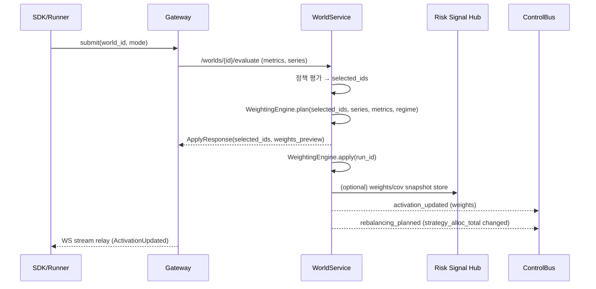

# World 전략 비중 조절(Weighting) v1.5 설계 초안

본 문서는 QMTL **WorldService(WS)** 가 월드 내부의 전략 비중을 **이론 기반 포트폴리오 최적화 기법**으로 자동 조절하는 기능을 추가하기 위한 설계 초안이다.  
월드 내 전략을 “자산(슬리브)”으로 보고, **성과/리스크/레짐 정보를 입력으로 받아 전략 가중치(=strategy_alloc_total, activation.weight)를 산출·적용**한다.

관련 문서:
- World/전략 생애주기 사양: [world/world.md](../world/world.md)
- WorldService SSOT/Activation/Apply: [architecture/worldservice.md](../architecture/worldservice.md)
- 리밸런싱 계약/캐스케이드: [world/rebalancing.md](../world/rebalancing.md)
- World 검증 v1.5 진행 현황: [design/world_validation_v1.5_implementation.md](world_validation_v1.5_implementation.md)
- Risk Signal Hub(실현 리스크/공분산 입력): [architecture/risk_signal_hub.md](../architecture/risk_signal_hub.md)

---

## 0. 배경 & 문제 정의

현재 WS는 정책 엔진으로 **전략 선정(top‑k/상관/히스테리시스)** 까지는 수행하지만,  
선정된 전략들의 **상대 비중(리스크/기대수익 기반 weight)** 은 다음 두 경로로만 갱신된다:
1) 외부 “성과 기반 가중치 모듈”이 산출해 `/allocations`에 전달  
2) 월드 비중 리밸런싱의 캐스케이드(전략 상대비율 유지)

즉, WS 내부에는 **전략 비중을 체계적으로 산출·적용하는 1급 모듈**이 아직 없다.  
특히 1m 선물/퍼프 환경에서는 평균수익 추정이 불안정하고 레짐 전환이 잦아,
**단순 Sharpe 비례 가중치**로는 월드 리스크가 특정 전략에 쏠리거나
레짐 변화 시 과도한 레버리지/턴오버가 발생할 수 있다.

따라서 WS에 **“월드 내 전략 비중 조절 엔진”을 내장**해,
아래 업계/학계 검증 기법들을 정책적으로 선택·조합하고
안전 제약 하에서 자동 리밸런싱을 수행할 수 있도록 한다.

---

## 1. 목표 & 비범위

### 1.1 목표
- WS가 월드 내부 전략을 입력 시계열 기반 “자산”으로 보고
  **전략 상대 비중 벡터 `w_world(strategy_id)`** 를 산출한다.
- 산출된 비중을
  - **Activation weight**(주문 스케일링, side‑level)과
  - **strategy_alloc_total**(총자산 대비 비중, rebalancer 입력)
  로 저장·전파한다.
- 정책(YAML)로 기법/윈도우/제약/스무딩/턴오버 상한을 선언하고,
  WS는 동일 계약으로 plan/apply를 제공한다.
- 데이터 부족/불안정/제약 실패 시 **fail‑safe 폴백**으로 수렴한다.

### 1.2 비범위
- 월드 간 자본 배분(world_alloc) 최적화(별도 allocator 범위).
- 레짐 탐지 자체의 신규 백엔드 서비스 도입(입력 제공자만 정의).
- 전략(알파) 로직을 `qmtl/`에 추가하는 일(전략은 `strategies/` 범위).

---

## 2. 시스템 개요 (WS 전략 비중 엔진)

WS는 기존 Core Loop 흐름을 유지하면서, **선정 이후 “비중 산출 단계”를 추가**한다.



핵심 SSOT 경계:
- **전략 선정/가중치/활성화/할당**의 SSOT는 WS.
- Gateway는 프록시/중계만 수행하며, 가중치 계산을 하지 않는다.

---

## 3. 입력 데이터 계약

### 3.1 전략 시계열 입력(필수)
WeightingEngine은 아래 중 하나를 전략별로 입력받는다.
- `StrategySeries.returns`: 일별(또는 바‑집계 후 일 단위) 수익률 시계열
- `StrategySeries.pnl`: 일별 PnL 시계열
- `StrategySeries.equity`: 일별 equity curve

입력 경로:
- backtest/paper: Runner가 `EvaluateRequest.series`로 전달  
  (현재 reports/*backtest*.json에서 추출 가능)
- live: Risk Signal Hub의 realized snapshot 또는 Live EvaluationRun
  (`live_metrics` 워커가 30/60/90일 realized Sharpe/DD/ES 생성)

### 3.2 메트릭 입력(선택)
기법/제약에 따라 아래 메트릭을 참조한다.
- `returns.*`: Sharpe, Sortino, MDD, VaR/ES 등 (`EvaluationMetrics`)
- `sample.*`: 최소 거래수/유효 연수
- `robustness.*`: DSR, CV gap 등
- `risk.*`: incremental VaR/ES, exposure 등

### 3.3 레짐 입력(선택)
Mixture‑of‑Experts(MoE)용.
- `diagnostics.extra_metrics.regime_posterior`: `{regime: prob}` (시점별 or 최근값)
- 또는 `diagnostics.extra_metrics.regime_metrics`: `{regime: {strategy_id: sharpe/pf/...}}`

레짐 산출은 **외부 RegimeProvider(전략/노드/워커)** 가 담당하고,
WS는 제공된 확률/조건부 성과만 소비한다.

---

## 4. WeightingEngine 설계

### 4.1 플러그형 인터페이스
`qmtl/services/worldservice/weighting/`에 아래 인터페이스를 추가한다.

- `StrategyWeightingEngine.plan(ctx) -> WeightPlan`
  - 입력: `world_id`, `strategy_ids`, `series`, `metrics`, `regime_payload`, `policy.weighting`
  - 출력: `weights_by_strategy`, `diagnostics`, `warnings`
- `StrategyWeightingEngine.apply(plan, execute=False) -> WeightApplyResult`
  - Activation/allocations 저장, ControlBus 이벤트 발행, 선택적 리밸런싱 execute

### 4.2 공통 전처리
- **일 단위 정규화**: bar‑PnL/returns는 일별로 리샘플링.
- **윈도우 선택**: `lookback_days` 또는 stage‑별 기본값(backtest=전체, live=60d).
- **클린/필터링**: NaN/inf 제거, 최소 표본수(`min_history_days`, `min_trades_total`) 미달 전략 제외.
- **공분산 추정(필요 시)**:
  - EWMA 또는 Ledoit‑Wolf shrinkage 기본.
  - 표본 부족 시 diagonal‑only로 축소(=독립 가정).

### 4.3 공통 제약/스무딩
- `max_weight`, `min_weight`(0 허용), `max_leverage`(총합 또는 per‑strategy)
- `max_dd`, `max_var_es` 등 리스크 컷 미달 전략은 weight=0
- **턴오버 상한**: `||w_t - w_{t-1}||_1 ≤ max_turnover`
- **EWMA 스무딩**: `w_t = α w_plan + (1-α) w_{t-1}`
- 제약 불만족/해결 실패 시 폴백(§9).

---

## 5. 지원 기법(알고리즘) 상세

각 기법은 `method`로 선택하며, 공통 전처리/제약을 공유한다.

### 5.1 Constrained Mean‑Variance / Max‑Sharpe
**입력:** 전략별 일 수익률(또는 PnL), 공분산.  
**특징:** 1m 선물의 평균추정 불안정성을 고려해 **기대수익을 Sharpe/Sortino 기반으로 대체**하고 강한 제약을 둔다.

- 기대수익 벡터:
  - `μ_i := Sharpe_i × σ_i` (또는 Sortino 기반)
- 최적화:
  - 목적: `min w^T Σ w` (risk‑min) 또는 `max (w·μ)/sqrt(w^T Σ w)` (max‑Sharpe)
  - 제약: `Σ w_i = 1`, `0 ≤ w_i ≤ max_weight`,  
    `n_active ≥ min_active_strategies`,  
    `DD_i ≤ max_dd`, `n_trades_i ≥ min_trades_total`
- 구현:
  - v1.5: cvxpy/OSQP 기반 QP(선택), 실패 시 휴리스틱 폴백.

### 5.2 Risk Parity / Volatility Targeting
**입력:** 최근 실현 변동성(30‑60d).  
**특징:** 기대수익 추정 없이도 안정적.

- inverse‑vol 기본:
  - `w_i ∝ 1/σ_i`, 정규화
- (옵션) marginal risk parity:
  - `RC_i = w_i (Σ w)_i` 가 동일하도록 반복 갱신
- vol target:
  - 월드 목표 변동성 `σ_target`에 맞춰  
    `scale = σ_target / σ_portfolio` 를 별도 출력(세계 레버리지 계층에서 사용)

### 5.3 HRP (Hierarchical Risk Parity)
**입력:** 상관 행렬.  
**특징:** 상관 구조 기반 클러스터링 → 추정 오차에 강함.

1) 상관→거리 변환 `d_ij = sqrt((1-ρ_ij)/2)`  
2) 계층적 클러스터링(linkage=`single|ward`)  
3) quasi‑diagonalization으로 순서 재배치  
4) recursive bisection으로 클러스터 분산 역비례 배분  
5) 공통 제약/턴오버 적용 후 정규화

### 5.4 Fractional Kelly Scaling
**입력:** 전략별 edge(PF, Sharpe, mean/var).  
**특징:** 고레버리지 선물 환경에서 **레버리지 최적화에 정합적**. 과최적화 방지를 위해 fractional 사용.

- 근사 Kelly:
  - `f_i = μ_i / σ_i^2` 또는 `f_i = (PF_i-1)/Var_i`
- fractional 적용:
  - `f_i' = k × f_i`, `k ∈ [0.25, 0.5]`
- 최종 weight:
  - base weight(예: HRP/RP/MV) × `f_i'` 로 스케일 → cap → 정규화

### 5.5 레짐‑컨디셔널 Mixture‑of‑Experts(MoE)
**입력:** 레짐별 조건부 성과 + 레짐 posterior.  
**특징:** on/off 라벨 대신 **soft weight**로 레짐 전환에 부드럽게 적응.

- 레짐 r에서:
  - `w_i(r) ∝ max(0, Sharpe_i(r))` (또는 PF/Sortino)
  - softmax 온도 `τ`로 완만화:  
    `w_i(r)=softmax( max(0,m_i(r))/τ )`
- 시점 t 최종 weight:
  - `w_i(t) = Σ_r p_t(r) w_i(r)`
- 이후 공통 스무딩/턴오버/제약 적용.

---

## 6. 정책(YAML) 스키마 확장

`Policy`에 `strategy_weighting` 블록을 추가한다(역호환: 미지정 시 Sharpe‑비례 폴백).

```yaml
strategy_weighting:
  method: constrained_mv        # constrained_mv | risk_parity | hrp | fractional_kelly | moe
  lookback_days: 60
  rebalance_interval: "1d"      # or cron, stage별 override 가능
  constraints:
    max_weight: 0.40
    min_weight: 0.02
    min_active_strategies: 3
    min_trades_total: 30
    max_dd: 0.30
    max_turnover: 0.20
  mv:
    objective: max_sharpe       # max_sharpe | min_var
    expected_return_source: sortino
    cov_estimator: ewma         # ewma | shrinkage | diagonal
  risk_parity:
    vol_target: 0.15
  hrp:
    linkage: ward
  kelly:
    fraction: 0.25
    edge_source: profit_factor
  moe:
    regimes: [low_vol, mid_vol, high_vol]
    temperature: 1.0
    smoothing_half_life_days: 7
```

---

## 7. WS API 설계

### 7.1 Plan
`POST /worlds/{world_id}/strategy-weights/plan`
- 입력: `EvaluateRequest` 호환 payload(series/metrics/stage/previous/override) + 선택적 `run_id`
- 출력:
  ```json
  {
    "world_id": "...",
    "run_id": "...",
    "method": "hrp",
    "weights_by_strategy": {"s1": 0.4, "s2": 0.35, "s3": 0.25},
    "leverage_by_strategy": null,
    "diagnostics": {"window_days": 60, "cov_estimator": "ewma"},
    "warnings": ["insufficient_history:s4"]
  }
  ```

### 7.2 Apply
`POST /worlds/{world_id}/strategy-weights/apply`
- 입력: plan 입력 + `execute: bool=false`
- 동작:
  1) weights 산출(idempotent `run_id`)
  2) Activation 테이블의 `(strategy_id, side)` weight 갱신
  3) 최신 world_alloc을 읽어 `strategy_alloc_total = world_alloc × weights` 저장
  4) ControlBus:
     - `activation_updated` 발행
     - 전략 비중 변화가 있으면 `rebalancing_planned` 발행(+execute 시 executor 호출)

### 7.3 CLI(후속)
- `qmtl world weights plan --world <id>`
- `qmtl world weights apply --world <id> [--execute]`

---

## 8. 저장·이벤트·관측성

- 저장:
  - Activation SSOT: Redis/DB activation table(기존)
  - Allocation SSOT: `world_allocations.strategy_alloc_total`(기존 컬럼)
  - Weighting audit: `WorldAuditLog`에 plan/apply 입력·출력 저장
- 이벤트:
  - 기존 `activation_updated`, `rebalancing_planned` 재사용
  - 필요 시 v2에서 `weights_updated` 타입 추가(분리 스트림)
- 메트릭:
  - `ws_weighting_plan_total{world_id,method,stage}`
  - `ws_weighting_apply_total{world_id,method,stage,ok}`
  - `ws_weighting_turnover{world_id}` p95

---

## 9. 안전 기본값 & 폴백

- 데이터 부족/레짐 입력 부재/공분산 추정 실패/제약 불만족 시:
  1) **Sharpe‑비례(현재 ValidationPipeline과 동일)**
  2) Sharpe 합=0이면 **균등 가중치**
  3) 그래도 실패하면 **기존 weight 유지**
- high‑tier & client‑critical 월드는 fail‑closed 원칙에 따라
  plan/apply 실패 시 weight 변경을 금지하고 경고만 남긴다.

---

## 10. 단계적 롤아웃(v1.5)

1) **P0: HRP/RiskParity 우선 도입**
   - 기대수익 추정 없이 안정적인 기법부터 WS 내부 플러그인으로 제공.
   - live 모드에서는 60d realized window 기본.
2) **P1: Constrained MV + Fractional Kelly**
   - cvxpy 기반 QP 및 Kelly 스케일링 추가.
   - 강한 제약/턴오버 상한 검증.
3) **P2: Regime‑conditional MoE**
   - RegimeProvider 계약 확정 후 soft weight 적용.
   - weak_off 실험 실패 원인(라벨 이분화) 개선 검증.

각 단계는 `strategy_weighting.method` 플래그로 opt‑in하며,
기본값은 현행 Sharpe‑비례를 유지한다.

