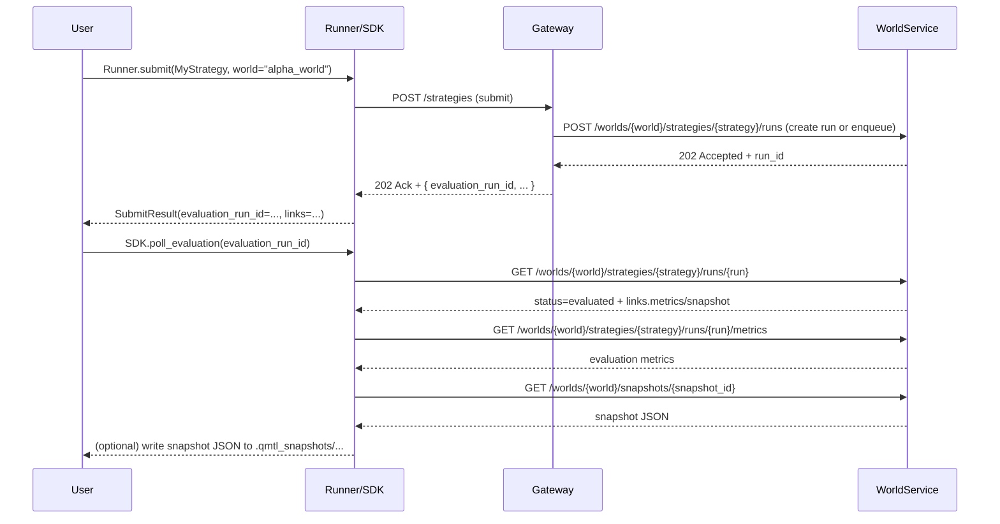

# WorldService 평가 런 & 메트릭 API 스케치

## 0. 배경 & 동기

이 문서는 qmtl v2 사용 경험(특히 `hft-factory-workspace` 베타 팩토리 v0; [hyophyop/qmtl#1750](https://github.com/hyophyop/qmtl/issues/1750))에서 나온 피드백을 바탕으로,

- **PnL/지표 계산 결과를 WorldService에서 일관된 형태로 소비·조회**하고,
- 전략이 **월드 내 생애 주기 중 어떤 단계에 있는지 조회하는 API**와,
- WS가 보관하는 **PnL/지표 스냅샷을 조회·저장하는 흐름**

을 Core Loop 관점에서 어떻게 구성할지 “임시 설계 스케치”로 정리한다.

!!! note "계산 위치(Responsibility) 전제"
    - 전략 단위 히스토리 replay, returns/지표 계산, (필요 시) 계좌 단위 PnL 시뮬레이션은 **Runner/SDK/ValidationPipeline 쪽에서 수행**하는 것을 기본 전제로 한다.
    - WorldService는 이 문서에서 제안하는 API를 통해 **이미 계산된 metrics/PnL을 입력으로 받아 정책을 적용하고, 결과와 스냅샷을 저장·조회하는 역할**에 집중한다.  
      (WS 안에 별도의 대규모 백테스트·PnL 엔진을 다시 구현하는 것은 목표가 아니다.)

관련 문서:

- [아키텍처 개요](../architecture/architecture.md), [WorldService](../architecture/worldservice.md)
- [auto_returns 통합 설계](auto_returns_unified_design.md)
- [로드맵](../roadmap.md)

여기서 제안하는 API/스키마는 **초안(draft)** 이며, 실제 적용 전에 worldservice/gateway/SDK 팀과 함께 구체화·축소·분할해야 한다.

## 1. As‑Is / To‑Be 요약

### 1.1 As‑Is

- PnL/지표:
  - ValidationPipeline과 Runner가 returns/지표를 계산하지만, 프로젝트별로 returns→PnL→snapshot 헬퍼를 재구현하는 경우가 많다.
  - WorldService는 정책 평가(Evaluate) 결과에 일부 메트릭을 포함할 수 있으나, **“전략 평가 런” 개념과 정규 메트릭 API**는 아직 정리되지 않았다.
- 전략 생애 주기:
  - Runner.submit 호출 시 히스토리 warm‑up → backtest → Validation → WS Evaluate/Apply 등이 일어나지만,
  - “이 제출이 지금 월드 내에서 어떤 단계인지”를 질의하는 명시적인 API/모델은 없다.
- 스냅샷:
  - 각 프로젝트가 `.qmtl_snapshots/*.json` 같은 파일 포맷과 로깅 유틸을 임의로 설계한다.

### 1.2 To‑Be (아이디어 수준)

- WorldService가 **전략 평가 런(Evaluation Run)** 을 일급 개념으로 관리한다:
  - 키: `(world_id, strategy_id, evaluation_run_id)`  
    (여기서 `evaluation_run_id`는 리밸런싱/할당용 run_id와는 **별도 네임스페이스**를 가진다.)
  - 상태: `submitted / backtest_running / evaluating / evaluated / activated / rejected / expired ...`
- 평가 런이 완료되면:
  - WS가 **표준화된 지표 세트**(returns/PnL 요약, 리스크·성과 지표, 게이팅 사유 등)를 저장하고,
  - 이를 조회하는 **메트릭/스냅샷 API**를 제공한다.
- Runner/CLI/툴은:
  - `Runner.submit` 결과에서 `evaluation_run_id`(또는 링크)를 받아,
  - WS의 **상태 조회 API**로 “지금 어느 단계인지” 확인하고,
  - 준비가 되면 **스냅샷 API**에서 지표를 가져와 JSON 파일로 덤프한다.
- 로컬 PnL 헬퍼는:
  - WS와 같은 계약을 따르는 “프리뷰/오프라인 모드”로 축소한다.

## 2. 전략 생애 주기 & 평가 런 모델

### 2.1 평가 런(Evaluation Run) 개념

- 식별자:
  - `world_id`: 월드 ID
  - `strategy_id`: 전략 ID (또는 `(strategy_id, version)` 쌍)
  - `run_id`: 특정 제출/평가 사이클을 가리키는 ID

평가 런 상태는 두 축을 기준으로 나눈다.
- **연산 관점:** 전략 단위(replay·지표 계산) vs 월드 단위(정책 평가·게이팅)
- **시간 관점:** 실행 중(running) vs 결과 확정(evaluated 이후)

- 상태 (초안):
   - `submitted`: Runner/Gateway가 WS에 평가 요청을 등록한 직후
   - `backtest_running`: 히스토리 warm‑up + replay backtest를 통해 **전략 단위 returns/지표를 계산 중인 상태**
   - `evaluating`: 이미 계산된 지표를 기반으로 WorldService 정책 엔진이  
     **월드 관점에서 활성/비활성/weight/기여도·제약 위반 여부를 결정 중인 상태**  
     (threshold/top‑k/correlation/hysteresis, cross‑strategy 비교 등)
   - `evaluated`: 지표 계산 & 정책 평가가 완료되어, 해당 런에 대한 **월드 차원 결정(snapshotted decision/metrics)**이 확정된 상태
   - `activated`: 이 런을 기준으로 월드 활성/가중치가 적용되어 실행/게이팅에 반영된 상태
   - `rejected`: 정책 위반 등으로 활성화되지 않고 폐기된 상태
   - `expired`: TTL 초과 또는 후속 런에 의해 superseded 된 상태 (참고용 히스토리만 유지)

요약하면 다음과 같다.

| 상태               | 관점       | 설명 |
|--------------------|------------|------|
| `submitted`        | 공통       | 평가 런이 생성되었으나 아직 실행되지 않음 |
| `backtest_running` | **전략 레벨** | 히스토리 replay를 돌며 전략별 returns/지표를 계산 중 |
| `evaluating`       | **월드 레벨** | 계산된 지표를 바탕으로 WS 정책(임계값·top‑k·상관·히스테리시스 등)을 적용해 활성/weight/제약 위반을 도출 중 |
| `evaluated`        | 월드 레벨  | 해당 런에 대한 월드 차원 결정 + 지표 스냅샷이 확정된 상태 |
| `activated`        | 월드 레벨  | 결정 결과가 실제 월드 활성/가중치로 적용된 상태 |
| `rejected`         | 월드 레벨  | 평가 결과 활성 기준을 만족하지 못해 폐기된 상태 |
| `expired`          | 공통       | 새 런 또는 TTL로 인해 더 이상 활성 후보가 아닌 히스토리 상태 |

대략적인 상태 전이는 아래와 같다.


!!! note "`backtest_running` / `evaluating` 상태 활용 가이드"
    - 위 정의에서 `backtest_running`은 **전략 단위 히스토리 replay + returns/지표 계산 단계**,  
      `evaluating`은 **이미 계산된 지표를 WorldService 정책에 넣어 월드 관점 결정(활성/weight/제약)을 내리는 단계**를 의미한다.
    - 현재 v2 구현에서는 이 두 단계가 **하나의 동기 파이프라인으로 이어지지만**, 상태 모델 자체는 전략 레벨과 월드 레벨을 구분해 표현한다.
    - 월드 간 상관/리스크 계산 등 평가 단계가 비동기·고비용으로 분리되는 시점에, 필요한 서비스는 `phase: backtest | evaluate`와 같은 서브 필드를 도입해 `evaluating`을 명시적으로 드러낼 수 있다.

!!! note "evaluation_run_id 불변성과 재평가"
    - `evaluation_run_id`로 식별되는 평가 런은 `evaluated` 이후에는 **불변(immutable)** 으로 취급하며, 메트릭/게이팅 결과는 append-only 히스토리로만 다룬다.
    - 동일 전략을 다른 조건/시점으로 다시 평가하고 싶다면 **새로운 `evaluation_run_id`를 가진 평가 런을 생성**해야 하며, 기존 run의 메트릭을 덮어쓰지 않는다.
    - 활성/비활성/가중치 적용(activation/apply)은 이후 단계에서 변경될 수 있지만, 특정 `evaluation_run_id`에 속한 평가 결과 스냅샷은 시간에 따라 변하지 않는 것을 목표로 한다.

### 2.2 Runner.submit과의 관계 (개념)

- `Runner.submit(MyStrategy, world="alpha_world")` 호출 시:
  - Gateway/WS가 내부적으로 `(world_id, strategy_id, run_id)` 평가 런을 생성하거나 queue에 넣는다.
  - `SubmitResult`에는 최소한 다음 정보가 포함될 수 있다:
    - `world_id`
    - `strategy_id`
    - `evaluation_run_id` (또는 `evaluation_run_url`)
    - (옵션) `snapshot_url` (지표 준비 후 조회할 수 있는 경로)

## 3. API 흐름 스케치

이 절에서는 REST 스타일 API를 기준으로, 평가 런/메트릭/스냅샷 조회 흐름을 개략적으로 정리한다. 실제 경로/스키마는 worldservice/gateway 설계와 함께 조정해야 한다.

### 3.1 평가 런 상태 조회 API (초안)

- 목적: “이 전략 제출이 지금 월드 내에서 어떤 단계인지”를 조회.

- 예시 엔드포인트(초안):

```http
GET /worlds/{world_id}/strategies/{strategy_id}/runs/{run_id}
```

- 응답(스케치):

```json
{
  "world_id": "alpha_world",
  "strategy_id": "beta_mkt_simple",
  "run_id": "2025-12-02T10:00:00Z-uuid",
  "status": "evaluated",
  "created_at": "2025-12-02T10:00:01Z",
  "updated_at": "2025-12-02T10:05:30Z",
  "effective_mode": "validate",
  "activation_state": "pending",  // or active/rejected
  "links": {
    "metrics": "/worlds/alpha_world/strategies/beta_mkt_simple/runs/2025-.../metrics",
    "snapshot": "/worlds/alpha_world/snapshots/alpha_world-beta_mkt_simple-2025-..."
  }
}
```

- Runner/CLI 용도:
  - `SubmitResult.evaluation_run_url`을 따라가면 현재 상태와, 메트릭/스냅샷 링크를 한 번에 확인할 수 있다.
  - CLI에서는 `qmtl world run-status --world alpha_world --strategy beta_mkt_simple --run latest` 같은 명령으로 감싼다.

### 3.2 메트릭 조회 API (초안)

- 목적: WorldService가 **저장·관리하는** 성과/리스크/게이팅 지표를 조회.  
  - 초기 구현에서는 Runner/ValidationPipeline이 계산한 metrics/PnL을 WS에 전달하고, WS는 이를 정책 평가·스냅샷 조회의 기준으로 사용한다.
  - 장기적으로 WS가 일부 지표를 직접 계산/보강하더라도, 이 엔드포인트는 **정규화된 “월드 평가 메트릭 계약”의 SSOT** 역할을 한다.

- 예시 엔드포인트:

```http
GET /worlds/{world_id}/strategies/{strategy_id}/runs/{run_id}/metrics
```

- 응답(스케치; 실제 필드명은 worldservice 스키마와 정렬 필요):

```json
{
  "world_id": "alpha_world",
  "strategy_id": "beta_mkt_simple",
  "run_id": "2025-12-02T10:00:00Z-uuid",
  "status": "evaluated",
  "evaluation": {
    "returns": {
      "sample_count": 1440,
      "window": "2025-12-01T00:00:00Z/2025-12-02T00:00:00Z",
      "source": "auto_returns",  // or "strategy_explicit"
      "sharpe": 1.8,
      "max_drawdown": -0.12,
      "volatility": 0.25,
      "win_rate": 0.54,
      "profit_factor": 1.7
    },
    "pnl": {
      "sample_count": 1440,
      "reference_currency": "USD",
      "pnl_total": 1234.5,
      "pnl_max_drawdown": -230.0,
      "pnl_equity_peak": 10234.0
    },
    "risk": {
      "turnover_proxy": 0.8,
      "exposure_bounds_ok": true,
      "concentration_warnings": []
    },
    "gating": {
      "verdict": "valid",   // or "invalid"
      "violations": [],
      "hysteresis": {
        "promote_after": 5,
        "demote_after": 3
      }
    }
  }
}
```

- 이 응답 구조 자체를 **표준 “월드 평가 메트릭 스냅샷” 포맷**으로 간주할 수 있다.

!!! note "메트릭 조회 시점과 에러 의미"
    - `GET /runs/{run_id}/metrics` 호출 시:
      - 지정된 `evaluation_run_id`가 존재하지 않으면 404(Not Found)를 반환한다.
      - run이 존재하지만 아직 `evaluated` 상태가 아니라면 409(Conflict)와 함께 `"error": "E_RUN_NOT_EVALUATED"` 같은 머신 친화적 코드를 반환하는 것을 제안한다.
    - 클라이언트는 먼저 `/runs/{run_id}` 상태를 조회해 `status=evaluated` 인지 확인한 뒤 메트릭을 요청하는 패턴을 기본으로 삼는다.

### 3.3 스냅샷 조회/저장 API (초안)

- 목적: §3.2 메트릭 응답(정규 계약)을 기반으로,  
  메트릭 + 요약된 시계열 정보(또는 별도 저장소 키)를 묶어 “스냅샷 객체”를 **전달·보관용 패키지** 형태의 표준 JSON으로 노출.

- 예시 엔드포인트:

```http
GET /worlds/{world_id}/snapshots/{snapshot_id}
```

- 응답(스케치):

```json
{
  "snapshot_id": "alpha_world-beta_mkt_simple-2025-12-02T10:00:00Z",
  "world_id": "alpha_world",
  "strategy_id": "beta_mkt_simple",
  "run_id": "2025-12-02T10:00:00Z-uuid",
  "created_at": "2025-12-02T10:05:30Z",
  "metrics": { "...": "..." },
  "series_heads": {
    "returns": [0.001, -0.0005, ...],
    "equity": [10000.0, 10010.0, ...],
    "pnl": [0.0, 10.0, ...]
  },
  "meta": {
    "pnl_source": "account_simulated_from_signals",
    "auto_returns": true,
    "tags": ["beta-factory", "sandbox"]
  },
  "storage_refs": {
    "full_returns_series": "s3://.../returns.parquet",
    "full_pnl_series": "s3://.../pnl.parquet"
  }
}
```

- 이 객체를 그대로 파일로 저장하면, 각 프로젝트가 별도의 스냅샷 스키마를 설계할 필요 없이 **WS 표준 포맷**을 재사용할 수 있다.

!!! note "메트릭 API vs 스냅샷 API 역할 분리"
    - `/runs/{run_id}/metrics`는 WS가 관리하는 **정규 평가 결과 계약(SSOT)** 이며, 정책/게이팅·대시보드·알고리즘적 소비(예: 리밸런싱 엔진)는 이 응답을 기준으로 삼는다.
    - `/snapshots/{snapshot_id}`는 동일한 평가 결과에 **series head·스토리지 참조·메타데이터를 덧붙인 전달/보관용 봉투(envelope)** 로,  
      CLI·툴·외부 분석 파이프라인이 `.qmtl_snapshots/*.json`을 읽을 때 사용하는 것을 1차 목표로 한다.

!!! note "기존 `/worlds/{id}/evaluate` API와의 관계"
    - 초기 구현에서는 `/worlds/{world_id}/strategies/{strategy_id}/runs/{run_id}/metrics`가 내부적으로 기존 `/worlds/{world_id}/evaluate` 호출(또는 동일한 정책 엔진)을 래핑해 **동일한 평가 결과를 정규화된 스키마로 노출**하는 형태를 권장한다.
    - 장기적으로는 `/runs/*` 계열이 “전략 제출 → 평가 런 생성 → 평가 결과 조회”를 위한 주 경로가 되고, `/evaluate`는 호환성 유지·배치 용도 등으로 점진적으로 축소하거나, 동일 엔진의 저수준 진입점으로만 남길 수 있다.

## 4. SDK/CLI 연동 흐름 (초안)

아래는 Runner/CLI가 WS 평가 런/메트릭/스냅샷 API를 사용하는 전체 흐름 스케치이다.



CLI 예시(아이디어):

- `qmtl submit strategies.beta_factory.beta_mkt_simple:Strategy --world alpha_world --snapshot`
- `qmtl world run-status --world alpha_world --strategy beta_mkt_simple --run latest`
- `qmtl world snapshot --world alpha_world --strategy beta_mkt_simple --run latest --output .qmtl_snapshots/alpha_world-beta_mkt_simple-latest.json`

## 5. 로컬 PnL 헬퍼와의 관계

이 설계가 적용되더라도, **WS/gateway를 띄우지 않는 순수 로컬 개발** 흐름에는 여전히 PnL 헬퍼가 필요하다. 이 경우:

- `qmtl.sdk.pnl.simulate_long_account_from_returns(...)` 와 같은 헬퍼는:
  - WS 메트릭/스냅샷 스키마와 최대한 동일한 계약을 따르고,
  - “WS가 없는 환경에서 쓸 수 있는 프리뷰 모드” 역할을 한다.
- Runner/ValidationPipeline는:
  - auto_returns + 로컬 PnL 헬퍼로 계산한 지표를 사용해 빠른 피드백을 주되,
  - “공식 평가”는 여전히 WS가 소유한다는 점을 문서에서 명확히 한다.

이 문서는 어디까지나 **아이디어/스케치 단계**이며, 실제 적용 시에는:

- worldservice 스키마(DecisionEnvelope/ActivationEnvelope/EvalKey 등)와의 정합성,
- commit‑log/ControlBus와의 연동,
- 백워드 호환성 및 점진 롤아웃 전략

을 함께 검토해야 한다.
