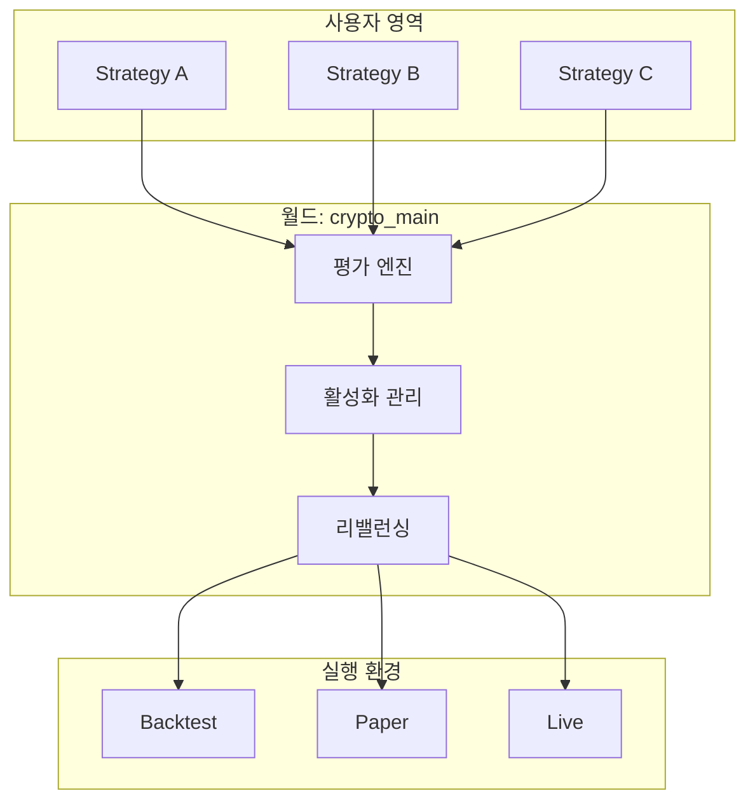

# 핵심 개념

QMTL을 사용하기 위해 알아야 할 개념은 **딱 3가지**입니다.

## 1. 전략 (Strategy)

**전략**은 시장 데이터를 받아서 매매 신호를 생성하는 로직입니다.

```python
from qmtl.sdk import Strategy, StreamInput, Node

class MyStrategy(Strategy):
    def setup(self):
        # 1. 필요한 데이터 선언
        price = StreamInput(tags=["BTC", "price"], interval="1m", period=30)
        
        # 2. 신호 생성 로직
        def generate_signal(view):
            closes = view.as_frame(price)["close"]
            return {"signal": 1 if closes.pct_change().mean() > 0 else 0}
        
        signal = Node(input=price, compute_fn=generate_signal)
        self.add_nodes([price, signal])
```

**사용자가 작성하는 것:**
- 어떤 데이터가 필요한지 (StreamInput)
- 데이터로 무엇을 계산할지 (compute_fn)

**시스템이 알아서 하는 것:**
- 데이터 수집 및 공급
- 캐싱 및 최적화
- 동일 계산 재사용

---

## 2. 월드 (World)

**월드**는 전략들이 함께 운용되는 포트폴리오 컨텍스트입니다.

```
┌─────────────────────────────────────────┐
│              World: "crypto_main"       │
│                                         │
│   ┌─────────┐  ┌─────────┐  ┌─────────┐│
│   │Strategy │  │Strategy │  │Strategy ││
│   │   A     │  │   B     │  │   C     ││
│   │ (25%)   │  │ (45%)   │  │ (30%)   ││
│   └─────────┘  └─────────┘  └─────────┘│
│                                         │
│   총 자본: $100,000                      │
│   월드 Sharpe: 1.85                      │
└─────────────────────────────────────────┘
```

**월드가 하는 일:**
- 전략 성과 평가 및 순위 매기기
- 유효한 전략만 활성화
- 자본 자동 배분 (성과/상관관계 기반)
- 리스크 관리 (익스포저 상한 등)

**사용자 관점:**
- 전략을 제출할 때 `world="crypto_main"`처럼 지정하고, 필요한 월드가 없으면 먼저 생성합니다.
- 기본 월드를 자주 쓴다면 `QMTL_DEFAULT_WORLD`나 프로젝트 설정으로 기본값을 지정해 반복 입력을 줄일 수 있습니다.

---

## 3. 단계 (Stage, WorldService 관리)

QMTL은 `Runner.submit(strategy, world=...)` 단일 제출 표면을 제공합니다. 실행 단계(backtest/paper/live)는 클라이언트 플래그가 아니라 WorldService의 결정(`effective_mode` + 월드 정책)입니다.

| 단계 | 의미 |
|------|------|
| `backtest` | 과거 데이터 기반 검증/지표 계산 |
| `paper` | 실시간 관찰 단계(주문 게이트/시뮬레이션) |
| `live` | 실거래 단계(거버넌스/승인 필요) |

```python
from qmtl.sdk import Runner

Runner.submit(MyStrategy, world="demo")
```

!!! warning "단계 전환은 월드가 결정"
    Paper/Live 승격은 월드 정책과 운영자 워크플로에 의해 결정됩니다.

---

## 개념 관계도



---

## 그 외 알아두면 좋은 것들

### 데이터 (StreamInput)

데이터는 **태그**로 지정합니다. 실제 데이터 소스 연결은 시스템이 처리합니다.

```python
# 태그로 데이터 지정 — 시스템이 알아서 적절한 소스 연결
btc_price = StreamInput(tags=["BTC", "price", "binance"], interval="1m", period=60)
eth_price = StreamInput(tags=["ETH", "price", "binance"], interval="1m", period=60)
```

**데이터 공급 (현재):**
- `world.data.presets[]`가 선언된 월드로 제출하면 Runner/CLI가 해당 프리셋 기반 Seamless provider를 자동 연결해 `StreamInput`에 주입합니다.
- 프리셋이 없는 월드는 직접 프로바이더를 구성하거나 월드에 프리셋을 추가한 뒤 사용합니다.
- 프리셋이 정해지면 데이터 플레인이 백필/캐시/데이터 지문 관리를 담당합니다.

### 성과 지표

제출 결과로 받는 주요 지표:

| 지표 | 설명 |
|------|------|
| `sharpe` | 위험 조정 수익률 (높을수록 좋음) |
| `max_drawdown` | 최대 낙폭 (낮을수록 좋음) |
| `win_rate` | 승률 |
| `contribution` | 월드 수익에 대한 기여도 |
| `weight` | 월드 내 자본 배분 비율 |
| `rank` | 월드 내 순위 |

---

## 다음 단계

개념을 이해했다면 → [빠른 시작](quickstart.md)에서 직접 전략을 만들어보세요.
