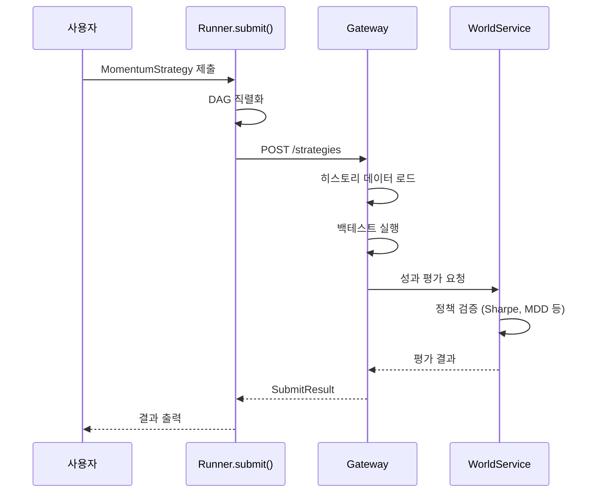

# 빠른 시작

이 가이드를 따라하면 **10분 안에** 첫 전략을 작성하고 제출할 수 있습니다.

## 전제 조건

- Python 3.11+
- QMTL 설치됨 (`pip install qmtl` 또는 `uv pip install -e .[dev]`)

## 1단계: 전략 작성 (3분)

`my_strategy.py` 파일을 생성합니다:

```python
from qmtl.sdk import Strategy, StreamInput, Node, Runner, Mode
import pandas as pd

class MomentumStrategy(Strategy):
    """단순 모멘텀 전략: 최근 수익률이 양수면 매수 신호"""
    
    def setup(self):
        # 1분봉 가격 데이터, 최근 30개 필요
        price = StreamInput(
            tags=["BTC", "price"],
            interval="1m",
            period=30
        )
        
        def compute_signal(view) -> pd.DataFrame:
            # 종가 데이터 가져오기
            df = view.as_frame(price, columns=["close"])
            
            # 5분 모멘텀 계산
            momentum = df["close"].pct_change().rolling(5).mean()
            
            # 모멘텀 > 0 이면 매수(1), 아니면 홀드(0)
            signal = (momentum > 0).astype(int)
            
            return pd.DataFrame({"signal": signal})
        
        signal_node = Node(
            input=price,
            compute_fn=compute_signal,
            name="momentum_signal"
        )
        
        self.add_nodes([price, signal_node])


if __name__ == "__main__":
    # 전략 제출
    result = Runner.submit(
        MomentumStrategy,
        world="quickstart_demo",
        mode=Mode.BACKTEST
    )
    print(result)
```

## 2단계: 전략 실행 (1분)

```bash
python my_strategy.py
```

## 3단계: 결과 확인 (1분)

성공하면 다음과 같은 결과를 받습니다:

```python
SubmitResult(
    strategy_id="momentum_btc_1m_abc123",
    status="valid",              # valid | invalid | pending
    world="quickstart_demo",
    mode="backtest",
    downgraded=False,            # 안전기본으로 강등되었는지 여부
    downgrade_reason=None,       # 예: backtest 필수 입력 누락 시 "missing_as_of"
    safe_mode=False,             # True면 주문 게이트 OFF 상태
    
    # 성과 지표
    metrics={
        "sharpe": 1.45,
        "max_drawdown": -0.08,
        "win_rate": 0.55,
        "profit_factor": 1.32,
    },
    
    # 월드 내 위치 (backtest에서는 시뮬레이션 값)
    contribution=0.0,            # 아직 활성화 전
    weight=0.0,
    rank=None,
    
    # 개선 힌트
    improvement_hints=[
        "Sharpe 1.5 이상이면 paper 모드 승격 가능",
        "최소 30일 백테스트 권장 (현재: 7일)"
    ]
)
```

---

## 이해하기: 무슨 일이 일어났나?



**시스템이 자동으로 한 것:**
1. 전략 코드를 DAG(계산 그래프)로 변환
2. 필요한 히스토리 데이터 자동 로드
3. 백테스트 실행 (시장 상황 리플레이)
4. 성과 지표 계산
5. 월드 정책 기준으로 유효성 판단
6. 개선 힌트 생성

---

## 다음 단계별 가이드

### A. 유효한 전략으로 만들기

`improvement_hints`를 참고해서 전략을 개선합니다:

```python
# 더 긴 기간의 데이터 사용
price = StreamInput(
    tags=["BTC", "price"],
    interval="1m",
    period=60  # 30 → 60으로 증가
)

# 더 정교한 신호 로직
def compute_signal(view):
    df = view.as_frame(price, columns=["close", "volume"])
    
    # 가격 모멘텀
    price_mom = df["close"].pct_change().rolling(10).mean()
    
    # 거래량 확인 (거래량 증가 시에만)
    vol_increase = df["volume"].pct_change() > 0
    
    # 둘 다 만족할 때만 매수
    signal = ((price_mom > 0) & vol_increase).astype(int)
    
    return pd.DataFrame({"signal": signal})
```

### B. Paper 모드로 승격

백테스트 성과가 기준을 충족하면:

```python
result = Runner.submit(
    MomentumStrategy,
    world="quickstart_demo",
    mode=Mode.PAPER  # 실시간 데이터로 가상 거래
)
```

!!! note "As-Is / To-Be: 자동 승격"
    **As-Is (현재):**
    - 사용자가 명시적으로 `mode=Mode.PAPER`로 재제출해야 함
    
    **To-Be (목표):**
    - 백테스트 통과 시 자동으로 Paper 모드 활성화
    - 사용자는 결과만 확인하면 됨

### C. 성과 모니터링

!!! note "As-Is / To-Be: 성과 조회"
    **As-Is (현재):**
    ```bash
    # CLI로 상태 확인
    qmtl status --world quickstart_demo
    ```
    
    **To-Be (목표):**
    ```python
    # Python에서 실시간 스트림 구독
    Runner.subscribe(world="quickstart_demo", on_update=print)
    ```
    
    - 대시보드 UI에서 실시간 성과/순위/기여도 확인
    - 승격/강등 알림 자동 수신

---

## CLI 사용하기

### 전략 제출

```bash
# 파일 직접 제출
qmtl submit my_strategy.py --world quickstart_demo

# 모드 지정
qmtl submit my_strategy.py --world quickstart_demo --mode paper
```

### 상태 확인

```bash
# 월드 상태 조회
qmtl world info quickstart_demo

# 내 전략 상태
qmtl status --strategy momentum_btc_1m_abc123
```

!!! note "As-Is / To-Be: CLI 간소화"
    **As-Is (현재):**
    ```bash
    qmtl submit my_strategy.py --world demo --gateway-url http://localhost:8000
    ```
    
    **To-Be (목표):**
    ```bash
    qmtl submit my_strategy.py  # 기본 월드, 기본 gateway 자동 사용
    ```

---

## 흔한 문제 해결

### "No returns produced" 오류

```
Error: No returns produced. Cannot validate strategy.
```

**원인:** 전략이 수익률(returns) 데이터를 생성하지 않음

**해결:** 
```python
# compute_fn에서 returns 컬럼 포함
def compute_signal(view):
    df = view.as_frame(price, columns=["close"])
    returns = df["close"].pct_change()
    signal = (returns.rolling(5).mean() > 0).astype(int)
    return pd.DataFrame({
        "signal": signal,
        "returns": returns  # 이 컬럼 필수
    })
```

!!! note "As-Is / To-Be: auto_returns"
    **As-Is (현재):**
    - 사용자가 `returns` 컬럼을 명시적으로 계산해야 함
    
    **To-Be (목표):**
    - `auto_returns=True` 옵션으로 가격 데이터에서 자동 파생
    - 또는 `StreamInput`에서 자동 계산

### Gateway 연결 실패

```
Error: Cannot connect to Gateway at http://localhost:8000
```

**해결:**
```bash
# Gateway 서버 시작
qmtl gateway

# 또는 다른 터미널에서 확인
curl http://localhost:8000/health
```

### 데이터 없음 오류

```
Error: No data available for tags=['BTC', 'price']
```

**해결:** 해당 태그의 데이터 소스가 구성되어 있는지 확인

```bash
# 사용 가능한 데이터 태그 조회
qmtl data list-tags
```

---

## 다음 단계

- 전략 개선 사이클 익히기 → [사용자 워크플로우](workflow.md)
- 더 복잡한 전략 작성하기 → [SDK 튜토리얼](../guides/sdk_tutorial.md)
- 아키텍처 이해하기 → [아키텍처 개요](../architecture/README.md)
