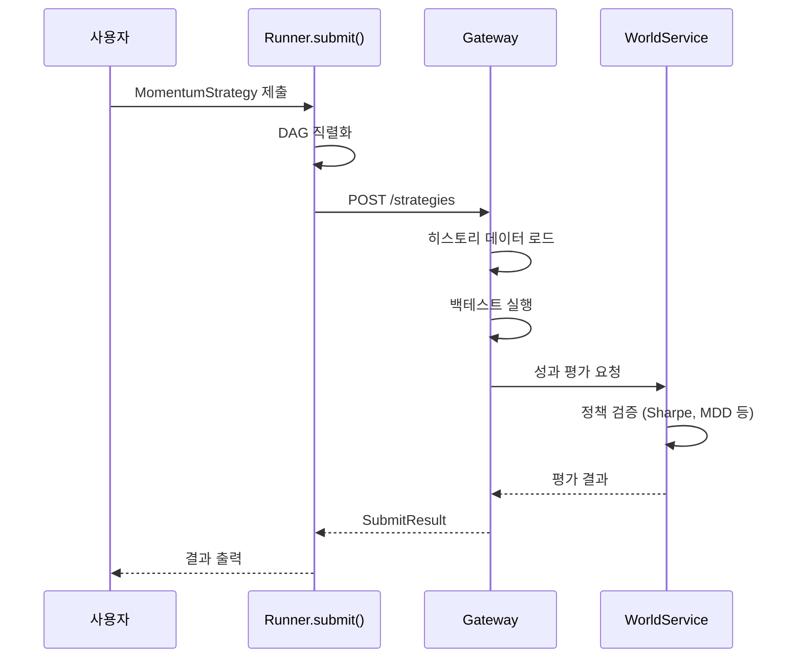

# 빠른 시작

이 가이드를 따라하면 **10분 안에** 첫 전략을 작성하고 제출할 수 있습니다.

## 전제 조건

- Python 3.11+
- QMTL 설치됨 (`pip install qmtl` 또는 `uv pip install -e .[dev]`)

## 1단계: 전략 작성 (3분)

`my_strategy.py` 파일을 생성합니다:

```python
from qmtl.sdk import Strategy, StreamInput, Node, Runner
import polars as pl

class MomentumStrategy(Strategy):
    """단순 모멘텀 전략: 최근 수익률이 양수면 매수 신호"""
    
    def setup(self):
        # 1분봉 가격 데이터, 최근 30개 필요
        price = StreamInput(
            tags=["BTC", "price"],
            interval="1m",
            period=30
        )
        
        def compute_signal(view) -> pl.DataFrame:
            # 종가 데이터 가져오기
            frame = view.as_frame(price, columns=["close"]).frame
            
            # 5분 모멘텀 계산
            momentum = frame.get_column("close").pct_change().rolling_mean(window_size=5)
            
            # 모멘텀 > 0 이면 매수(1), 아니면 홀드(0)
            signal = (momentum > 0).cast(pl.Int64)
            
            return pl.DataFrame({"signal": signal})
        
        signal_node = Node(
            input=price,
            compute_fn=compute_signal,
            name="momentum_signal"
        )
        
        self.add_nodes([price, signal_node])


if __name__ == "__main__":
    # 전략 제출
    result = Runner.submit(
        MomentumStrategy,
        world="quickstart_demo",
    )
    print(result)
```

## 2단계: 전략 실행 (1분)

```bash
python my_strategy.py
```

## 3단계: 결과 확인 (1분)

성공하면 다음과 같은 결과를 받습니다:

```python
{
  "strategy_id": "momentum_btc_1m_abc123",
  "status": "valid",              # valid | invalid | pending | rejected
  "world": "quickstart_demo",
  "downgraded": false,            # 안전기본 강등 여부 (필요 시 compute-only로 전환)
  "downgrade_reason": null,       # 예: backtest 필수 입력 누락 시 "missing_as_of"
  "safe_mode": false,             # True면 주문 게이트 OFF 상태
  "ws": {                         # WorldService가 SSOT로 제공하는 결정/활성 요약
    "decision": { "world_id": "quickstart_demo", "effective_mode": "validate", "etag": "..." },
    "activation": { "strategy_id": "momentum_btc_1m_abc123", "weight": 0.10, "active": true },
    "metrics": { "sharpe": 1.45, "max_drawdown": -0.08, "win_rate": 0.55, "profit_factor": 1.32 },
    "threshold_violations": [],
    "rejection_reason": null
  },
  "precheck": {                   # 로컬 ValidationPipeline 참고용 출력
    "status": "passed",
    "violations": [],
    "metrics": { "sharpe": 1.4, "max_drawdown": -0.09 }
  }
}
```

CLI에서도 동일하게 `--output json` 플래그로 WS/Precheck가 분리된 결과를 받을 수 있습니다:

```bash
qmtl submit strategies.momentum:MomentumStrategy --world quickstart_demo --output json
```

---

## 이해하기: 무슨 일이 일어났나?



**시스템이 자동으로 한 것:**
1. 전략 코드를 DAG(계산 그래프)로 변환
2. 필요한 히스토리 데이터 자동 로드
3. 백테스트 실행 (시장 상황 리플레이)
4. 성과 지표 계산
5. 월드 정책 기준으로 유효성 판단
6. 개선 힌트 생성

---

## 다음 단계별 가이드

### A. 유효한 전략으로 만들기

`improvement_hints`를 참고해서 전략을 개선합니다:

```python
# 더 긴 기간의 데이터 사용
price = StreamInput(
    tags=["BTC", "price"],
    interval="1m",
    period=60  # 30 → 60으로 증가
)

# 더 정교한 신호 로직
def compute_signal(view):
    frame = view.as_frame(price, columns=["close", "volume"]).frame
    
    # 가격 모멘텀
    price_mom = frame.get_column("close").pct_change().rolling_mean(window_size=10)
    
    # 거래량 확인 (거래량 증가 시에만)
    vol_increase = frame.get_column("volume").pct_change() > 0
    
    # 둘 다 만족할 때만 매수
    signal = ((price_mom > 0) & vol_increase).cast(pl.Int64)
    
    return pl.DataFrame({"signal": signal})
```

### B. Paper/Live는 월드가 관리

전략을 제출한 뒤 Paper/Live 캠페인으로의 진행은 월드 정책/거버넌스에 의해 결정됩니다. 클라이언트에서 `mode` 플래그로 단계를 요청하지 않습니다.

- 월드/캠페인 상태 확인: `qmtl world status quickstart_demo`
- live 후보 조회(운영자): `qmtl world live-candidates quickstart_demo`

### C. 성과 모니터링

- CLI: `qmtl status --world quickstart_demo`, `qmtl world info quickstart_demo`
- 공개 구독 헬퍼는 추후 제공 예정입니다. 그 전까지는 CLI/REST로 상태를 조회하세요.

---

## CLI 사용하기

### 전략 제출

```bash
# 파일 직접 제출
qmtl submit my_strategy.py --world quickstart_demo
```

### 상태 확인

```bash
# 월드 상태 조회
qmtl world info quickstart_demo

# 내 전략 상태
qmtl status --strategy momentum_btc_1m_abc123
```

팁: `QMTL_DEFAULT_WORLD`나 프로젝트 설정으로 기본 월드를 지정하고, 로컬이 아니라면 `QMTL_GATEWAY_URL`을 설정하세요.

---

## 흔한 문제 해결

### "No returns produced" 오류

```
Error: No returns produced. Cannot validate strategy.
```

**원인:** 전략이 수익률(returns) 데이터를 생성하지 않음

**해결:** 
```python
# compute_fn에서 returns 컬럼 포함
def compute_signal(view):
    frame = view.as_frame(price, columns=["close"]).frame
    returns = frame.get_column("close").pct_change()
    signal = (returns.rolling_mean(window_size=5) > 0).cast(pl.Int64)
    return pl.DataFrame({
        "signal": signal,
        "returns": returns  # 이 컬럼 필수
    })
```

`returns` 컬럼 추가가 어려우면 `Runner.submit(..., auto_returns=True)`로 가격/에쿼티 데이터에서 자동 파생할 수 있습니다.

### Gateway 연결 실패

```
Error: Cannot connect to Gateway at http://localhost:8000
```

**해결:**
```bash
# Gateway 서버 시작
qmtl gateway

# 또는 다른 터미널에서 확인
curl http://localhost:8000/health
```

### 데이터 없음 오류

```
Error: No data available for tags=['BTC', 'price']
```

**해결:** 해당 태그의 데이터 소스가 구성되어 있는지 확인

```bash
# 사용 가능한 데이터 태그 조회
qmtl data list-tags
```

---

## 다음 단계

- 전략 개선 사이클 익히기 → [사용자 워크플로우](workflow.md)
- 더 복잡한 전략 작성하기 → [SDK 튜토리얼](../guides/sdk_tutorial.md)
- 아키텍처 이해하기 → [아키텍처 개요](../architecture/README.md)
