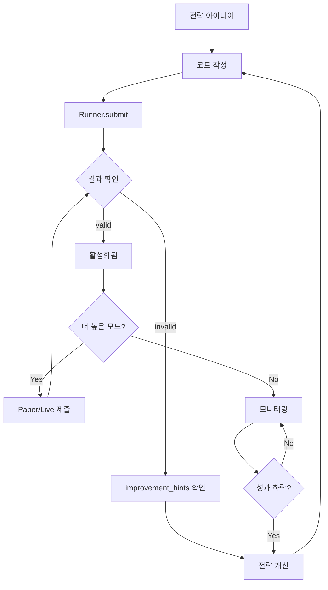

# 사용자 워크플로우

QMTL 사용자의 핵심 사이클은 **개발 → 평가 → 개선**입니다.

```
┌──────────────────────────────────────────────────────────────────┐
│                        사용자 핵심 사이클                         │
│                                                                  │
│    ┌─────────┐      ┌─────────┐      ┌─────────┐               │
│    │ 1. 개발 │ ───▶ │ 2. 평가 │ ───▶ │ 3. 개선 │               │
│    │         │      │         │      │         │               │
│    │ 전략    │      │ 제출 →  │      │ 힌트    │               │
│    │ 작성    │      │ 결과    │      │ 반영    │               │
│    └─────────┘      └─────────┘      └────┬────┘               │
│         ▲                                  │                    │
│         └──────────────────────────────────┘                    │
│                                                                  │
│    이 사이클만 반복하면 월드에 좋은 전략이 누적되어               │
│    수익이 점차 늘어납니다                                        │
└──────────────────────────────────────────────────────────────────┘
```

---

## 1단계: 전략 개발

### 아이디어에서 코드로

```python
from qmtl.sdk import Strategy, StreamInput, Node
import pandas as pd

class MyStrategy(Strategy):
    """
    전략 아이디어:
    - 단기 이동평균이 장기 이동평균을 상향 돌파하면 매수
    - 하향 돌파하면 매도
    """
    
    def setup(self):
        price = StreamInput(
            tags=["BTC", "price"],
            interval="5m",
            period=100  # 100개 봉 필요 (MA 계산용)
        )
        
        def compute_signal(view):
            df = view.as_frame(price, columns=["close"])
            
            ma_short = df["close"].rolling(10).mean()
            ma_long = df["close"].rolling(50).mean()
            
            # 골든크로스: 1, 데드크로스: -1, 그 외: 0
            signal = pd.Series(0, index=df.index)
            signal[ma_short > ma_long] = 1
            signal[ma_short < ma_long] = -1
            
            returns = df["close"].pct_change()
            
            return pd.DataFrame({
                "signal": signal,
                "returns": returns
            })
        
        signal_node = Node(
            input=price,
            compute_fn=compute_signal,
            name="ma_crossover"
        )
        
        self.add_nodes([price, signal_node])
```

### 개발 시 고려사항

| 항목 | 권장 사항 |
|------|----------|
| 데이터 기간 | `period`는 전략에 필요한 최소값 + 20% 여유 |
| 계산 함수 | 순수 함수로 작성 (외부 상태 참조 금지) |
| 신호 값 | `-1` (매도), `0` (홀드), `1` (매수) |
| returns | 반드시 포함 (성과 평가에 필요) |

---

## 2단계: 제출 및 평가

### 전략 제출

```python
from qmtl.sdk import Runner, Mode

result = Runner.submit(
    MyStrategy,
    world="my_portfolio",
    mode=Mode.BACKTEST
)
```

### 결과 해석

```python
print(f"상태: {result.status}")  # valid, invalid, pending
print(f"Sharpe: {result.metrics['sharpe']}")
print(f"MDD: {result.metrics['max_drawdown']}")
print(f"승률: {result.metrics['win_rate']}")

# 월드 내 위치 (활성화된 경우)
if result.status == "valid":
    print(f"기여도: {result.contribution}")
    print(f"배분 비율: {result.weight}")
    print(f"순위: {result.rank}")
```

### 상태별 의미

| 상태 | 의미 | 다음 행동 |
|------|------|----------|
| `valid` | 정책 기준 충족, 활성화 대기/완료 | 다음 모드(paper/live) 시도 |
| `invalid` | 정책 기준 미달 | `improvement_hints` 참고하여 개선 |
| `pending` | 평가 진행 중 | 잠시 후 재조회 |

---

## 3단계: 개선

### improvement_hints 활용

```python
result = Runner.submit(MyStrategy, world="demo")

for hint in result.improvement_hints:
    print(f"💡 {hint}")
```

예시 힌트들:

```
💡 Sharpe Ratio가 1.2입니다. 1.5 이상이면 Paper 모드 승격 가능합니다.
💡 최대 낙폭이 -15%입니다. -10% 이내로 개선을 권장합니다.
💡 기존 전략들과 상관계수가 0.85입니다. 0.7 이하면 분산 효과가 높아집니다.
💡 백테스트 기간이 14일입니다. 최소 30일 이상을 권장합니다.
```

### 개선 전략

| 힌트 유형 | 개선 방향 |
|----------|----------|
| Sharpe 부족 | 신호 정확도 개선, 노이즈 필터 추가 |
| MDD 과다 | 손절 로직 추가, 포지션 사이징 조절 |
| 상관계수 높음 | 다른 시장/시간대/로직 사용 |
| 기간 부족 | `period` 늘리기, 더 긴 백테스트 |

### 반복 개선 예시

```python
# 버전 1: 기본
class MyStrategy_v1(Strategy):
    def setup(self):
        price = StreamInput(tags=["BTC", "price"], interval="5m", period=100)
        # ... 기본 로직

# 버전 2: MDD 개선 - 손절 추가
class MyStrategy_v2(Strategy):
    def setup(self):
        price = StreamInput(tags=["BTC", "price"], interval="5m", period=100)
        
        def compute_signal(view):
            df = view.as_frame(price, columns=["close"])
            # ... 기존 로직
            
            # 손절: 5% 이상 하락 시 포지션 청산
            drawdown = (df["close"] / df["close"].cummax() - 1)
            signal[drawdown < -0.05] = 0  # 손절
            
            return pd.DataFrame({"signal": signal, "returns": returns})

# 버전 3: 분산 효과 - 다른 자산 추가
class MyStrategy_v3(Strategy):
    def setup(self):
        btc = StreamInput(tags=["BTC", "price"], interval="5m", period=100)
        eth = StreamInput(tags=["ETH", "price"], interval="5m", period=100)
        # ... 멀티 자산 로직
```

---

## 전체 흐름도



---

## 고급: 다중 전략 운용

### 월드에 여러 전략 제출

```python
strategies = [
    MomentumStrategy,
    MeanReversionStrategy,
    BreakoutStrategy,
]

for strategy_cls in strategies:
    result = Runner.submit(strategy_cls, world="my_portfolio")
    print(f"{strategy_cls.__name__}: {result.status}")
```

### 전략 간 상관관계 고려

월드는 자동으로 전략 간 상관관계를 계산합니다:

```python
result = Runner.submit(NewStrategy, world="my_portfolio")

# 기존 전략과의 상관관계
print(result.metrics.get("correlation_with_portfolio"))
# 출력: 0.45 (낮을수록 분산 효과 좋음)
```

!!! tip "분산 효과 극대화"
    - 서로 다른 시간대 (1m vs 1h)
    - 서로 다른 자산 (BTC vs ETH vs 주식)
    - 서로 다른 전략 유형 (모멘텀 vs 평균회귀)
    
    이런 전략들을 조합하면 월드 전체 Sharpe가 개별 전략보다 높아집니다.

---

## As-Is / To-Be: 워크플로우 자동화

### 현재 (As-Is)

```
사용자 작업:
1. 전략 코드 작성
2. Runner.submit() 호출
3. 결과 확인
4. improvement_hints 읽기
5. 코드 수정
6. 다시 제출
7. (반복)
```

### 목표 (To-Be)

```
사용자 작업:
1. 전략 코드 작성
2. Runner.submit() 호출
3. 결과 확인 (대시보드에서)

자동화되는 것:
- 백테스트 통과 → 자동 Paper 승격
- Paper 안정화 → 자동 Live 승격  
- 성과 하락 → 자동 강등
- 알림/리포트 자동 발송
```

!!! note "자동 승격/강등 (To-Be)"
    **목표 상태:**
    
    - 전략 제출 후 사용자가 모드 전환을 신경 쓰지 않아도 됨
    - 월드 정책이 자동으로 승격/강등 결정
    - 사용자는 "전략 개선"에만 집중
    
    **현재 상태:**
    
    - 승격: 사용자가 `mode=Mode.PAPER` 등으로 명시적 재제출 필요
    - 강등: WorldService가 자동 처리 (구현됨)
    - 알림: 수동 조회 필요

---

## 모니터링 (To-Be)

!!! note "실시간 대시보드 (To-Be)"
    **목표 상태:**
    
    ```
    ┌─────────────────────────────────────────────────────────┐
    │ World: my_portfolio          총 자산: $125,432         │
    │ 오늘 수익: +1.2%              Sharpe: 1.85             │
    ├─────────────────────────────────────────────────────────┤
    │ 전략           │ 상태   │ 기여도 │ 배분  │ 오늘 수익   │
    │ ─────────────────────────────────────────────────────── │
    │ Momentum_v3    │ Live   │ 45%   │ 35%  │ +0.8%       │
    │ MeanRev_v2     │ Paper  │ 30%   │ 25%  │ +0.3%       │
    │ Breakout_v1    │ BT     │ 25%   │ 0%   │ (시뮬)      │
    └─────────────────────────────────────────────────────────┘
    ```
    
    **현재 상태:**
    
    - CLI `qmtl status` 또는 `qmtl world info`로 조회
    - 실시간 스트림 구독 미구현

---

## 요약: 사용자가 집중해야 할 것

| 집중 O | 집중 X (시스템이 처리) |
|--------|----------------------|
| 전략 아이디어 | 데이터 수집/저장 |
| 신호 로직 작성 | 백테스트 실행 |
| 힌트 기반 개선 | 성과 지표 계산 |
| | 정책 검증 |
| | 자본 배분 |
| | 리스크 관리 |

---

## 다음 단계

- 고급 노드 사용법 → [SDK 튜토리얼](../guides/sdk_tutorial.md)
- 월드 정책 이해하기 → [월드 문서](../world/world.md)
