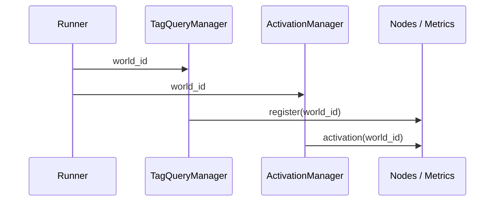

{{ nav_links() }}

# **러닝 경로 요약**

1. [MVP 전략 예제]({{ code_url('qmtl/examples/templates/single_indicator.py') }})
   - `qmtl project init --path mvp --strategy single_indicator --with-sample-data`
   - `uv run python strategy.py` 실행 후 `uv run qmtl report run.log`로 리포트 생성
2. [전략 템플릿 모음](../reference/templates.md)
3. [아키텍처 상세](../architecture/architecture.md)

# SDK 사용 가이드

본 문서는 QMTL SDK를 이용해 전략을 구현하고 실행하는 기본 절차를 소개합니다. 보다 상세한 아키텍처 설명과 예시는 [architecture.md](../architecture/architecture.md)와 `qmtl/examples/` 디렉터리를 참고하세요.

## 설치

```bash
uv venv
uv pip install -e .[dev]
```

필요에 따라 데이터 IO 모듈을 설치할 수 있습니다.

```bash
uv pip install -e .[io]  # 데이터 IO 모듈
```

## 기본 구조


SDK를 사용하려면 `Strategy` 클래스를 상속하고 `setup()` 메서드만 구현하면 됩니다. 노드는 `StreamInput`, `TagQueryNode` 와 같은 **소스 노드**(`SourceNode`)와 다른 노드를 처리하는 **프로세싱 노드**(`ProcessingNode`)로 나뉩니다. `ProcessingNode`는 하나 이상의 업스트림을 반드시 가져야 합니다. `interval` 값은 정수 또는 `"1h"`, `"30m"`, `"45s"`처럼 단위 접미사를 가진 문자열로 지정할 수 있습니다. `period` 값은 **항상 양의 정수(바 개수)** 로 지정합니다. `TagQueryNode` 자체는 네트워크 요청을 수행하지 않고, Runner가 생성하는 **TagQueryManager**가 Gateway와 통신하여 큐 목록을 갱신합니다. 각 노드가 등록된 후 `TagQueryManager.resolve_tags()`를 호출하면 초기 큐 목록만 로드되며, WebSocket 구독에 필요한 이벤트 설명자(event descriptor)와 토큰(token)은 `TagQueryManager.start()`가 Gateway와의 핸드셰이크에서 내부적으로 확보합니다. 이후 업데이트는 확보된 설명자와 토큰을 사용해 WebSocket으로 처리됩니다. 태그 매칭 방식은 `match_mode` 옵션으로 지정하며 기본값은 OR 조건에 해당하는 `MatchMode.ANY` (문자열 "any"도 허용됨) 입니다. 모든 태그가 일치해야 할 경우 `MatchMode.ALL` 또는 문자열 "all"을 사용합니다.

### WebSocketClient

Gateway 상태 변화를 실시간으로 수신하기 위한 클래스입니다. 기본 사용법은 다음과 같습니다.

```python
client = WebSocketClient(
    "ws://localhost:8000",
    token="<JWT>",
    on_message=my_handler,
)
```

`url`은 WebSocket 엔드포인트 주소이며 `on_message`는 수신 메시지를 처리할 비동기 함수입니다. `token`은 `/events/subscribe` 호출이 반환한 JWT로, Gateway 스트림 구독 시 항상 전달되어야 합니다. `start()`를 호출하면 백그라운드에서 연결을 유지하며 메시지를 받고, `stop()`을 호출하면 연결이 종료됩니다.

`TagQueryManager`는 이 객체를 생성하거나 주입받아 `handle_message()`를 콜백으로 등록합니다. 이벤트 설명자와 토큰을 자동으로 전달하므로 커스텀 클라이언트 구현도 `token` 매개변수를 지원해야 합니다. 큐 업데이트(`queue_update`)와 센티널 가중치(`sentinel_weight`) 이벤트가 도착하면 해당 `TagQueryNode`에 `update_queues()`가 호출되고, 가중치 값은 `WebSocketClient.sentinel_weights`에 저장됩니다.

### Gateway Event Subscription

Gateway는 `/events/subscribe` 엔드포인트를 통해 WebSocket 이벤트를 제공합니다. 실제 활성화와 큐 업데이트 이벤트는 내부 ControlBus에서 발생하며 Gateway가 이를 전달합니다. 정책과 활성화 결정에 대한 최종 권위는 WorldService에 있습니다.


`ProcessingNode`의 `input`은 단일 노드 또는 노드들의 리스트로 지정합니다. 딕셔너리 입력 형식은 더 이상 지원되지 않습니다.

### Node와 ProcessingNode

`Node`는 모든 노드의 기본 클래스이며, 특별한 제약이 없습니다. 반면 `ProcessingNode`는 한 개 이상의 업스트림 노드를 요구하도록 만들어져 있어 연산 노드를 구현할 때 보다 명시적인 오류 메시지를 제공합니다. 새로운 프로세싱 로직을 구현할 때는 `ProcessingNode`를 상속하는 방식을 권장합니다. 필요하지 않은 경우에는 기본 `Node`만 사용해도 동작에는 문제가 없습니다.


```python
from qmtl.runtime.sdk import Strategy, ProcessingNode, StreamInput

class MyStrategy(Strategy):
    def setup(self):
        price = StreamInput(interval="1m", period=30)

        def compute(view):
            return view

        out = ProcessingNode(input=price, compute_fn=compute, name="out")
        self.add_nodes([price, out])
```

## 실행 방법 (월드 주도)

전략 실행은 월드(WorldService) 결정에 따릅니다. `Runner`는 단일 진입점만 제공합니다.

- `Runner.run(MyStrategy, world_id="...", gateway_url="http://gw")` — WS 결정과 활성 이벤트를 따르는 실행. 게이트는 WS 활성 상태에 따라 ON/OFF 됩니다. 결정이 부재/만료일 때는 기본적으로 compute‑only(주문 OFF)로 동작합니다.
- `Runner.offline(MyStrategy)` — Gateway 없이 로컬에서만 실행합니다. 태그 기반 노드는 빈 큐 목록으로 초기화됩니다.

```python
from qmtl.runtime.sdk import Runner

# 월드 주도 실행
Runner.run(MyStrategy, world_id="my_world", gateway_url="http://gw")

# 오프라인 실행
Runner.offline(MyStrategy)
```

`Runner`는 각 `TagQueryNode`가 등록된 후 자동으로 Gateway와 통신하여 해당 태그에
매칭되는 큐를 조회하고, `TagQueryManager.start()` 단계에서 이벤트 디스크립터/토큰을 교환해 WebSocket 구독을 시작합니다. 핸드셰이크 결과는 매니저 내부에서 관리되므로 호출자가 별도로 반환값을 저장할 필요는 없습니다. 모든 정책 판단은 WorldService가 수행하며, SDK는 전달받은 결정/활성에 따라 동작만 조정합니다.

### Backtest/Dry‑Run 요구사항

Backtest/Dry‑Run에 필요한 Clock/스냅샷 메타데이터(as_of, dataset_fingerprint)는
서버 측(WorldService/Gateway)에서 강제·검증됩니다. SDK `Runner`는 실행 도메인이나
클록을 설정하지 않으며, WS 결정과 활성 상태를 그대로 따릅니다.

- Gateway/WS는 backtest/dry‑run에 스냅샷 메타데이터가 누락되면 요청을 거부하거나
  안전 모드(compute‑only, 주문 게이트 OFF)로 강등합니다.
- 결정이 부재/만료 상태이거나 활성 정보가 없으면 SDK는 기본적으로
  compute‑only로 유지합니다.

로컬 재현/테스트에는 `Runner.offline(MyStrategy)`를 사용하세요. 태그 기반 노드는
빈 큐 목록으로 초기화되며, 필요 시 스냅샷/피처 아티팩트를 직접 주입해 재현성을 확보합니다.

### world_id 전달 흐름

`world_id`는 실행 시점에서 `Runner`가 받아 `TagQueryManager`와 `ActivationManager`에 전파됩니다. 두 관리자는 각 노드와 메트릭에 동일한 `world_id`를 주입해 큐·활성 상태와 지표가 월드별로 분리되도록 보장합니다.



```python
from qmtl.runtime.sdk import Strategy, StreamInput, Runner

class WorldStrategy(Strategy):
    def setup(self):
        price = StreamInput(tags=["BTC", "price"], interval="1m", period=30)
        self.add_nodes([price])

# world_id는 노드 등록과 메트릭 레이블에 자동으로 반영됩니다.
Runner.run(WorldStrategy, world_id="demo_world", gateway_url="http://gw")
```

### ExecutionDomain 매핑

- WorldService는 정책 평가 결과를 `effective_mode` (`validate|compute-only|paper|live`)로 전달합니다.
- Gateway와 SDK는 이 값을 ExecutionDomain으로 매핑해 `execution_domain` 필드를 채웁니다.
- **매핑 규칙:** `validate → backtest (주문 게이트 OFF)`, `compute-only → backtest`, `paper → dryrun`, `live → live`. `shadow`는 운영자 전용입니다.
- 실행 예시: [`dryrun_live_switch_strategy.py`]({{ code_url('qmtl/examples/strategies/dryrun_live_switch_strategy.py') }})는 `connectors.execution_domain` 설정으로 `dryrun`/`live`를 전환합니다. 레거시 `trade_mode` 값 `paper`는 자동으로 `dryrun`으로 변환됩니다.
- 오프라인 실행(`Runner.offline`)은 기본적으로 `backtest` 도메인과 동일한 게이팅을 적용합니다. WorldService가 `effective_mode="validate"`를 전달하면 SDK는 자동으로 `backtest` ExecutionDomain을 사용해 주문을 차단합니다.

## CLI 도움말

`qmtl tools sdk run` 명령으로 전략을 실행할 때는 `--world-id`를 반드시 지정합니다.

```bash
qmtl tools sdk run strategies.my:MyStrategy --world-id demo_world --gateway-url http://gw
```

환경 변수로 값을 주입할 수도 있습니다.

```bash
export WORLD_ID=demo_world
qmtl tools sdk run strategies.my:MyStrategy --world-id $WORLD_ID --gateway-url http://gw
```

구성 파일에서 값을 읽어오는 방법의 예시는 다음과 같습니다.

```yaml
# config.yml
world_id: demo_world
gateway_url: http://gw
```

```bash
WORLD_ID=$(yq '.world_id' config.yml)
GATEWAY_URL=$(yq '.gateway_url' config.yml)
qmtl tools sdk run strategies.my:MyStrategy --world-id $WORLD_ID --gateway-url $GATEWAY_URL
```

전체 옵션은 아래 명령으로 확인할 수 있습니다.

```bash
qmtl tools sdk --help
```

`qmtl tools sdk run` 명령은 Clock/데이터 메타데이터를 직접 설정할 수 있는 옵션을 제공합니다.

```bash
qmtl tools sdk run strategies.my:MyStrategy \
  --world-id demo_world \
  --gateway-url http://gw \
  --mode backtest \
  --clock virtual \
  --as-of 2025-09-30T23:59:59Z \
  --dataset-fingerprint lake:blake3:ohlcv:20250930
```

`--mode live`를 사용할 경우 `--clock wall`만 허용되며, 잘못된 조합은 즉시 실패합니다. 백테스트/드라이런에서 `--as-of` 또는 `--dataset-fingerprint`를 생략하면 Runner가 Gateway 호출을 차단하고 compute-only 모드로 전환합니다. 이 동작은 혼합 데이터셋이 라이브 큐에 섞이는 것을 방지하기 위한 방어선입니다.

## 캐시 조회

`compute_fn`에는 `NodeCache.view()`가 반환하는 **읽기 전용 CacheView** 객체가
전달됩니다. 이전 버전에서 사용하던 `NodeCache.snapshot()`은 내부 구현으로
변경되었으므로 전략 코드에서 직접 호출하지 않아야 합니다.

PyArrow 기반 캐시는 `cache.arrow_cache_enabled: true` 설정으로 활성화합니다.
만료 슬라이스 정리는 `cache.cache_evict_interval`(초) 값에 따라 주기적으로 실행되며
Ray가 설치되어 있으면 Ray Actor에서 동작합니다. CLI의 `--no-ray` 옵션을 사용하면 계산 함수 실행과
캐시 정리가 모두 스레드 기반으로 전환됩니다.

## Cache Backends

기본 `NodeCache`는 각 `(upstream_id, interval)` 쌍을 링 버퍼로 관리합니다. 누락된
타임스탬프는 `missing_flags()`로 확인하고 마지막 버킷은 `last_timestamps()`로 조회할
수 있습니다. `get_slice()`는 리스트 또는 `xarray.DataArray` 형태의 윈도우 데이터를
반환합니다.

PyArrow가 설치되어 있고 `cache.arrow_cache_enabled: true`를 설정하면 `NodeCacheArrow` 백엔드가
활성화됩니다. 만료된 슬라이스는 `cache.cache_evict_interval` 초 간격으로 제거되며
Ray가 켜져 있고 `--no-ray`를 사용하지 않는 경우 Actor에서, 그렇지 않으면 백그라운드 스레드에서 실행됩니다.

캐시 조회 수는 `qmtl.runtime.sdk.metrics` 모듈의 `cache_read_total` 및
`cache_last_read_timestamp` 지표로 모니터링할 수 있습니다. 다음과 같이 메트릭 서버를
시작하면 `/metrics` 경로에서 값을 확인할 수 있습니다.

```python
from qmtl.runtime.sdk import metrics

metrics.start_metrics_server(port=8000)
```

## Performance Metrics

`alpha_performance_node`는 Sharpe, 최대 낙폭, CAR/MDD 등의 성과 지표를 계산합니다.
생성된 지표는 `alpha_performance.<metric>` 네임스페이스(예: `alpha_performance.sharpe`,
`alpha_performance.max_drawdown`)로 표기되어 WorldService의 `alpha_metrics` 봉투와
일치하며, 알 수 없는 키는 파서가 무시해 향후 확장에도 대비할 수 있습니다.
`alpha_history_node`와 조합하면 수익률 누적과 성과 계산을 분리하여 로직과 테스트를
병렬로 개발할 수 있습니다.

```python
from qmtl.runtime.transforms import alpha_history_node, alpha_performance_from_history_node

history = alpha_history_node(alpha, window=30)
perf = alpha_performance_from_history_node(history)
```

## Custom Alpha Indicators with History

`alpha_indicator_with_history` wraps a function that returns an
``{"alpha": value}`` mapping and automatically maintains a sliding
window of recent alpha values:

```python
from qmtl.runtime.indicators import alpha_indicator_with_history

history = alpha_indicator_with_history(my_alpha_fn, inputs=[src], window=30)
```

## Alpha-to-Signal Pipeline

`TradeSignalGeneratorNode` converts an alpha history into actionable trade
signals. Combine it with `alpha_history_node` to produce orders based on the
latest alpha value:

```python
from qmtl.runtime.transforms import TradeSignalGeneratorNode

history = alpha_history_node(alpha, window=30)
signal = TradeSignalGeneratorNode(
    history,
    long_threshold=0.5,
    short_threshold=-0.5,
)
```

## ExecutionModel과 비용 조정 성과 지표

`ExecutionModel`은 커미션, 슬리피지, 시장 임팩트 등 현실적인 체결 비용을 추정합니다.
생성된 `ExecutionFill` 목록을 `alpha_performance_node`에 전달하면 비용을 반영한 성과 지표를 계산할 수 있습니다.

```python
from qmtl.runtime.sdk.execution_modeling import (
    ExecutionModel, OrderSide, OrderType, create_market_data_from_ohlcv,
)
from qmtl.runtime.transforms import TradeSignalGeneratorNode, alpha_history_node
from qmtl.runtime.transforms.alpha_performance import alpha_performance_node

## Timing Controls

실전 시장 시간대를 반영한 타이밍 제어를 통해 비현실적인 체결을 방지할 수 있습니다. 기본 `TimingController`는 고정된 미국 주식 시간(프리마켓 04:00, 정규장 09:30–16:00, 애프터마켓 20:00)을 사용합니다. 서머타임(DST) 또는 조기폐장과 같은 경계 조건을 시뮬레이션하려면 `MarketHours`를 커스터마이즈하세요.

```python
from datetime import time
from qmtl.runtime.sdk.timing_controls import MarketHours, TimingController

# 조기폐장(13:00) 시나리오
hours = MarketHours(
    pre_market_start=time(4, 0),
    regular_start=time(9, 30),
    regular_end=time(13, 0),   # 조기폐장
    post_market_end=time(17, 0),
)
controller = TimingController(market_hours=hours, allow_pre_post_market=True)
```

검증 유틸리티 `validate_backtest_timing(strategy)`를 사용하면 주말/폐장 시간 체결 시도를 빠르게 찾아낼 수 있습니다. 필요 시 `require_regular_hours=True`로 정규장 외 체결을 차단할 수 있습니다.

history = alpha_history_node(alpha, window=30)
signal = TradeSignalGeneratorNode(history, long_threshold=0.5, short_threshold=-0.5)

model = ExecutionModel(commission_rate=0.0005, base_slippage_bps=2.0)
market = create_market_data_from_ohlcv(
    timestamp=0,
    open_price=100,
    high=101,
    low=99,
    close=100,
    volume=10_000,
)

fill = model.simulate_execution(
    order_id="demo",
    symbol="TEST",
    side=OrderSide.BUY,
    quantity=100,
    order_type=OrderType.MARKET,
    requested_price=100.0,
    market_data=market,
    timestamp=0,
)

metrics = alpha_performance_node(
    returns,
    execution_fills=[fill],
    use_realistic_costs=True,
)
```

## Order Results and External Executors

`TradeOrderPublisherNode` turns trade signals into standardized order
payloads. Publication targets are configured through `Runner` hooks; the
node itself carries no topic information. The `topic` parameter has been
removed from this node; configure destinations via `Runner` hooks. The `Runner` examines node results
and delivers orders to external systems via:

1. `Runner.set_trade_execution_service(service)` forwards the order to a
   custom object exposing ``post_order``.
2. `Runner.set_trade_order_http_url(url)` posts the order to an HTTP
   endpoint as JSON.
3. `Runner.set_trade_order_kafka_topic(topic)` publishes the order to a
   Kafka topic using the configured producer.

Combine these hooks with a simple pipeline to convert alpha values into
standardized orders:

```python
from qmtl.runtime.transforms import (
    alpha_history_node,
    TradeSignalGeneratorNode,
    TradeOrderPublisherNode,
)

history = alpha_history_node(alpha, window=30)
signal = TradeSignalGeneratorNode(history, long_threshold=0.5, short_threshold=-0.5)
orders = TradeOrderPublisherNode(signal)

from qmtl.runtime.sdk import Runner, TradeExecutionService

service = TradeExecutionService("http://broker")
Runner.set_trade_execution_service(service)
Runner.set_trade_order_http_url("http://endpoint")
Runner.set_trade_order_kafka_topic("orders")
```

See [`order_pipeline_strategy.py`](https://github.com/hyophyop/qmtl/blob/main/qmtl/examples/strategies/order_pipeline_strategy.py)
for a complete runnable example. If none of these targets are configured the
order is ignored, allowing strategies to remain agnostic about the actual
execution backend.

## 백필 작업

노드 캐시를 과거 데이터로 초기화하는 방법은
[backfill.md](../operations/backfill.md) 문서를 참고하세요.


{{ nav_links() }}
