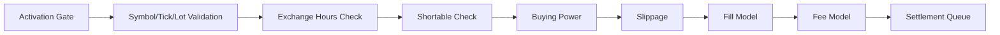

{{ nav_links() }}

# 브로커리지 API

이 문서는 QMTL 브로커리지 레이어가 주문을 어떻게 검증하고 실행하는지 설명합니다. 틱/호가 단위, 거래 시간, 공매도 가능 여부, 슬리피지, 수수료, 결제 처리를 포함하며 `architecture/lean_brokerage_model.md` 의 설계 문서와 함께 읽으면 좋습니다.

`qmtl.runtime.brokerage.simple` 아래의 레거시 단축 경로는 제거되었습니다. 업그레이드 절차는 [마이그레이션: 레거시 모드 및 하위 호환 제거](../../guides/migration_bc_removal.md) 를 참고하세요.

## 구성 요소

- 인터페이스: BuyingPowerModel, FillModel, SlippageModel, FeeModel
- Fill 모델: MarketFillModel, LimitFillModel, StopMarketFillModel, StopLimitFillModel (IOC/FOK는 TIF로 지원)
- 슬리피지 모델: NullSlippageModel, ConstantSlippageModel, SpreadBasedSlippageModel, VolumeShareSlippageModel
- 수수료 모델: PerShareFeeModel, PercentFeeModel, MakerTakerFeeModel, TieredExchangeFeeModel, BorrowFeeModel, CompositeFeeModel, IBKRFeeModel(거래소/규제 수수료와 유동성 리베이트가 포함된 티어 기반 per-share)
- 프로바이더: SymbolPropertiesProvider(자산군별 틱/호가/멀티플라이어 DB),
  ExchangeHoursProvider(정규/프리/포스트), ShortableProvider(`StaticShortableProvider` + `ShortableLot` 로 일일 공매도 수량 제공)
- 프로파일: BrokerageProfile, SecurityInitializer, ibkr_equities_like_profile()

## 실행 흐름



메모:
- 실행은 SDK/Gateway에서 활성화 게이트를 통과한 후에 진행됩니다.
- 결제는 두 가지 모드를 지원합니다. 기본은 기록만 남기는 즉시 현금 이동, 선택적 `SettlementModel(defer_cash=True)` 는 `CashWithSettlementBuyingPowerModel` 과 함께 지연 결제를 처리합니다.

SDK에서의 활성화:
- SDK `Runner` 는 거래 주문에 대해 활성화 게이트를 통합합니다. 라이브 모드에서 `gateway_url` 을 지정하면 `ActivationUpdated` 이벤트를 구독하고, 해당 롱/숏 사이드가 비활성화된 경우 BUY/SELL 제출을 차단합니다.

## 빠른 시작

```python
from qmtl.runtime.brokerage import (
    BrokerageModel,
    CashBuyingPowerModel,
    MarketFillModel,
    PerShareFeeModel,
    MakerTakerFeeModel,
    NullSlippageModel,
    SymbolPropertiesProvider,
    ExchangeHoursProvider,
    StaticShortableProvider,
    ShortableLot,
)

model = BrokerageModel(
    CashBuyingPowerModel(),
    MakerTakerFeeModel(maker_rate=0.0002, taker_rate=0.0007),
    NullSlippageModel(),
    MarketFillModel(),
    symbols=SymbolPropertiesProvider(),  # 내장된 JSON/CSV 심볼 DB 로드
    hours=ExchangeHoursProvider(allow_pre_post_market=False, require_regular_hours=True),
    shortable=StaticShortableProvider({"AAPL": ShortableLot(quantity=1000, fee=0.01)}),
)

# 선택: IBKR 유사 티어 수수료
from qmtl.runtime.brokerage import IBKRFeeModel
fee = IBKRFeeModel(minimum=1.0, exchange_fee_remove=0.0008, exchange_fee_add=-0.0002, regulatory_fee_remove=0.0001)
```

### 수수료 모델 매트릭스

| 모델 | 기준 | 설명 |
| --- | --- | --- |
| PercentFeeModel | 명목 대비 비율 | 최소값 지정 가능 |
| PerShareFeeModel | 주당 | 최소/최대 옵션 |
| MakerTakerFeeModel | 명목 대비 비율 | 메이커/테이커 요율 분리 |
| TieredExchangeFeeModel | 명목 대비 비율 | 체결 금액 구간에 따라 요율 결정 |
| BorrowFeeModel | 명목 대비 비율 | 공매도 거래에 적용 |
| IBKRFeeModel | 주당 | 거래소/규제 수수료와 유동성 리베이트를 포함한 티어 구조 |
| CompositeFeeModel | n/a | 여러 수수료 모델을 합산 |

## 타임 인 포스와 주문 유형

- 타임 인 포스: DAY, GTC, GTD, IOC, FOK. IOC는 즉시 체결 가능한 수량만 채우고, FOK는 전체 체결을 요구합니다. GTD 주문은 제공된 `expire_at` 타임스탬프에 만료됩니다.
- 주문 유형: market, limit, stop, stop-limit, market-on-open, market-on-close, trailing-stop. Limit/StopLimit은 주문 객체의 `limit_price`, `stop_price` 를 사용하고, trailing-stop은 `trail_amount` 를 사용합니다.

## 프로파일

```python
from qmtl.runtime.brokerage import ibkr_equities_like_profile

profile = ibkr_equities_like_profile()
model = profile.build()
```

### CCXT 기반 프로파일(크립토)

CCXT 메타데이터에서 메이커/테이커 수수료를 추론해 빠르게 크립토 브로커리지 모델을 구성하세요. CCXT/네트워크를 사용할 수 없는 경우 보수적인 기본값으로 폴백합니다.

```python
from qmtl.runtime.brokerage.ccxt_profile import make_ccxt_brokerage

# CCXT에서 수수료를 감지합니다(가능할 경우 심볼별).
model = make_ccxt_brokerage(
    "binance",               # CCXT ID ("binanceusdm" 은 선물용)
    product="spot",          # 또는 "futures"
    symbol="BTC/USDT",       # 선택; 마켓별 수수료 선택 정확도 향상
    sandbox=False,           # 지원 시 테스트넷 라우팅
)

# CCXT 없이 명시적 기본값
model_default = make_ccxt_brokerage(
    "binance",
    detect_fees=False,
    defaults=(0.0002, 0.0007),   # maker, taker
)
```

메모:
- 수수료 탐지 우선순위: 마켓 레벨(심볼) → `exchange.fees["trading"]` → 기본값.
- 거래소가 제공하면 음수 메이커 요율(리베이트)도 유지합니다.
- 선물 전용 동작(레버리지/마진/헷지)은 커넥터의 `FuturesCcxtBrokerageClient` 를 참고하세요. 이 팩토리는 수수료/슬리피지 형상에 집중합니다.

실행 예제: `qmtl/examples/brokerage_demo/ccxt_fee_profile_demo.py` (스팟/선물, 메이커/테이커 포함).

## 이자

`MarginInterestModel` 은 현금 잔고에 대한 일별 이자를 계산합니다. 양의 잔고는 `cash_rate`, 음의 잔고는 `borrow_rate` 를 적용합니다. 요율은 상수 또는 티어 구조가 될 수 있습니다.

```python
from datetime import datetime, timezone
from qmtl.runtime.brokerage import MarginInterestModel, Cashbook

# 균일 요율
m = MarginInterestModel(cash_rate=0.01, borrow_rate=0.10)
cb = Cashbook()
cb.set("USD", 1_000.0)
interest = m.accrue_daily(cb, "USD", datetime.now(timezone.utc))

# 잔고별 티어 요율
m = MarginInterestModel(
    cash_rate=[(0, 0.01), (10_000, 0.02)],
    borrow_rate=[(0, 0.10), (5_000, 0.08)],
)
```

## 초기화 오버라이드

`SecurityInitializer` 는 심볼별 또는 자산군별 프로파일 오버라이드를 적용하고 선택적 post-build 훅을 제공합니다.

```python
from qmtl.runtime.brokerage import BrokerageProfile, SecurityInitializer,
    CashBuyingPowerModel, PerShareFeeModel, SpreadBasedSlippageModel, ImmediateFillModel

equities = ibkr_equities_like_profile()
free_fee = BrokerageProfile(
    buying_power=CashBuyingPowerModel(),
    fee=PerShareFeeModel(fee_per_share=0.0),
    slippage=SpreadBasedSlippageModel(spread_fraction=0.1),
    fill=ImmediateFillModel(),
)

init = SecurityInitializer(
    equities,
    profiles_by_symbol={"SPY": free_fee},
    profiles_by_asset_class={"forex": free_fee},
    classify=lambda s: "forex" if s == "EURUSD" else "equity",
)

spy_model = init.for_symbol("SPY")
eurusd_model = init.for_symbol("EURUSD")
```

## 테스트와 예제

- TIF 및 체결 로직은 `tests/qmtl/runtime/brokerage/test_brokerage_orders_tif.py` 를 참고하세요.
- 공매도/프로파일 사용법은 `tests/qmtl/runtime/brokerage/test_brokerage_extras.py` 에 정리되어 있습니다.

{{ nav_links() }}
