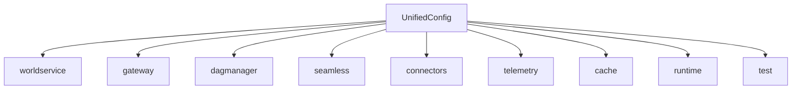

# 구성 레퍼런스

통합 `qmtl.yml` 스키마는 임시 환경 변수 기반 구성을 제거하고 린트/버전 관리가 가능한 구조화 문서를 제공합니다. 각 섹션은 런타임 서비스와 1:1 매핑되어 필요할 경우 `qmtl config env export` 로 환경 변수 할당을 생성할 수 있습니다.



`qmtl config validate --target schema` 명령으로 각 섹션이 예상 타입과 호환되는 값을 포함하는지 확인한 후, 더 깊은 서비스 연결 검사를 실행하세요.

```bash
qmtl config validate --target schema --config path/to/qmtl.yml
```

일반 환경용 샘플 구성은 `operations/config/` (`dev.yml`, `stage.yml`, `prod.yml`) 에서 확인할 수 있습니다.

## 섹션

### Worldservice

| Key | 타입 | 기본값 | 환경 변수 | 필수 |
| --- | --- | --- | --- | --- |
| `url` | 문자열 또는 null | `null` | `QMTL__GATEWAY__WORLDSERVICE_URL` | 아니오 |
| `timeout` | float | `0.3` | `QMTL__GATEWAY__WORLDSERVICE_TIMEOUT` | 아니오 |
| `retries` | 정수 | `2` | `QMTL__GATEWAY__WORLDSERVICE_RETRIES` | 아니오 |
| `enable_proxy` | boolean | `True` | `QMTL__GATEWAY__ENABLE_WORLDSERVICE_PROXY` | 아니오 |
| `enforce_live_guard` | boolean | `True` | `QMTL__GATEWAY__ENFORCE_LIVE_GUARD` | 아니오 |
| `cache_ttl_seconds` | 정수 또는 null | `null` | `QMTL__GATEWAY__WORLDSERVICE_CACHE_TTL` | 아니오 |
| `cache_max_entries` | 정수 또는 null | `null` | `QMTL__GATEWAY__WORLDSERVICE_CACHE_MAX` | 아니오 |
| `dsn` | 문자열 | – | – | 예 |
| `redis` | 문자열 | – | – | 예 |
| `bind.host` | 문자열 | `"0.0.0.0"` | – | 아니오 |
| `bind.port` | 정수 | `8080` | – | 아니오 |
| `auth.header` | 문자열 | `"Authorization"` | – | 아니오 |
| `auth.tokens` | 문자열 목록 | `[]` | – | 아니오 |

### Gateway

| Key | 타입 | 기본값 | 환경 변수 | 필수 |
| --- | --- | --- | --- | --- |
| `host` | 문자열 | `"0.0.0.0"` | `QMTL__GATEWAY__HOST` | 아니오 |
| `port` | 정수 | `8000` | `QMTL__GATEWAY__PORT` | 아니오 |
| `redis_dsn` | 문자열 또는 null | `null` | `QMTL__GATEWAY__REDIS_DSN` | 아니오 |
| `database_backend` | 문자열 | `"sqlite"` | `QMTL__GATEWAY__DATABASE_BACKEND` | 아니오 |
| `database_dsn` | 문자열 | `"./qmtl.db"` | `QMTL__GATEWAY__DATABASE_DSN` | 아니오 |
| `insert_sentinel` | boolean | `True` | `QMTL__GATEWAY__INSERT_SENTINEL` | 아니오 |
| `controlbus_brokers` | 문자열 목록 | `[]` | `QMTL__GATEWAY__CONTROLBUS_BROKERS` | 아니오 |
| `controlbus_topics` | 문자열 목록 | `[]` | `QMTL__GATEWAY__CONTROLBUS_TOPICS` | 아니오 |
| `controlbus_group` | 문자열 | `"gateway"` | `QMTL__GATEWAY__CONTROLBUS_GROUP` | 아니오 |
| `commitlog_bootstrap` | 문자열 또는 null | `null` | `QMTL__GATEWAY__COMMITLOG_BOOTSTRAP` | 아니오 |
| `commitlog_topic` | 문자열 또는 null | `"gateway.ingest"` | `QMTL__GATEWAY__COMMITLOG_TOPIC` | 아니오 |
| `commitlog_group` | 문자열 | `"gateway-commit"` | `QMTL__GATEWAY__COMMITLOG_GROUP` | 아니오 |
| `commitlog_transactional_id` | 문자열 | `"gateway-commit-writer"` | `QMTL__GATEWAY__COMMITLOG_TRANSACTIONAL_ID` | 아니오 |
| `controlbus_dsn` | 문자열 또는 null | `null` | `QMTL__GATEWAY__CONTROLBUS_DSN` | 아니오 |
| `events.secret` | 문자열 또는 null | `null` | — | 아니오 |
| `events.keys` | 매핑 | `{}` | — | 아니오 |
| `events.active_kid` | 문자열 | `"default"` | — | 아니오 |
| `events.ttl` | 정수 | `300` | — | 아니오 |
| `events.stream_url` | 문자열 | `"wss://gateway/ws/evt"` | — | 아니오 |
| `events.fallback_url` | 문자열 | `"wss://gateway/ws"` | — | 아니오 |
| `websocket.rate_limit_per_sec` | 정수 또는 null | `null` | — | 아니오 |

### Dagmanager

| Key | 타입 | 기본값 | 환경 변수 | 필수 |
| --- | --- | --- | --- | --- |
| `neo4j_dsn` | 문자열 또는 null | `null` | `QMTL__DAGMANAGER__NEO4J_DSN` | 아니오 |
| `neo4j_user` | 문자열 | `"neo4j"` | `QMTL__DAGMANAGER__NEO4J_USER` | 아니오 |
| `neo4j_password` | 문자열 | `"neo4j"` | `QMTL__DAGMANAGER__NEO4J_PASSWORD` | 아니오 |
| `memory_repo_path` | 문자열 | `"memrepo.gpickle"` | `QMTL__DAGMANAGER__MEMORY_REPO_PATH` | 아니오 |
| `kafka_dsn` | 문자열 또는 null | `null` | `QMTL__DAGMANAGER__KAFKA_DSN` | 아니오 |
| `grpc_host` | 문자열 | `"0.0.0.0"` | `QMTL__DAGMANAGER__GRPC_HOST` | 아니오 |
| `grpc_port` | 정수 | `50051` | `QMTL__DAGMANAGER__GRPC_PORT` | 아니오 |
| `http_host` | 문자열 | `"0.0.0.0"` | `QMTL__DAGMANAGER__HTTP_HOST` | 아니오 |
| `http_port` | 정수 | `8001` | `QMTL__DAGMANAGER__HTTP_PORT` | 아니오 |
| `controlbus_dsn` | 문자열 또는 null | `null` | `QMTL__DAGMANAGER__CONTROLBUS_DSN` | 아니오 |
| `controlbus_queue_topic` | 문자열 | `"queue"` | `QMTL__DAGMANAGER__CONTROLBUS_QUEUE_TOPIC` | 아니오 |
| `enable_topic_namespace` | boolean | `True` | — | 아니오 |

### Seamless

| Key | 타입 | 기본값 | 환경 변수 | 필수 |
| --- | --- | --- | --- | --- |
| `coordinator_url` | 문자열 또는 null | `null` | — | 아니오 |
| `artifacts_enabled` | boolean | `False` | — | 아니오 |
| `artifact_dir` | 문자열 | `"~/.qmtl_seamless_artifacts"` | — | 아니오 |
| `fingerprint_mode` | 문자열 | `"canonical"` | — | 아니오 |
| `publish_fingerprint` | boolean | `True` | — | 아니오 |
| `preview_fingerprint` | boolean | `False` | — | 아니오 |
| `early_fingerprint` | boolean | `False` | — | 아니오 |
| `sla_preset` | 문자열 | `"baseline"` | — | 아니오 |
| `conformance_preset` | 문자열 | `"strict-blocking"` | — | 아니오 |
| `presets_file` | 문자열 또는 null | `null` | — | 아니오 |

### Connectors

| Key | 타입 | 기본값 | 환경 변수 | 필수 |
| --- | --- | --- | --- | --- |
| `ccxt_rate_limiter_redis` | 문자열 또는 null | `null` | `QMTL_CCXT_RATE_LIMITER_REDIS` | 아니오 |
| `schema_registry_url` | 문자열 또는 null | `null` | `QMTL_SCHEMA_REGISTRY_URL` | 아니오 |
| `worker_id` | 문자열 또는 null | `null` | `QMTL_WORKER_ID` | 아니오 |
| `seamless_worker_id` | 문자열 또는 null | `null` | `QMTL_SEAMLESS_WORKER` | 아니오 |
| `strategy_id` | 문자열 또는 null | `null` | `QMTL_STRATEGY_ID` | 아니오 |
| `execution_domain` | 문자열 또는 null | `null` | `QMTL_EXECUTION_DOMAIN` | 아니오 |
| `broker_url` | 문자열 또는 null | `null` | `QMTL_BROKER_URL` | 아니오 |
| `trade_max_retries` | 정수 | `3` | `QMTL_TRADE_MAX_RETRIES` | 아니오 |
| `trade_backoff` | float | `0.1` | `QMTL_TRADE_BACKOFF` | 아니오 |
| `ws_url` | 문자열 또는 null | `null` | `QMTL_WS_URL` | 아니오 |

### Telemetry

| Key | 타입 | 기본값 | 환경 변수 | 필수 |
| --- | --- | --- | --- | --- |
| `otel_exporter_endpoint` | 문자열 또는 null | `null` | — (환경 변수 제거) | 아니오 |
| `enable_fastapi_otel` | boolean | `False` | `QMTL_ENABLE_FASTAPI_OTEL` | 아니오 |
| `prometheus_url` | 문자열 또는 null | `null` | `QMTL_PROMETHEUS_URL` | 아니오 |

> **참고:** Telemetry 설정은 이제 YAML에서만 해결됩니다. 폐기된 `QMTL_OTEL_EXPORTER_ENDPOINT` 환경 변수는 CLI와 서비스에서 무시됩니다.

### Cache

| Key | 타입 | 기본값 | 환경 변수 | 필수 |
| --- | --- | --- | --- | --- |
| `arrow_cache_enabled` | boolean | `False` | `QMTL_ARROW_CACHE` | 아니오 |
| `cache_evict_interval` | 정수 | `60` | `QMTL_CACHE_EVICT_INTERVAL` | 아니오 |
| `feature_artifacts_enabled` | boolean | `False` | `QMTL_FEATURE_ARTIFACTS` | 아니오 |
| `feature_artifact_dir` | 문자열 | `".qmtl_feature_artifacts"` | `QMTL_FEATURE_ARTIFACT_DIR` | 아니오 |
| `feature_artifact_versions` | 정수 또는 null | `null` | `QMTL_FEATURE_ARTIFACT_VERSIONS` | 아니오 |
| `feature_artifact_write_domains` | 문자열 목록 | `[]` | `QMTL_FEATURE_ARTIFACT_WRITE_DOMAINS` | 아니오 |
| `tagquery_cache_path` | 문자열 | `".qmtl_tagmap.json"` | `QMTL_TAGQUERY_CACHE` | 아니오 |
| `snapshot_dir` | 문자열 | `".qmtl_snapshots"` | `QMTL_SNAPSHOT_DIR` | 아니오 |
| `snapshot_url` | 문자열 또는 null | `null` | `QMTL_SNAPSHOT_URL` | 아니오 |
| `snapshot_strict_runtime` | boolean | `False` | `QMTL_SNAPSHOT_STRICT_RUNTIME` | 아니오 |
| `snapshot_format` | 문자열 | `"json"` | `QMTL_SNAPSHOT_FORMAT` | 아니오 |

### Runtime

| Key | 타입 | 기본값 | 환경 변수 | 필수 |
| --- | --- | --- | --- | --- |
| `http_timeout_seconds` | float | `2.0` | `QMTL_HTTP_TIMEOUT` | 아니오 |
| `http_timeout_seconds_test` | float | `1.5` | `QMTL_HTTP_TIMEOUT_TEST` | 아니오 |
| `ws_recv_timeout_seconds` | float | `30.0` | `QMTL_WS_RECV_TIMEOUT` | 아니오 |
| `ws_recv_timeout_seconds_test` | float | `5.0` | `QMTL_WS_RECV_TIMEOUT_TEST` | 아니오 |
| `ws_max_total_time_seconds` | float 또는 null | `null` | `QMTL_WS_MAX_TOTAL_TIME` | 아니오 |
| `ws_max_total_time_seconds_test` | float 또는 null | `5.0` | `QMTL_WS_MAX_TOTAL_TIME_TEST` | 아니오 |
| `poll_interval_seconds` | float | `10.0` | `QMTL_POLL_INTERVAL` | 아니오 |
| `poll_interval_seconds_test` | float | `2.0` | `QMTL_POLL_INTERVAL_TEST` | 아니오 |

### Test

| Key | 타입 | 기본값 | 환경 변수 | 필수 |
| --- | --- | --- | --- | --- |
| `test_mode` | boolean | `False` | `QMTL_TEST_MODE` | 아니오 |
| `fail_on_history_gap` | boolean | `False` | `QMTL_FAIL_ON_HISTORY_GAP` | 아니오 |
| `fixed_now` | 문자열 또는 null | `null` | `QMTL_FIXED_NOW` | 아니오 |
| `history_start` | 문자열 또는 null | `null` | `QMTL_HISTORY_START` | 아니오 |
| `history_end` | 문자열 또는 null | `null` | `QMTL_HISTORY_END` | 아니오 |

> **참고:** `qmtl tools sdk run` 은 이제 `qmtl.yml` 의 `test.history_start`, `test.history_end` 키만을 사용합니다. 기존 `QMTL_HISTORY_START`, `QMTL_HISTORY_END` 환경 변수 재정의는 무시됩니다.

## 검증 요약

- `qmtl config validate --target schema` 는 구조적 타입만 검사합니다.
- `qmtl config validate --target gateway`, `--target dagmanager` 는 Redis, Postgres, Neo4j, Kafka 등 연결 검사를 실행합니다.
