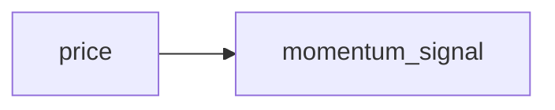
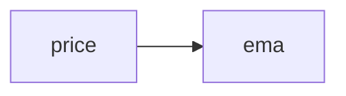
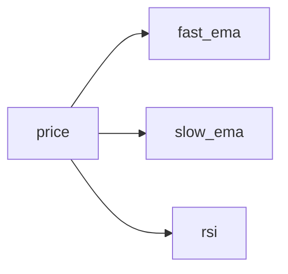
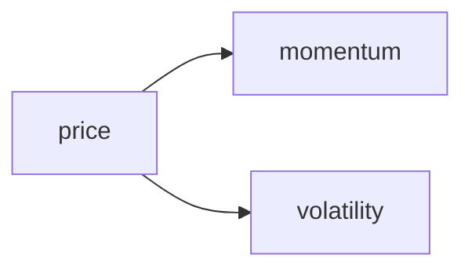
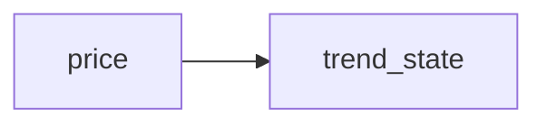

{{ nav_links() }}

<!-- markdownlint-disable MD013 MD025 MD012 -->

# 전략 템플릿

`qmtl project init` 실행 시 사용할 수 있는 스타터 전략 템플릿이 함께 제공됩니다.
단계별 소개와 최소 동작 예시는
[SDK 사용 가이드](../guides/sdk_tutorial.md)를 참고하세요.

`--with-sample-data` 옵션으로 샘플 데이터와 분석 노트북을 함께 추가할 수 있습니다:

```bash
qmtl project init --path my_proj --preset minimal --with-sample-data
```

## general



*기본으로 사용되는 예제.* 최소한의 모멘텀 시그널 계산을 보여주며 새 프로젝트의 출발점으로 적합합니다.

## single_indicator



*단일 EMA 인디케이터 예제.* 가격 스트림에 하나의 인디케이터를 연결하는 방법을 보여줍니다.
[MVP 전략 예제](../guides/sdk_tutorial.md)의 시작점으로 추천합니다.

## multi_indicator



*하나의 입력 스트림에서 여러 인디케이터 계산.* 동일한 데이터 소스에서 서로 다른 인디케이터를 비교할 때 유용합니다.

## branching



*하나의 입력에서 두 개의 계산 분기.* 전략 내 브랜칭 로직을 보여줍니다.

## state_machine



*실행 간 추세 방향을 추적.* 전략 내부에서 간단한 상태를 유지하는 방법을 보여줍니다.

## 백엔드 구성 템플릿

`qmtl project init`으로 프로젝트를 스캐폴딩하면 생성된 `templates/` 디렉터리에 두 가지 백엔드 구성 샘플이 포함됩니다:

* {{ code_link('qmtl/examples/templates/local_stack.example.yml', text='`local_stack.example.yml`') }} &mdash; SQLite, 선택적 Redis, 그리고 Kafka/Neo4j의 인프로세스 대체를 사용하는 경량 백엔드 스택. 외부 의존성 없이 로컬 개발 또는 스모크 테스트에 유용합니다.
* {{ code_link('qmtl/examples/templates/backend_stack.example.yml', text='`backend_stack.example.yml`') }} &mdash; Redis, Postgres, Kafka, Neo4j 및 관측성 서비스를 포함한 프로덕션 준비 템플릿. 배포 전에 플레이스홀더 값을 실제 값으로 교체하세요.

다양한 환경에서 Gateway, DAG Manager, WorldService를 연결할 때 이 파일들을 시작점으로 사용하세요.

## 태깅 가이드라인

모듈에는 범위, 패밀리 등의 메타데이터를 설명하는 `TAGS` 딕셔너리를 포함할 수 있습니다. 필수 키는 `scope`, `family`, `interval`, `asset`이며, `window`, `price`, `side`, `target_horizon`, `label` 같은 선택 키는 노드를 더 세분화하는 데 도움이 됩니다. 문자열은 소문자를 사용하고 `1m`, `5m`, `1h`, `1d` 같은 표준화된 인터벌을 사용하세요.

`qmtl taglint`로 TAGS를 린트할 수 있습니다:

```bash
qmtl taglint path/to/module.py
```

`--fix` 옵션을 추가하면 인터벌을 정규화하고 누락된 키를 스캐폴딩합니다. 린트 작업은 문서 작업과 병렬로 수행할 수 있으므로, 팀은 문서를 업데이트하는 동안 `qmtl taglint`가 코드를 점검하도록 둘 수 있습니다.

{{ nav_links() }}
