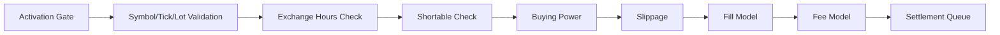

{{ nav_links() }}

# Brokerage API

This page describes QMTL’s brokerage layer: how orders are validated and executed with realistic constraints (ticks/lots, hours, shortability), and how slippage, fees, and settlement are applied. It complements the high-level design in architecture/lean_brokerage_model.md.

Legacy shortcuts under `qmtl.brokerage.simple` have been removed. See [Migration: Removing Legacy Modes and Backward Compatibility](../../guides/migration_bc_removal.md) for upgrade steps.

## Components

- Interfaces: BuyingPowerModel, FillModel, SlippageModel, FeeModel
- Fill models: MarketFillModel, LimitFillModel, StopMarketFillModel, StopLimitFillModel (IOC/FOK supported via TIF)
- Slippage models: NullSlippageModel, ConstantSlippageModel, SpreadBasedSlippageModel, VolumeShareSlippageModel
- Fee models: PerShareFeeModel, PercentFeeModel, MakerTakerFeeModel, TieredExchangeFeeModel, BorrowFeeModel, CompositeFeeModel, IBKRFeeModel (tiered per-share with venue/regulatory fees and liquidity rebates)
- Providers: SymbolPropertiesProvider (asset-class aware tick/lot/multiplier database),
  ExchangeHoursProvider (regular/pre/post), ShortableProvider (daily shortable quantities
  via ``StaticShortableProvider`` + ``ShortableLot``)
- Profiles: BrokerageProfile, SecurityInitializer, ibkr_equities_like_profile()

## Execution Flow



Notes:
- Activation is enforced in SDK/Gateway, before brokerage checks.
- Settlement supports two modes: record-only (default, immediate cash move) and deferred-cash (`SettlementModel(defer_cash=True)` with `CashWithSettlementBuyingPowerModel`).

Activation in SDK:
- The SDK `Runner` integrates an activation gate for trade orders. When running live with a `gateway_url`, it subscribes to `ActivationUpdated` events and blocks BUY/SELL submissions if the corresponding long/short side is disabled.


## Quick Start

```python
from qmtl.brokerage import (
    BrokerageModel,
    CashBuyingPowerModel,
    MarketFillModel,
    PerShareFeeModel,
    MakerTakerFeeModel,
    NullSlippageModel,
    SymbolPropertiesProvider,
    ExchangeHoursProvider,
    StaticShortableProvider,
    ShortableLot,
)

model = BrokerageModel(
    CashBuyingPowerModel(),
    MakerTakerFeeModel(maker_rate=0.0002, taker_rate=0.0007),
    NullSlippageModel(),
    MarketFillModel(),
    symbols=SymbolPropertiesProvider(),  # loads built-in JSON/CSV symbol DB
    hours=ExchangeHoursProvider(allow_pre_post_market=False, require_regular_hours=True),
    shortable=StaticShortableProvider({"AAPL": ShortableLot(quantity=1000, fee=0.01)}),
)

# Optional: tiered IBKR-like fees
from qmtl.brokerage import IBKRFeeModel
fee = IBKRFeeModel(minimum=1.0, exchange_fee_remove=0.0008, exchange_fee_add=-0.0002, regulatory_fee_remove=0.0001)
```

### Fee Model Matrix

| Model | Basis | Notes |
| --- | --- | --- |
| PercentFeeModel | % of notional | Rate with minimum |
| PerShareFeeModel | per share | Optional min/max |
| MakerTakerFeeModel | % of notional | Separate maker/taker rates |
| TieredExchangeFeeModel | % of notional | Rate determined by notional tiers |
| BorrowFeeModel | % of notional | Applied on short sales |
| IBKRFeeModel | per share | Tiered per-share schedule with venue/regulatory fees & liquidity rebates |
| CompositeFeeModel | n/a | Sum multiple fee models |

## Time-in-Force and Order Types

- Time-in-Force: DAY, GTC, GTD, IOC, FOK. IOC partially fills up to immediate liquidity; FOK requires full fill. GTD orders expire at the provided `expire_at` timestamp.
- Order types: market, limit, stop, stop-limit, market-on-open, market-on-close, trailing-stop. Limit/StopLimit use `limit_price` and `stop_price` on Order; trailing-stop uses `trail_amount`.

## Profiles

```python
from qmtl.brokerage import ibkr_equities_like_profile

profile = ibkr_equities_like_profile()
model = profile.build()
```

### CCXT-based Profiles (Crypto)

Quickly spin up a crypto brokerage model by detecting maker/taker fees from CCXT. Falls back to conservative defaults when CCXT/network is unavailable.

```python
from qmtl.brokerage.ccxt_profile import make_ccxt_brokerage

# Detect fees from ccxt (symbol-specific when provided). Hours=None assumes 24/7.
model = make_ccxt_brokerage(
    "binance",               # CCXT id (use "binanceusdm" for Binance USDT‑M futures)
    product="spot",          # or "futures"
    symbol="BTC/USDT",       # optional; improves fee selection if markets differ
    sandbox=False,            # True to route to testnet if supported
)

# Explicit fallback/defaults without ccxt
model_default = make_ccxt_brokerage(
    "binance",
    detect_fees=False,
    defaults=(0.0002, 0.0007),   # maker, taker
)
```

Notes:
- Fee detection priority: market-level (symbol) → exchange.fees["trading"] → defaults.
- Negative maker rates (rebates) are preserved if reported by the exchange.
- For futures-specific behavior (leverage/margin/hedge), see ``FuturesCcxtBrokerageClient`` under Connectors; this factory only shapes fees/slippage.

## Interest

Use `MarginInterestModel` to accrue daily interest on cash balances. Positive
balances earn at `cash_rate`, negative balances pay at `borrow_rate`. Rates can
be constants or tiered schedules.

```python
from datetime import datetime, timezone
from qmtl.brokerage import MarginInterestModel, Cashbook

# Flat rates
m = MarginInterestModel(cash_rate=0.01, borrow_rate=0.10)
cb = Cashbook()
cb.set("USD", 1_000.0)
interest = m.accrue_daily(cb, "USD", datetime.now(timezone.utc))

# Tiered rates by balance
m = MarginInterestModel(
    cash_rate=[(0, 0.01), (10_000, 0.02)],
    borrow_rate=[(0, 0.10), (5_000, 0.08)],
)
```

## Initializer Overrides

`SecurityInitializer` can apply per-symbol or per-asset-class profile
overrides and an optional post-build hook.

```python
from qmtl.brokerage import BrokerageProfile, SecurityInitializer,
    CashBuyingPowerModel, PerShareFeeModel, SpreadBasedSlippageModel, ImmediateFillModel

equities = ibkr_equities_like_profile()
free_fee = BrokerageProfile(
    buying_power=CashBuyingPowerModel(),
    fee=PerShareFeeModel(fee_per_share=0.0),
    slippage=SpreadBasedSlippageModel(spread_fraction=0.1),
    fill=ImmediateFillModel(),
)

init = SecurityInitializer(
    equities,
    profiles_by_symbol={"SPY": free_fee},
    profiles_by_asset_class={"forex": free_fee},
    classify=lambda s: "forex" if s == "EURUSD" else "equity",
)

spy_model = init.for_symbol("SPY")  # uses free_fee
eurusd_model = init.for_symbol("EURUSD")  # uses free_fee via asset-class
```

## Testing and Examples

- See `tests/test_brokerage_orders_tif.py` for TIF and crossing logic.
- See `tests/test_brokerage_extras.py` for shortable/profile usage.

{{ nav_links() }}
