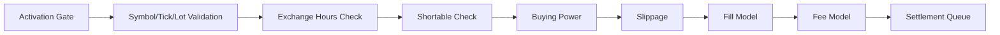

{{ nav_links() }}

# Brokerage API

This page describes QMTL’s brokerage layer: how orders are validated and executed with realistic constraints (ticks/lots, hours, shortability), and how slippage, fees, and settlement are applied. It complements the high-level design in architecture/lean_brokerage_model.md.

## Components

- Interfaces: BuyingPowerModel, FillModel, SlippageModel, FeeModel
- Fill models: MarketFillModel, LimitFillModel, StopMarketFillModel, StopLimitFillModel (IOC/FOK supported via TIF)
- Slippage models: NullSlippageModel, ConstantSlippageModel, SpreadBasedSlippageModel, VolumeShareSlippageModel
- Fee models: PerShareFeeModel, PercentFeeModel, CompositeFeeModel, IBKRFeeModel (tiered per-share)
- Providers: SymbolPropertiesProvider (tick/lot/min), ExchangeHoursProvider (regular/pre/post), ShortableProvider
- Profiles: BrokerageProfile, SecurityInitializer, ibkr_equities_like_profile()

## Execution Flow



Notes:
- Activation is enforced in SDK/Gateway, before brokerage checks.
- Settlement supports two modes: record-only (default, immediate cash move) and deferred-cash (`SettlementModel(defer_cash=True)` with `CashWithSettlementBuyingPowerModel`).

Activation in SDK:
- The SDK `Runner` integrates an activation gate for trade orders. When running live with a `gateway_url`, it subscribes to `ActivationUpdated` events and blocks BUY/SELL submissions if the corresponding long/short side is disabled.


## Quick Start

```python
from qmtl.brokerage import (
    BrokerageModel,
    CashBuyingPowerModel,
    MarketFillModel,
    PerShareFeeModel,
    NullSlippageModel,
    SymbolPropertiesProvider,
    ExchangeHoursProvider,
)

model = BrokerageModel(
    CashBuyingPowerModel(),
    PerShareFeeModel(fee_per_share=0.005, minimum=1.0),
    NullSlippageModel(),
    MarketFillModel(),
    symbols=SymbolPropertiesProvider(),
    hours=ExchangeHoursProvider(allow_pre_post_market=False, require_regular_hours=True),
)

# Optional: tiered IBKR-like fees
from qmtl.brokerage import IBKRFeeModel
fee = IBKRFeeModel(minimum=1.0)
```

## Time-in-Force and Order Types

- Time-in-Force: DAY, GTC, IOC, FOK. IOC partially fills up to immediate liquidity; FOK requires full fill.
- Order types: market, limit, stop, stop-limit. Limit/StopLimit use `limit_price` and `stop_price` on Order.

## Profiles

```python
from qmtl.brokerage import ibkr_equities_like_profile

profile = ibkr_equities_like_profile()
model = profile.build()
```

## Testing and Examples

- See `tests/test_brokerage_orders_tif.py` for TIF and crossing logic.
- See `tests/test_brokerage_extras.py` for shortable/profile usage.
```

{{ nav_links() }}
