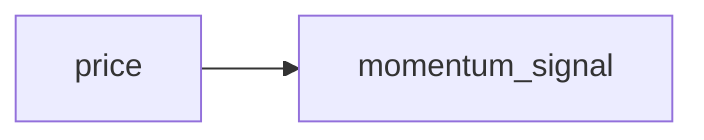
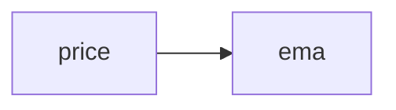
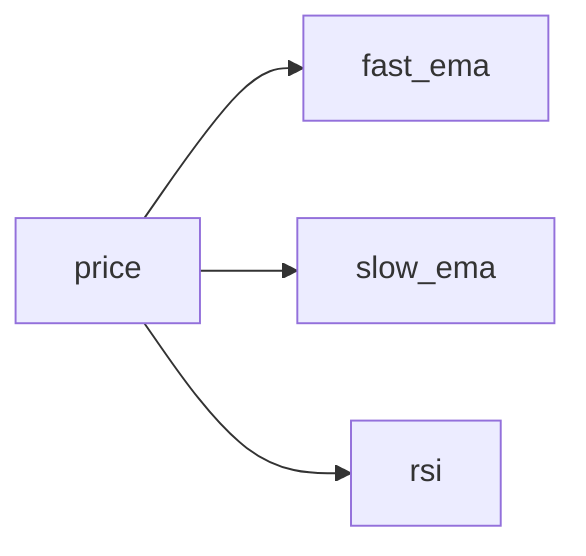
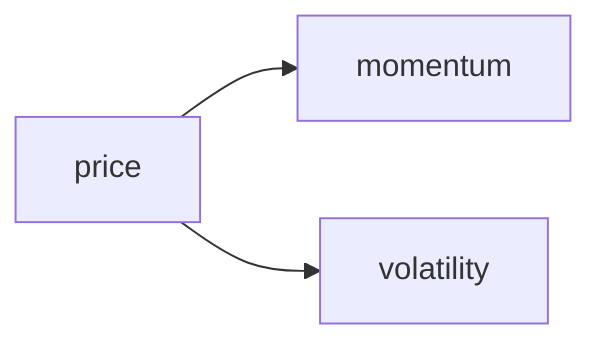
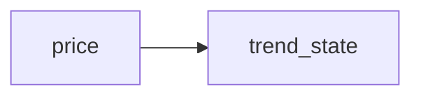

# Strategy Templates

QMTL ships with starter strategies that can be used when running `qmtl init`.
List them with:

```bash
qmtl init --list-templates
```

Add sample data and an analysis notebook with `--with-sample-data`:

```bash
qmtl init --path my_proj --with-sample-data
```

Choose a template using the `--strategy` option. Each template below shows the
node flow and offers quick usage notes.

## general



*Basic example used by default.* Demonstrates a minimal momentum signal
calculation and serves as a starting point for new projects.

```bash
qmtl init --path my_proj --strategy general
```

## single_indicator



*Single EMA indicator.* Shows how to attach one indicator to a price stream.

```bash
qmtl init --path my_proj --strategy single_indicator
```

## multi_indicator



*Multiple indicators from one stream.* Useful when comparing different
indicators over the same data source.

```bash
qmtl init --path my_proj --strategy multi_indicator
```

## branching



*Two computation branches from one input.* Demonstrates branching logic within a
strategy.

```bash
qmtl init --path my_proj --strategy branching
```

## state_machine



*Keeps track of trend direction between runs.* Shows how to maintain simple
state inside a strategy.

```bash
qmtl init --path my_proj --strategy state_machine
```
