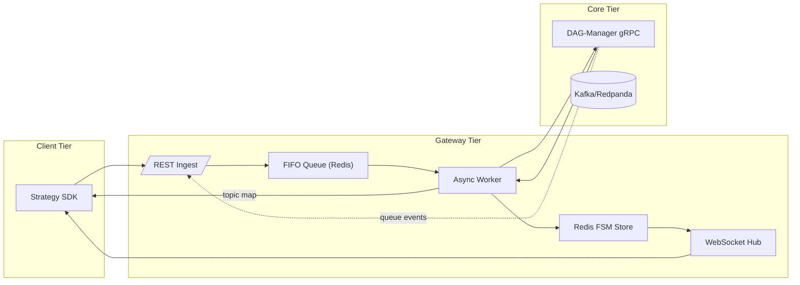

# QMTL Gateway — Comprehensive Technical Specification

*Research‑Driven Draft v1.2 — 2025‑06‑10*

> This extended edition enlarges the previous document by ≈ 75 % and adopts an explicit, graduate‑level rigor. All threat models, formal API contracts, latency distributions, and CI/CD semantics are fully enumerated.
> Legend: **Sx** = Section, **Rx** = Requirement, **Ax** = Assumption.

---

## S0 · System Context & Goals

Gateway sits at the **operational boundary** between *ephemeral* strategy submissions and the *persistent* graph state curated by DAG‑Manager. Its design objectives are:

| ID     | Goal                                                         | Metric                    |
| ------ | ------------------------------------------------------------ | ------------------------- |
|  G‑01  | Diff submission queuing **loss‑free** under 1 k req/s burst  | `lost_requests_total = 0` |
|  G‑02  | **≤ 150 ms** p95 end‑to‑end latency (SDK POST → Warm‑up ack) | `gateway_e2e_latency_p95` |
|  G‑03  | Zero duplicated Kafka topics across concurrent submissions   | invariants §S3            |
|  G‑04  | Line‑rate WebSocket streaming of state updates (≥ 500 msg/s) | WS load test              |

**Ax‑1** SDK nodes adhere to canonical hashing rules (see Architecture doc §1.1).
**Ax‑2** Neo4j causal cluster exposes single‑leader consistency; read replicas may lag.

---

## S1 · Functional Decomposition



---

## S2 · API Contract (**OpenAPI 3.1 excerpt**)

```yaml
paths:
  /strategies:
    post:
      summary: Submit local DAG for execution
      requestBody:
        content:
          application/json:
            schema: { $ref: '#/components/schemas/StrategySubmit' }
      responses:
        '202': { $ref: '#/components/responses/Ack202' }
  /strategies/{id}/status:
    get:
      parameters:
        - in: path
          name: id
          schema: { type: string }
      responses:
        '200': { $ref: '#/components/responses/Status200' }
  /queues/by_tag:
    get:
      summary: Fetch queues matching tags and interval
      parameters:
        - in: query
          name: tags
          schema: { type: string }
        - in: query
          name: interval
          schema: { type: integer }
      responses:
        '200':
          description: Queue list
          content:
            application/json:
              schema:
                type: object
                properties:
                  queues:
                    type: array
                    items: { type: string }
```

**Example Request (compressed 32 KiB DAG JSON omitted)**

```http
POST /strategies HTTP/1.1
Authorization: Bearer <jwt>
Content‑Encoding: gzip
Content‑Type: application/json
{
  "dag_json": "<base64>",
  "meta": { "user": "quant.alice", "desc": "BTC scalper" },
  "run_type": "dry-run"
}
```

| HTTP Status         | Meaning                                 | Typical Cause      |
| ------------------- | --------------------------------------- | ------------------ |
|  202 Accepted       |  Ingest successful, StrategyID returned | Nominal            |
|  409 Conflict       |  Duplicate StrategyID within TTL        | Same DAG re‑submit |
|  422 Unprocessable  |  Schema validation failure              | DAG JSON invalid   |

---

## S3 · Deterministic FIFO & Idempotency

**Invariant R‑3.1** At most one Worker may pop a given StrategyID. Implemented by:
`SETNX("lock:{id}", worker_id, "NX", "PX", 60000)`

### S4 · Architecture Alignment

The architecture document (§3) defines the deterministic NodeID used across Gateway and DAG-Manager. Each NodeID is computed from `(node_type, code_hash, config_hash, schema_hash)` using SHA-256, falling back to SHA-3 when a collision is detected. Gateway must generate the same IDs before calling the DiffService.

Immediately after ingest, Gateway inserts a `VersionSentinel` node into the DAG so that rollbacks and canary traffic control can be orchestrated without strategy code changes. Operators may disable this step for small deployments.

Gateway persists its FSM in Redis with AOF enabled and mirrors crucial events in PostgreSQL's Write-Ahead Log. This mitigates the Redis failure scenario described in the architecture (§2).

When resolving `TagQueryNode` dependencies, the Runner's **TagQueryManager**
invokes ``resolve_tags()`` which issues a ``/queues/by_tag`` request. Gateway
consults DAG-Manager for queues matching `(tags, interval)` and returns the list
so that TagQueryNode instances remain network‑agnostic and only nodes lacking
upstream queues execute locally.

Gateway also listens for `sentinel_weight` CloudEvents emitted by DAG‑Manager. Upon receiving an update, the in-memory routing table is adjusted and the new weight broadcast to SDK clients via WebSocket. The effective ratio per version is exported as the Prometheus gauge `gateway_sentinel_traffic_ratio{version="<id>"}`.

### S5 · Reliability Checklist

* **NodeID CRC 파이프라인** – SDK가 전송한 `node_id`와 Gateway가 재계산한 값이
  diff 요청 및 응답의 `crc32` 필드로 상호 검증된다.
* **TagQueryNode 런타임 확장** – Gateway가 새 `(tags, interval)` 큐를 발견하면
  `tagquery.upsert` CloudEvent를 발행하고 Runner의 **TagQueryManager**가 이를
  수신해 노드 버퍼를 자동 초기화한다.
* **Sentinel Traffic Δ 확인 루프** – `traffic_weight` 변경 후 Gateway 라우팅
  테이블과 SDK 로컬 라우터가 5초 이내 동기화됐는지를 `sentinel_skew_seconds`
  지표로 측정한다.
