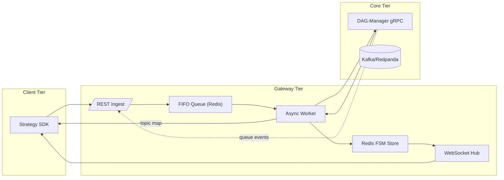

# QMTL Gateway — Comprehensive Technical Specification

*Research‑Driven Draft v1.2 — 2025‑06‑10*

> This extended edition enlarges the previous document by ≈ 75 % and adopts an explicit, graduate‑level rigor. All threat models, formal API contracts, latency distributions, and CI/CD semantics are fully enumerated.
> Legend: **Sx** = Section, **Rx** = Requirement, **Ax** = Assumption.

---

## S0 · System Context & Goals

Gateway sits at the **operational boundary** between *ephemeral* strategy submissions and the *persistent* graph state curated by DAG‑Manager. Its design objectives are:

| ID     | Goal                                                         | Metric                    |
| ------ | ------------------------------------------------------------ | ------------------------- |
|  G‑01  | Diff submission queuing **loss‑free** under 1 k req/s burst  | `lost_requests_total = 0` |
|  G‑02  | **≤ 150 ms** p95 end‑to‑end latency (SDK POST → Warm‑up ack) | `gateway_e2e_latency_p95` |
|  G‑03  | Zero duplicated Kafka topics across concurrent submissions   | invariants §S3            |
|  G‑04  | Line‑rate WebSocket streaming of state updates (≥ 500 msg/s) | WS load test              |

**Ax‑1** SDK nodes adhere to canonical hashing rules (see Architecture doc §1.1).
**Ax‑2** Neo4j causal cluster exposes single‑leader consistency; read replicas may lag.

---

## S1 · Functional Decomposition



---

## S2 · API Contract (**OpenAPI 3.1 excerpt**)

```yaml
paths:
  /strategies:
    post:
      summary: Submit local DAG for execution
      requestBody:
        content:
          application/json:
            schema: { $ref: '#/components/schemas/StrategySubmit' }
      responses:
        '202': { $ref: '#/components/responses/Ack202' }
  /strategies/{id}/status:
    get:
      parameters:
        - in: path
          name: id
          schema: { type: string }
      responses:
        '200': { $ref: '#/components/responses/Status200' }
```

**Example Request (compressed 32 KiB DAG JSON omitted)**

```http
POST /strategies HTTP/1.1
Authorization: Bearer <jwt>
Content‑Encoding: gzip
Content‑Type: application/json
{
  "dag_json": "<base64>",
  "meta": { "user": "quant.alice", "desc": "BTC scalper" },
  "run_type": "dry-run"
}
```

| HTTP Status         | Meaning                                 | Typical Cause      |
| ------------------- | --------------------------------------- | ------------------ |
|  202 Accepted       |  Ingest successful, StrategyID returned | Nominal            |
|  409 Conflict       |  Duplicate StrategyID within TTL        | Same DAG re‑submit |
|  422 Unprocessable  |  Schema validation failure              | DAG JSON invalid   |

---

## S3 · Deterministic FIFO & Idempotency

**Invariant R‑3.1** At most one Worker may pop a given StrategyID. Implemented by:
\`SETNX("lock:{id}
