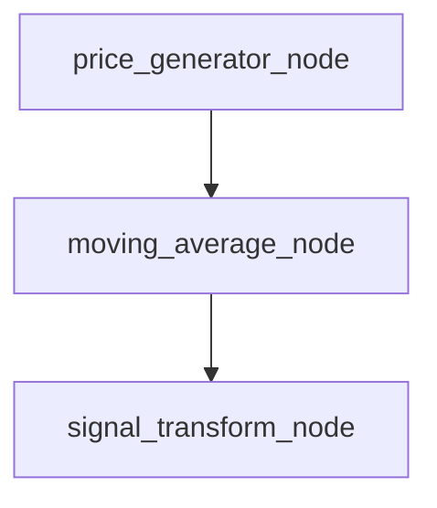

# Strategy DAG Guide

This guide explains how to define node processors, combine them into DAGs, and reuse components across strategies.

## Node Processor Definition

Node processors are pure functions located under the `nodes/` package. Name each function with the `_node` suffix so it can be easily identified and reused.

```python
# nodes/generators/price.py

def price_generator_node():
    """Generate the latest price as a dictionary."""
    return {"price": 100}
```

## Composing a DAG

Use `qmtl.dag_manager` to wire processors into an acyclic graph. Inputs are mapped by explicit keys, allowing outputs from one node to feed downstream nodes.

```python
from qmtl.dag_manager import DAGManager
from nodes.generators.price import price_generator_node
from nodes.indicators.moving_average import moving_average_node
from nodes.transforms.signal import signal_transform_node

dag = DAGManager()
dag.add_node("price", price_generator_node)
dag.add_node("ma", moving_average_node, inputs={"data": "price"})
dag.add_node("signal", signal_transform_node, inputs={"metric": "ma"})

result = dag.execute()
```

### Dependency Diagram



## Reusing Nodes

Because processors are pure functions, a single node can serve multiple DAGs. For example, `price_generator_node` may feed both a mean-reversion and a momentum strategy without modification.

```python
# dags/mean_reversion_dag.py
from nodes.generators.price import price_generator_node
from nodes.indicators.moving_average import moving_average_node

def build_dag():
    ...
```

This reuse minimizes duplication and keeps strategies consistent.

## Binance History Strategy

The `dags/binance_history_dag.py` module demonstrates wiring a `StreamInput`
with `QuestDBLoader` and `QuestDBRecorder` so Binance kline data is
persisted to QuestDB and missing ranges can be backfilled via
`BinanceFetcher`.

### Initialization

Before executing `BinanceHistoryStrategy`, create the QuestDB table using the
SQL script in `binance_history_strategy/`:

```bash
psql < strategies/binance_history_strategy/create_table.sql
```

The script defines `node_id VARCHAR`, `interval INT`, `ts TIMESTAMP`, and
price/volume columns (`open`, `high`, `low`, `close`, `volume`). Running it
ensures the recorder can persist data when the strategy starts.
